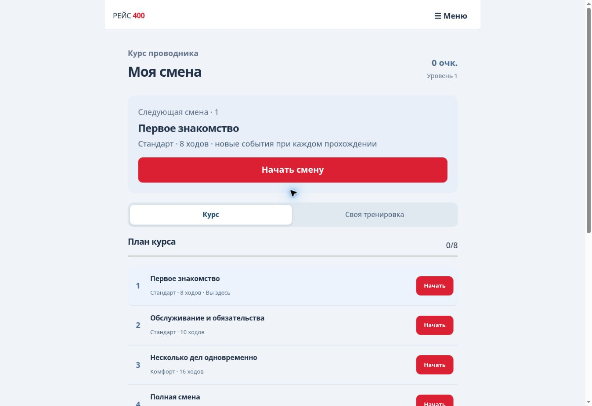
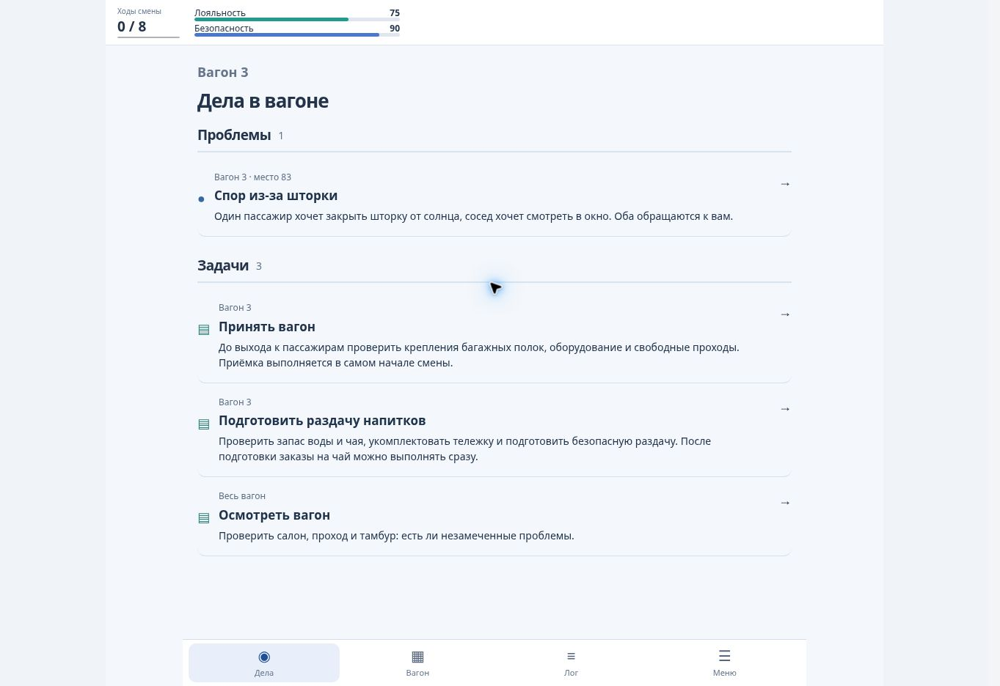
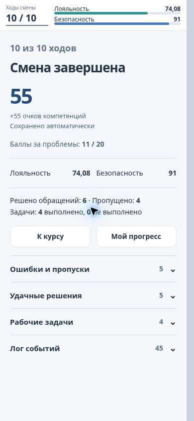

<div align="center">

# РЕЙС 400

### Учебная смена проводника ВСМ

Решайте обращения пассажиров, расставляйте приоритеты и наблюдайте последствия своих решений.

**[Открыть игру](https://5.42.113.212:9443/)** · **[Путь игрока](docs/USER-FLOW.md)** · **[Архитектура](docs/ARCHITECTURE.md)** · **[Материалы для жюри](docs/SUBMISSION.md)**

Браузерная игра · Телефон и компьютер · 8 этапов курса · 4 класса обслуживания

</div>



## Идея

Проводнику приходится одновременно учитывать интересы пассажиров, безопасность и рабочие обязанности. РЕЙС 400 превращает это в практику принятия решений: игрок получает вагон, ограниченный запас ходов и несколько дел, требующих внимания.

Обращения развиваются через диалоги и разные исходы. Часть проблем видна сразу, часть обнаруживается при осмотре; отложенные последствия зависят от предыдущих действий. Нельзя бесконечно откладывать остальные дела, пока занимаешься одним пассажиром.

Проект создан для трека **«Геймификация для ВСМ»** MT-хакатона. Ситуации и профили учебные; игра не является официальной аттестацией сотрудников.

## Попробовать

1. Откройте **[демонстрацию на сервере команды](https://5.42.113.212:9443/)**.
2. Выберите **«Войти как проводник»**. Регистрация и реальные персональные данные не нужны.
3. Нажмите **«Начать смену»** в курсе или настройте **«Свою тренировку»**.
4. Работайте с проблемами и задачами; осматривайте вагон, следите за лояльностью и безопасностью.
5. После последнего действия подтвердите его результат: откроется итог смены с разбором и начисленными очками.

На стартовом экране есть отдельный **«Администратор»** — открытая демонстрационная сводка учебных профилей. Это просмотр, без изменения пользователей и игровых данных.

## Как устроена игра

| Возможность | Что делает игрок |
|---|---|
| **Курс** | Проходит 8 подготовленных этапов — от знакомства в Стандарте до полной смены в Первом классе |
| **Своя тренировка** | Выбирает класс, объём смены, режим и время критического решения |
| **Проблемы и задачи** | Выбирает приоритет между обращениями пассажиров и обязанностями проводника |
| **Ветвящиеся диалоги** | Уточняет ситуацию, проверяет факты, принимает решение и видит реакцию внутри карточки |
| **Случайность** | Получает новую комбинацию событий и мест; сохранённая смена воспроизводима |
| **Вагон** | Видит нумерованные места и известные обращения на схеме; сначала выбирает маркер, затем открывает проблему |
| **Лог событий** | Восстанавливает ход текущей смены: новые записи сверху, подробности раскрываются по запросу |
| **Прогресс и рейтинг** | Получает очки компетенций, видит историю результатов и рейтинг бригады, депо или компании |

Библиотека содержит **27 ситуаций: 19 базовых и 8 связанных последствий**. В актуальном контенте — **53 промежуточных узла диалогов и 182 маршрута к исходам**. Это размер библиотеки, а не число событий в одной смене.

### Темп и последствия

Смена рассчитана на **8, 10, 16 или 20 ходов**. Чтение реплик, просмотр схемы и лога не расходуют ход. Завершённое рабочее действие продвигает события; у проблем и задач есть внутренние сроки. Их числовые значения скрыты: срочность нужно распознать по ситуации.

Для открытой критической ситуации действует отдельный реальный таймер — **60 или 120 секунд**. Его срок хранит сервер: обновление страницы не даёт дополнительного времени.

Результат проблемы оценивается в 0, 1 или 2 балла. Итог смены нормируется относительно доступных баллов; очки завершённых смен накапливаются в профиле. Рабочие задачи влияют на состояние вагона и последствия, но не дают отдельные баллы компетенций. [Подробная модель и примеры](docs/USER-FLOW.md).

## Внутри смены



<p align="center">
  
</p>

Первые два снимка сделаны на сервере команды 27 сентября 2026 года. Мобильный итог — из проверочного прохождения той же игровой версии; это снимок интерфейса, не макет.

## Запуск локально

Нужен **Node.js 24**. Для запуска игры установка npm-пакетов не требуется: сервер использует встроенный SQLite.

```sh
git clone https://github.com/RomaGrach/mt-hackathon.git
cd mt-hackathon
node server.mjs
```

Откройте **http://127.0.0.1:3000**. База автоматически создаётся в `data/reis400.sqlite`; перезапуск сервера не удаляет прогресс. Пока репозиторий приватный, для клонирования нужен доступ GitHub.

<details>
<summary><strong>Запуск через Docker</strong></summary>

```sh
docker compose up --build -d
```

Откройте **http://127.0.0.1:3000**. Данные хранятся в томе `game-data`. Команда `docker compose down` останавливает приложение; добавление `-v` удаляет и данные.

Docker-конфигурация подготовлена; её фактический запуск в последней проверочной среде не проверялся.

</details>

<details>
<summary><strong>Настройки сервера</strong></summary>

Для нестандартного окружения скопируйте `.env.example` в `.env` и запустите `node --env-file=.env server.mjs`.

| Переменная | Назначение |
|---|---|
| `PORT`, `HOST` | По умолчанию `3000`, `127.0.0.1` |
| `DB_PATH` | Путь к постоянному файлу SQLite |
| `PUBLIC_ORIGIN` | Внешний HTTPS origin без завершающего слеша |
| `COOKIE_SECURE` | `true` для HTTPS |
| `NODE_ENV` | `production` включает проверку HTTPS-настроек |
| `HR_API_KEY` | Необязательный ключ read-only экспорта; без него интеграционный API отключён |

[Развёртывание и обновление сервера](docs/DEPLOYMENT.md). Frontend и API должны работать на одном origin; одной статической публикации недостаточно.

</details>

## Технологии и устройство

**JavaScript / HTML / CSS · Node.js 24 · SQLite · HTTP API / OpenAPI 3.1**

Браузер показывает состояние и отправляет команды. Сервер проверяет сессию, версию состояния и идентификатор запроса, выполняет игровое правило и сохраняет результат. Баллы, таймеры и скрытые события рассчитываются на сервере. Повтор сетевого запроса не создаёт второе действие.

| Каталог | Содержание |
|---|---|
| `src/` | Экраны, управление, клиент API и схема вагона |
| `backend/` | Игровой движок, контент, профили, API и SQLite |
| `tests/` | Проверки движка, хранилища, API и интерфейса |
| `docs/` | Архитектура, пользовательский путь, проверки и сдача |
| `research/`, `materials/` | Исследование и материалы задания |
| `worker/` | Альтернативный адаптер Sites; основной адрес теперь на сервере команды |

Внутренние идентификаторы текущей версии: `shift-4`, `design002@1.3.0`, API v2. Они нужны для совместимости сохранений, а не являются названием продукта. Старые движки сохраняют читаемость прежних попыток; их механики не описывают текущую игру.

## Проверки

```sh
npm run check
npm test
```

Для сборки и браузерных тестов:

```sh
npm ci
npm run build:site
npx playwright install chromium
npm run test:e2e
```

`build:site` собирает frontend, которому по-прежнему нужен backend. `build:sites` предназначен только для альтернативного размещения Sites.

Последняя проверка игрового кода: **166 тестов**, проверка синтаксиса и сборка Sites прошли; вручную пройдена смена до итога, проверены размеры **390 × 844** и **320 × 740**. Новый сервер отдельно проверен на доступность и начало смены. Полный набор старых Playwright-тестов не выдаётся за повторно пройденный на новом хостинге. [Протокол и границы проверки](docs/QA.md).

## Документация

| Для чего | Документ |
|---|---|
| Заполнить форму сдачи | [Материалы для жюри](docs/SUBMISSION.md) |
| Разобраться в решении | [Архитектура и диаграммы](docs/ARCHITECTURE.md) |
| Изучить API | [API v2](docs/API-V2.md) · [OpenAPI](docs/openapi.json) |
| Пройти демонстрацию | [Пользовательский путь и игровые примеры](docs/USER-FLOW.md) |
| Проверить требования | [Матрица текущей версии](docs/REQUIREMENTS.md) |
| Оценить границы MVP | [Ограничения и план развития](docs/LIMITATIONS.md) |
| Обновить сервер | [Развёртывание](docs/DEPLOYMENT.md) |
| Подготовиться к защите | [Карта кода и практикум](docs/TEAM-HANDOFF.md) |
| Найти источники | [Материалы и границы адаптации](docs/SOURCES.md) |

## Границы прототипа

Сценарии и балансовые коэффициенты требуют методической проверки перевозчиком. Корпоративные SSO/RBAC, промышленная нагрузка и подключение к реальной HR/LMS не входят в готовую демонстрацию. Публичный администратор допустим здесь только для синтетических данных. Схема вагона — учебное представление, а не утверждённая билетная схема состава.

Разработка велась с помощью ИИ. Команда должна самостоятельно понимать код, правила расчёта и ограничения решения перед защитой.
