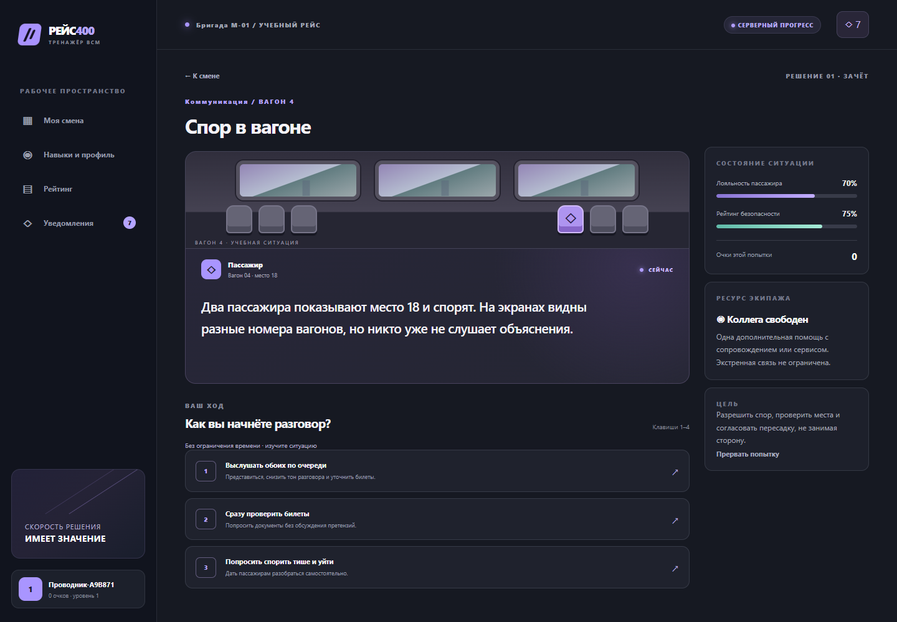

# РЕЙС 400

Интерактивная обучающая игра для проводников ВСМ. Версия 2.0: браузерный интерфейс, серверный движок и SQLite. Пять модулей с развилками, условиями, таймерами, лояльностью пассажира, безопасностью и разбором каждого решения.

**Для хакатона и демонстрации на синтетических данных. Не является системой официальной аттестации.** Клинические действия, корпоративные регламенты и рубрика оценки требуют согласования с заказчиком. Разработка выполнена с помощью ИИ; перед защитой команде необходимо самостоятельно изучить и проверить код — [карта кода и практикум](docs/TEAM-HANDOFF.md).



## Запуск за минуту

Нужен **Node.js 24**. Установка npm-пакетов для самой игры не требуется.

```sh
git clone https://github.com/RomaGrach/mt-hackathon.git
cd mt-hackathon
node server.mjs
```

Откройте **http://127.0.0.1:3000**. Выберите учебную бригаду, создайте автоматически именуемый профиль, откройте модуль и начните попытку. Репозиторий приватный: для клонирования нужен доступ GitHub.

SQLite создаётся автоматически в `data/reis400.sqlite`. Обновление страницы и перезапуск сервера не обнуляют прохождение или таймер. Остановить сервер — Ctrl+C.

### Docker

```sh
docker compose up --build -d
```

Тот же адрес: **http://127.0.0.1:3000**. Данные сохраняются в именованном томе `game-data`. `docker compose down` останавливает игру без удаления данных; `docker compose down -v` также удаляет базу. Dockerfile работает от непривилегированного пользователя, образ не содержит документов исследования, секретов или дампов базы.

### Параметры

Скопируйте `.env.example` в `.env` и запускайте `node --env-file=.env server.mjs`. Для запуска по умолчанию файл не нужен.

| Переменная | Назначение |
|---|---|
| PORT / HOST | По умолчанию 3000 / 127.0.0.1 |
| DB_PATH | Путь к постоянной SQLite-базе |
| HR_API_KEY | Ключ не короче 32 символов; пустое значение отключает внешний API |
| PUBLIC_ORIGIN | Внешний origin, например https://training.example.org, без завершающего слеша |
| COOKIE_SECURE | true за HTTPS-прокси |
| NODE_ENV | При production проверяется наличие HTTPS-origin и Secure-cookie |

Ключ для интеграции генерируется локально: `node -e "console.log(require('node:crypto').randomBytes(32).toString('hex'))"`. Не помещайте ключ в код браузера, Git или скриншоты. HTTPS-прокси и корпоративная авторизация не входят в локальную демоконфигурацию.

## Что есть в игре

**Игровой цикл:** карта смены → брифинг → нелинейная ситуация → последствия → следующий шаг → итоговый разбор → профиль, достижения и рейтинг → новая попытка или практика.

Модули: спор из-за места, организация помощи пассажиру, внеплановая остановка, сервис в бистро, багаж в проходе. Ветки зависят от выполненных проверок, уровня доверия, безопасности и поддержки коллеги. Вызов ответственных сотрудников не ограничен игровым ресурсом. Условия зачёта: безопасность не ниже 65, лояльность не ниже 55 и отсутствие критических ошибок.

Сервер ведёт уровни, семь достижений, лучшие результаты и рейтинги бригады, депо и компании. Повтор не позволяет бесконечно набирать очки: учитывается лучший зачёт каждого модуля. Любую пройденную развилку можно переиграть как практику без изменения рейтинга.

Аналитика показывает эмпатию, работу по регламенту, скорость реакции и взаимодействие с экипажем. Есть журнал решений, динамика шкал, пробелы и рекомендации. Уведомления появляются о версиях сценариев, недельном челлендже, достижениях и истечении сезонных бонусов. Постоянные очки компетенций не сгорают.

## Проверки

```sh
node --test tests/*.test.js
node scripts/validate-scenarios.mjs
node scripts/check.mjs
```

Для браузерных проверок:

```sh
npm ci
npx playwright install chromium
npm run test:e2e
```

На Linux перед первым запуском может потребоваться `npx playwright install --with-deps chromium`. Проверки создают отдельную базу в памяти, не трогают рабочие профили. Для установленного Edge: `BROWSER_CHANNEL=msedge npm run test:e2e`; в PowerShell сначала `$env:BROWSER_CHANNEL='msedge'`. Результаты проверок и их границы — [QA](docs/QA.md).

## Документация и сдача

| Материал | Что проверить |
|---|---|
| [Соответствие заданию](docs/REQUIREMENTS.md) | Все 9 функций, ограничения и обязательные артефакты |
| [Архитектура](docs/ARCHITECTURE.md) | Диаграммы, транзакции, хранение, путь масштабирования |
| [API](docs/API.md) / [OpenAPI](docs/openapi.json) | Контракты, примеры, интеграция HR/LMS/учёта баллов |
| [Пользовательский путь](docs/USER-FLOW.md) | Пошаговая демонстрация и варианты исходов |
| [Передача команде](docs/TEAM-HANDOFF.md) | Как менять ветки, оценки и достижения; вопросы для защиты |
| [Источники](docs/SOURCES.md) | Какие материалы использованы и что является авторской моделью |
| [Удержание и геймификация](docs/10-retention-gamification.md) | Duolingo-паттерны, недельный ритм, карта навыков, spaced repetition, экипажные миссии и план внедрения |
| [Исходные материалы заказчика](materials/) | Задание и датасет, добавленные командой |
| [Ограничения и развитие](docs/LIMITATIONS.md) | Что нельзя заявлять как готовое производственное внедрение |

`GET /api/health` проверяет доступность сервера и БД; `GET /api/openapi.json` отдаёт описание API. Для жюри ссылка на этот репозиторий вместе с инструкцией локального запуска является воспроизводимым прототипом. Отправку формы на платформе хакатона команда выполняет самостоятельно.

### О старом прототипе и статическом хостинге

Предыдущая браузерная версия сохранена в истории Git. Полная игра **требует backend**. `npm run build:site` собирает только frontend в `dist/`; его нужно обслуживать с соответствующим сервером по `/api` на том же origin. Старый сайт на статическом хостинге не обновляется автоматически этим коммитом и не является адресом новой серверной игры.

Исследовательские материалы `docs/01-…09-…`, `research/` и `planning/` сохранены. Это исторические материалы подготовки; при расхождениях реализация и матрица требований этой версии опираются на полученное полное задание, а не на ранние гипотезы.
