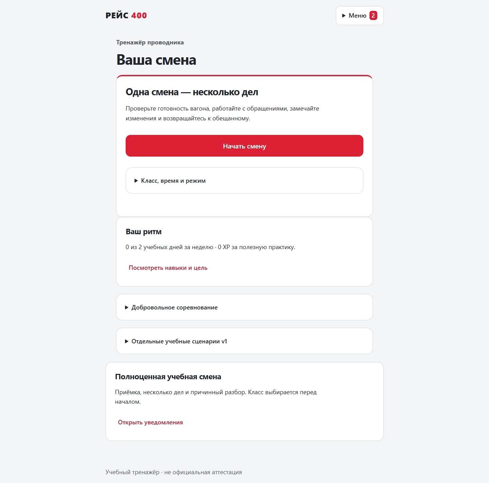

# РЕЙС 400

> [Играть в опубликованную v2](https://mt-hackathon.realeurguy.chatgpt.site) · [как собрать, обновить и проверить развёртывание Sites](docs/SITES-DEPLOYMENT.md). Sites выполняет настоящий движок игры с постоянным хранением в D1; Node.js остаётся локальным вариантом запуска. Обновление GitHub само по себе не публикует сайт.

Интерактивная обучающая игра для проводников ВСМ. **Версия 2.1: полноценная серверная смена**, два параллельных дела, самостоятельное обнаружение проблемы, адресные задачи, передача коллеге, отложенные последствия и причинный разбор. Есть две содержательные формы, четыре класса обслуживания и отдельные XP/недельные соревнования. Пять прежних модулей v1 сохранены в отдельном разделе.

**Для хакатона и демонстрации на синтетических данных. Не является системой официальной аттестации.** Численные правила и профессиональная рубрика требуют проверки заказчиком. Разработка выполнена с помощью ИИ; команде необходимо самостоятельно изучить код перед защитой.



### Полноценная смена — задача 08 / #26

Основная страница / запускает реальный движок shift-2, а не локальный макет. Приёмка → обзор вагона → короткая сцена → последствия → возвращение к другим делам → итог всей смены. Прогресс, таймеры и отправленные команды восстанавливаются после перезагрузки. Сохранены крупные элементы и красно-белая палитра, утверждённые в #24.

[Что реализовано, источники, четыре демонстрационных маршрута и проверки](docs/IMPLEMENTATION-08.md) · [API v2](docs/API-V2.md) · [OpenAPI](docs/openapi.json).

/preview.html остаётся явно помеченным архивным UX-прототипом без серверных наград; для игры он не нужен. Автоматические проверки не заменяют пользовательскую приёмку #27 и методическую проверку перевозчиком.

## Запуск за минуту

Нужен **Node.js 24**. Установка npm-пакетов для самой игры не требуется.

```sh
git clone https://github.com/RomaGrach/mt-hackathon.git
cd mt-hackathon
node server.mjs
```

Откройте **http://127.0.0.1:3000**. Нажмите «Начать тренировку»: учебное имя и бригада по умолчанию заданы автоматически; бригаду можно изменить в раскрываемом разделе. Затем нажмите «Начать смену». Класс, время и режим можно изменить в раскрываемом блоке; обычная практика доступна без рейтинга. Репозиторий приватный: для клонирования нужен доступ GitHub.

SQLite создаётся автоматически в `data/reis400.sqlite`. Обновление страницы и перезапуск сервера не обнуляют прохождение или таймер. Остановить сервер — Ctrl+C.

### Docker

```sh
docker compose up --build -d
```

Тот же адрес: **http://127.0.0.1:3000**. Данные сохраняются в именованном томе `game-data`. `docker compose down` останавливает игру без удаления данных; `docker compose down -v` также удаляет базу. Dockerfile работает от непривилегированного пользователя, образ не содержит документов исследования, секретов или дампов базы.

### Параметры

Скопируйте `.env.example` в `.env` и запускайте `node --env-file=.env server.mjs`. Для запуска по умолчанию файл не нужен.

| Переменная | Назначение |
|---|---|
| PORT / HOST | По умолчанию 3000 / 127.0.0.1 |
| DB_PATH | Путь к постоянной SQLite-базе |
| HR_API_KEY | Ключ не короче 32 символов; пустое значение отключает внешний API |
| PUBLIC_ORIGIN | Внешний origin, например https://training.example.org, без завершающего слеша |
| COOKIE_SECURE | true за HTTPS-прокси |
| NODE_ENV | При production проверяется наличие HTTPS-origin и Secure-cookie |

Ключ для интеграции генерируется локально: `node -e "console.log(require('node:crypto').randomBytes(32).toString('hex'))"`. Не помещайте ключ в код браузера, Git или скриншоты. HTTPS-прокси и корпоративная авторизация не входят в локальную демоконфигурацию.

## Что есть в игре

**Сквозная смена:** проверка готовности вагона; обращение у мест 18–19; независимая ситуация в салоне; осмотр; ожидание подтверждения коллеги; выполнение обещанного возврата конкретному пассажиру. Обращение, принятие передачи и исполнение не подменяют друг друга. За чтение и переключение дел рабочие шаги не расходуются.

Раннее обнаружение предотвращает ухудшение. При позднем обнаружении открывается срочная сцена; таймер начинается вместе с её описанием и вариантами, а не во время чтения предыдущего feedback. Доступны 20 секунд, расширенные 200 секунд и режим без времени. В обучении подсказка/пауза сохраняют остаток; в проверке помощь не предлагается. Критическая ошибка запрещает зачёт, даже если остальные дела решены успешно.

**Разбор и навыки:** лояльность, безопасность, семь проверяемых критериев, история причин и альтернатив, точное воспроизведение и новая тренировка от любой собственной рабочей развилки. Разные режимы/варианты/классы не смешиваются в доказательствах навыка; untimed не означает нулевой навык своевременности.

**Мотивация gamification-1:** опыт практики XP и уровень не сгорают; полезный разбор полного прохождения даёт до 20 XP за семейство в неделю, ветка — 10 с возможностью добрать до 20. Один реальный недельный пакет, добровольное участие, две попытки, лучший сопоставимый результат до 100 СП. Неделя — по Москве. Есть три области рейтинга, отдельные потоки новичков/основной практики/возвращения, честное отсутствие мест при малой группе, личная цель 1/2/3 дня и пауза без обнуления истории, четыре постоянных достижения, следующая практика и редкие уведомления.

Прежние сценарии v1 — спор о месте, организация помощи, внеплановая остановка, бистро, багаж — остаются доступными. Их история, старые уровни, награды и рейтинги показаны отдельно: прежние points не добавляются к новым XP/СП. Все показатели учебные, не оценка профессиональной пригодности.

## Проверки

```sh
node --test tests/*.test.js
node scripts/validate-scenarios.mjs
node scripts/shift-content.mjs validate
node scripts/check.mjs
```

Для браузерных проверок:

```sh
npm ci
npx playwright install chromium
npm run test:e2e
```

На Linux перед первым запуском может потребоваться `npx playwright install --with-deps chromium`. Проверки создают отдельную базу в памяти, не трогают рабочие профили. Для установленного Edge: `BROWSER_CHANNEL=msedge npm run test:e2e`; в PowerShell сначала `$env:BROWSER_CHANNEL='msedge'`. Результаты проверок и их границы — [QA](docs/QA.md).

Эталонные проверки проектных правил мотивации: `node docs/examples/validate-gamification-rules.mjs`. Они проверяют формулы и ограничения документа, не production-движок, миграцию или UI.

## Документация и сдача

| Материал | Что проверить |
|---|---|
| [Соответствие заданию](docs/REQUIREMENTS.md) | Все 9 функций, ограничения и обязательные артефакты |
| [Реализация #26](docs/IMPLEMENTATION-08.md) | Демонстрация, классы/источники, миграция, оператор, матрица runtime-проверок |
| [Архитектура](docs/ARCHITECTURE.md) | Диаграммы, транзакции, хранение, путь масштабирования |
| [API v2](docs/API-V2.md) / [legacy API](docs/API.md) / [OpenAPI](docs/openapi.json) | Контракты, примеры, интеграция HR/LMS/учёта баллов |
| [Пользовательский путь](docs/USER-FLOW.md) | Пошаговая демонстрация и варианты исходов |
| [Передача команде](docs/TEAM-HANDOFF.md) | Как менять ветки, оценки и достижения; вопросы для защиты |
| [Источники](docs/SOURCES.md) | Какие материалы использованы и что является авторской моделью |
| [Правила мотивации](docs/GAMIFICATION-RULES.md) | Выбранная модель gamification-1: формулы, антифарм, периоды, три рейтинга, пользовательские циклы и изменения для #26 |
| [Исследование Duolingo](research/duolingo-mechanics.md) | Фактическая база #22; механики, эксперименты, ограничения и неизвестные параметры |
| [Раннее исследование удержания](docs/10-retention-gamification.md) | Архив рекомендаций; актуальный выбор механик определён в GAMIFICATION-RULES, а не этим перечнем идей |
| [Q&A экспертов 25.09](research/qa/2026-09-25-qa-summary.md) | Выжимка ответов экспертов; рядом полная транскрипция с таймкодами |
| [Исходные материалы заказчика](materials/) | Задание и датасет, добавленные командой |
| [Ограничения и развитие](docs/LIMITATIONS.md) | Что нельзя заявлять как готовое производственное внедрение |

`GET /api/health` проверяет доступность сервера и БД; `GET /api/openapi.json` отдаёт описание API. Для жюри ссылка на этот репозиторий вместе с инструкцией локального запуска является воспроизводимым прототипом. Отправку формы на платформе хакатона команда выполняет самостоятельно.

### О старом прототипе и статическом хостинге

Предыдущая браузерная версия сохранена в истории Git. Полная игра **требует backend**. `npm run build:site` собирает только frontend в `dist/`; его нужно обслуживать с соответствующим сервером по `/api` на том же origin. Старый сайт на статическом хостинге не обновляется автоматически этим коммитом и не является адресом новой серверной игры.

Исследовательские материалы `docs/01-…09-…`, `research/` и `planning/` сохранены. Это исторические материалы подготовки; при расхождениях реализация и матрица требований этой версии опираются на полученное полное задание, а не на ранние гипотезы.
