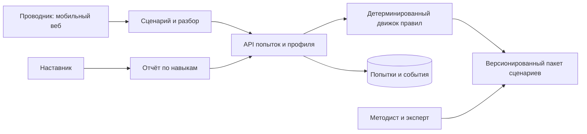

# 07 · MVP и технический план

[← Главная](../README.md)

**Статус: предварительная спецификация и локальный прототип от 24.09.2026.** Код прототипа создан до открытия полного ТЗ для проверки игрового цикла. Окончательные требования, зависимости, рубрика и версии фиксируются после получения полного ТЗ. Технический выбор ниже не объявлен обязательным стеком организаторов.

## Граница первой версии

| Приоритет | Объём | Проверяемый результат |
|---|---|---|
| MUST | Один законченный сервисный сценарий с несколькими исходами | Не менее двух существенно разных маршрутов; действие влияет на дальнейшие события |
| MUST | Таймер в отмеченных узлах, две шкалы, запрет зачёта при критической ошибке | Переход по таймауту определён; опасный маршрут нельзя компенсировать сервисными баллами |
| MUST | Разбор маршрута и повтор ключевой развилки | Пользователь видит причину оценки и отличие альтернативы |
| MUST | Учебный профиль, история, достижения, таблица лидеров | Данные сохраняются; повтор не даёт бесконечный опыт; тестовые записи явно помечены |
| MUST | Мобильный интерфейс и надёжный запуск демо | Основной маршрут работает на телефоне и ноутбуке; есть инструкция и резервная запись |
| MUST | Версионируемый контент и журнал решений | Для попытки восстанавливаются сценарий, рубрика и последовательность действий |
| SHOULD | Ещё два коротких кейса | Добавляются только после готовности основного и проверки материалов |
| SHOULD | Простой отчёт наставника и импорт пакета сценариев | Ошибки видны по компетенциям; не нужен универсальный визуальный редактор |
| COULD | Кэширование сценариев для офлайна | Офлайн-результат не выдаётся за защищённый официальный зачёт |
| WON’T | VR/полный 3D-вагон, голосовой ИИ, генеративная проверка безопасности, настоящая система лояльности, корпоративная LMS/SSO | Не отвлекают от обязательного сценарного цикла |

При нехватке времени убираем дополнительные кейсы и визуальные эффекты, **не** нелинейность, последствия, профиль/достижения/рейтинг из публичного брифа и обязательный разбор.

## Предлагаемая архитектура

Один репозиторий, один небольшой сервис, без микросервисов. Базовый вариант: **TypeScript; React + Vite для интерфейса; Node.js + Fastify для API; SQLite для прототипа**. Это предложение для команды с пока неизвестным стеком; после проверки компетенций допустима эквивалентная реализация. Офлайн-кэш и PWA — дополнительный слой, а не условие работоспособности первой версии.

Реализованный предварительный прототип проще: HTML/CSS/JavaScript без внешних пакетов, локальный Node HTTP-сервер и `localStorage`. Он проверяет игровой цикл, но не предоставляет серверный API, общую базу и защищённый рейтинг. Решение о стеке конкурсной версии принимается после полного ТЗ.

Диаграмма — план компонентов, не реализованные интеграции. LLM не находится на пути оценивания действия. Сервер не получает весь экспорт Telegram или иные исследовательские материалы.

## Договор о данных

**Scenario:** идентификатор, версия, заголовок, аудитория, режимы, компетенции, источник и его версия, статус проверки, автор/проверяющий, стартовый узел, список узлов. **Node:** ситуация, допустимые действия, лимит времени при наличии, переход при таймауте. **Choice:** следующий узел, эффекты на шкалы и навыки, отложенное событие, флаг критической ошибки, объяснение и ссылка на правило. **Attempt:** псевдоним ученика, версия сценария/рубрики, режим, начало/конец, события, итог.

Это целевая схема. Текущий прототип использует упрощённые модули `src/scenarios.js`, `src/game.js` и локальное хранение; серверные контракты, валидатор пакета и экспертная проверка ещё не реализованы. Демонстрационные тексты написаны до получения полного ТЗ, их происхождение и статус нужно явно указывать при сдаче.

Перед публикацией пакета проверяем уникальность идентификаторов, наличие всех переходов, достижимость окончаний, отсутствие непреднамеренных циклов, определённость таймаутов и наличие объяснения для оцениваемых действий. Если сценарий отозван, новые попытки по нему не начинаются; старые результаты сохраняют версию.

## API — план минимальных контрактов

`GET /scenarios` — список разрешённых сценариев; `POST /attempts` — создать попытку; `POST /attempts/{id}/actions` — записать допустимое действие; `GET /attempts/{id}/debrief` — результат и разбор; `GET /profile` — личный прогресс; `GET /leaderboard` — сопоставимый учебный рейтинг; `GET /trainer/report` — отчёт с проверкой роли.

Повторная отправка действия с тем же идентификатором не начисляет очки дважды. Сервер проверяет текущий узел и разрешённый переход, а не принимает итоговый балл от клиента. Прототипная авторизация и демонстрационные пользователи описываются честно: демо-вход не называем корпоративным SSO. Для локального режима явно показываем, что результат не защищён от изменения пользователем и не подходит для аттестации.

## Приёмка

| Тест | Условие готовности |
|---|---|
| Развилки | Каждая заявленная концовка достижима; неверный переход отклоняется |
| Безопасность | Любая помеченная критическая ошибка исключает успешный зачёт, независимо от доверия и XP |
| Таймер | Таймаут и пограничное нажатие дают один переход; поведение фоновой вкладки определено |
| Повтор / двойной запрос | Одно событие учитывается один раз, достижения не дублируются |
| Версии | Разбор старой попытки не пересчитывается молча по новой рубрике |
| Сохранение | Перезагрузка не уничтожает завершённую попытку и профиль |
| Рейтинг | Разные сценарии, версии, режимы и подсказки не сравниваются без явно заданной политики |
| Приватность | Ученик не читает чужую детальную попытку; наставник видит только свою группу |
| Интерфейс | Нет обрезанных кнопок и горизонтальной прокрутки на целевом телефоне; текст читаем, фокус виден |
| Демо | Запуск с чистой машины по инструкции; тест на отключение внешних AI/API; доступ для жюри проверен |

## Что сдаём — наш подготовительный чек-лист

Рабочий прототип и разрешённый доступ; репозиторий/архив с закреплённой версией; README запуска; объяснение архитектуры и рубрики; демонстрационное видео; презентация; ограничения; реестр лицензий, данных и ранее созданных материалов; план пилота. Поля и форматы уточняются **по полному ТЗ**, этот список не заменяет требования платформы. [S2 §8.7; S3 №964]

**Нельзя включать в сдачу:** сырой чат с персональными данными, токены, внутренние документы без разрешения, неутверждённые медицинские инструкции и неподтверждённые результаты тестов. См. [правила](09-risks-and-rules.md).
