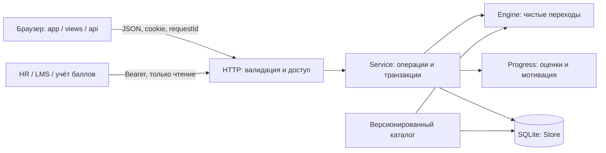
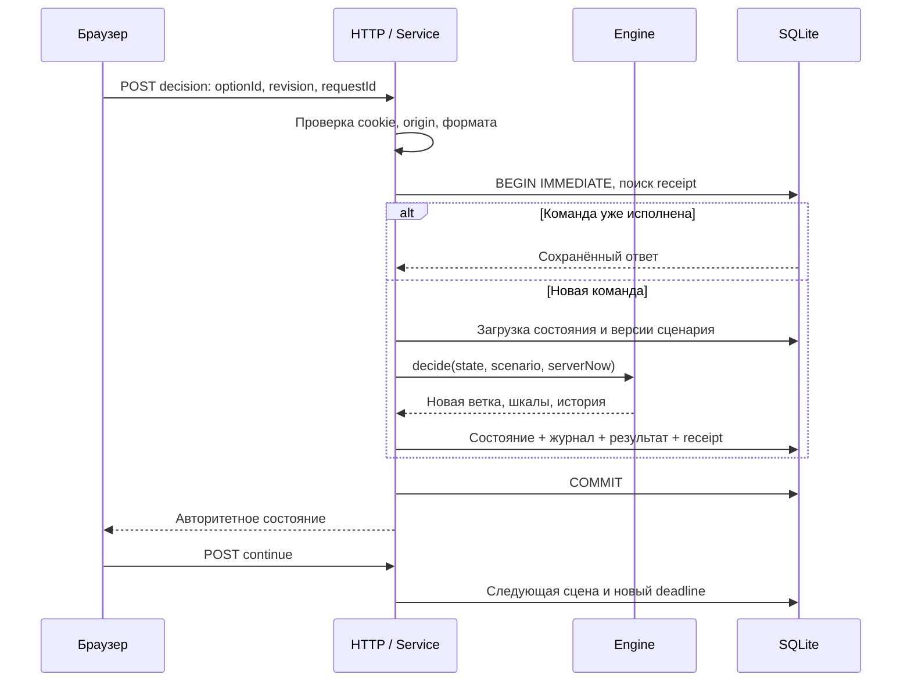

# Архитектура РЕЙС 400

## Компоненты

Frontend не считает итоговые баллы и не отправляет таймер, флаги или шкалы. Он отправляет только выбранное действие, ожидаемую ревизию и идентификатор команды. В текущей сцене браузер получает текст доступных действий, но не ключи правильных ответов и будущие переходы. История уже принятых решений доступна для обучения.

## Последовательность решения

## Инварианты

`decision → feedback → decision/result`. Во время чтения обратной связи следующий таймер ещё не запущен. Дедлайн хранится как абсолютное серверное время. При `now >= deadline` побеждает таймаут, даже если в запросе есть обычный вариант ответа. Фоновый проход раз в секунду, чтение попытки и bootstrap применяют просроченные таймеры. После рестарта сохранённая просрочка обрабатывается по тем же правилам.

Каждая команда вместе с ответом сохраняется в одной транзакции. Повтор с тем же `requestId` возвращает тот же ответ; другое содержимое с таким ключом даёт 409. Повтор со старой ревизией не делает второй переход. Результат имеет уникальный `run_id`, поэтому просмотр финала не начисляет награду повторно.

Критическая ошибка фиксируется до конца попытки. Практика никогда не изменяет постоянный рейтинг. Шкалы ограничены 0–100; в истории показано фактическое изменение после ограничения. Компетенции считаются относительно доступных в данной сцене наблюдений, а не произвольного максимума другого маршрута.

## Данные

| Таблица | Содержание |
|---|---|
| profiles / sessions | Синтетический псевдоним, учебная группа; хеш токена сессии и срок |
| scenarios | Неизменяемый документ каждой пары id/version |
| runs | Текущее состояние, фаза, deadline, revision |
| results | Единственный итог каждой завершённой попытки |
| events | Старт, выбор, таймаут, продолжение, финал, переигрывание |
| notices / bonuses | Уведомления, отметки чтения и сроки сезонных бонусов |
| requests | Ответы для идемпотентного повтора, срок хранения 7 дней |

SQLite использует WAL, внешние ключи и транзакции. Удаление профиля каскадно удаляет его данные. Историю сценария нельзя незаметно заменить под прежней версией: запуск отклонит такую публикацию. Смена версии не ломает старую активную попытку, потому что она использует сохранённый снимок.

## Масштабирование

Текущая поставка — **один процесс и локальная SQLite**. Её нельзя объявлять готовым горизонтально масштабированным кластером. Функции движка независимы от HTTP, процесс не хранит игровые сессии в памяти, данные изолированы адаптером Store.

Для нескольких backend-реплик потребуются PostgreSQL, асинхронный адаптер хранения, транзакционные блокировки строк/условные UPDATE по revision, общий rate limiter и координация фоновой обработки. SQL в Service/Progress также нужно адаптировать и прогнать конкурентные тесты. Фронтенд может обслуживаться отдельно уже сейчас при проксировании `/api` на тот же origin. SQLite-файл нельзя делить между машинами через сетевую папку.

Для резервной копии локальной демонстрации остановите сервер и сохраните каталог data целиком. Для живого production-бэкапа нужен согласованный механизм SQLite backup и проверка восстановления; простое копирование открытого файла не рекомендуется.
