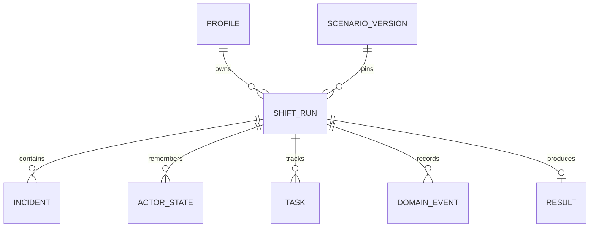

# РЕЙС 400 — минимальная предметная модель и контракт v2

[Gameplay](GAMEPLAY.md) · [ADR-001](adr/001-two-level-text-shift.md) · [План изменений](GAMEPLAY-HANDOFF.md) · [JSON-примеры](examples/shift-v2-contract.json)

**26.09.2026 · решение #21 · `schemaVersion: 2`, `engineVersion: shift-2`.** Нормативный контракт для будущей реализации #26, не описание уже доступного API. Существующий API и попытки v1 остаются отдельными. Источники требований — [SPECIFICATION](SPECIFICATION.md), [REQUIREMENTS](REQUIREMENTS.md); базовый исследованный код — `42ee32d456fc8a6627a6239e9134b66a36dfbd95`.

## 1. Словарь: что действительно является сущностью

| Понятие | Решение и идентичность | Что хранится / связь |
|---|---|---|
| Profile | Существующий агрегат профиля | Владелец попыток; не переименовываем в Passenger. |
| ScenarioDefinition | Неизменяемая опубликованная версия содержания | `scenarioId + contentVersion`; стадии, варианты, локальные графы, определения событий, рубрика, служебные политики, ссылки на источники. |
| ShiftRun | Единственный новый игровой агрегат; физически существующая запись `runs` | `runId`, владелец, закреплённые версии, весь мир попытки, revision, журнал. Другие игровые объекты изменяются только в его транзакции. |
| Incident | Вложенная сущность с собственным жизненным циклом | `incidentId` уникален внутри run; участники, обнаруженность, статус, срочность, локальная сцена, передача. Два таких объекта могут существовать одновременно. |
| ActorState | Вложенная сущность только при адресной памяти | `actorId` внутри run, роль `passenger/crew`, синтетическая подпись, раскрытые факты. Участвует в нескольких событиях/инцидентах. |
| Task | Вложенная сущность рабочего дела игрока | `taskId`, `type`, `status`, `source`, опциональные `incidentId/actorId/dueStep`, обязательность и причинные события. Task может появиться из распорядка стадии, Incident, обещания или DomainEvent. |
| DomainEvent | Неизменяемая запись журнала | `runId + seq`; причина, серверное время, шаг, изменения, версия и связи с действием/другим событием. |
| Result | Существующая итоговая запись, одна на run | Неизменяемый итог: критерии, шкалы, причины, группа сравнения и ограничения режима. |

**Отдельный Passenger как глобальная таблица/AI-агент не нужен.** Нужен маленький ActorState для пассажира p1: последующее действие должно проверить, кому обещан возврат и выполнен ли он. Без этого глобальный `promised=true` ошибочно засчитает разговор с p2. Пассажир, который только произнёс одноразовую реплику, может остаться контекстом сцены; его не превращаем в сущность автоматически. Память не переносится между попытками и не содержит реальных ФИО/контактов.

**Не создаём отдельные агрегаты:** `Shift` как ещё один дубликат ShiftRun; `Wagon` как симуляцию оборудования; `TaskQueue` как отдельную сохраняемую копию инцидентов; `SceneRun` как вторую попытку; `Participation` как SQL-таблицу. Вагон/зона/класс — значения контекста. Очередь известных дел — производное представление `tasks`, отфильтрованных по видимости и нетерминальному статусу; отдельный `TaskQueue` не сохраняется. Связь участников — `actorIds`. Локальная сцена — `sceneId` внутри конкретного Incident. Передача, наблюдение, снимок, рубрика и часы — структуры-значения.

Диаграмма логическая, не требование создать семь новых таблиц. В MVP Incident, ActorState, Task, observations, flags и scheduler помещаются в транзакционно сохраняемый JSON `runs.state`. Журнал и уникальные результаты/квитанции обеспечиваются хранением; см. §8.

## 2. State: обязательные поля и инварианты

| Поле ShiftRun | Тип/смысл |
|---|---|
| `schemaVersion`, `engineVersion` | `2`, `shift-2`; выбирают сериализацию и reducer. |
| `id`, `profileId` | Идентификаторы попытки и владельца. `profileId` не берётся из команды клиента. |
| `scenarioId`, `contentVersion`, `rulesVersion` | Неизменяемые версии содержания и рубрики; ссылка на сохранённые байты и их hash. |
| `variantId`, `variantSelection` | Принятый вариант и способ выбора. В MVP выбор из конечного списка; `seed: null`, `algorithm: authored-selection-v1`. Seed появится только вместе с версией PRNG, когда она действительно используется. |
| `mode`, `timingPolicy` | `training/assessment`; закреплённая политика `standard/extended/untimed` с `durationMs`. Нельзя менять через произвольный PATCH состояния. |
| `status` | `active/completed/aborted`; completed означает, что итог рассчитан, а не обязательно получен зачёт. |
| `phase`, `stage` | `briefing/overview/scene/feedback/paused/result`; `inspection/service`. |
| `revision` | Целое от 0; увеличивается на 1 на каждый успешно зафиксированный пакет изменений мира. Не совпадает с номером рабочего шага или события. |
| `step`, `maxSteps` | Целые шаги моделирования; в примере 0..16. |
| `context` | `wagonId`, `zoneId`, `serviceClass`, `servicePolicyId`; не отдельные сущности. |
| `inspection` | `pending/passed/skipped`, событие проверки. Пропуск приёмки не маскируется поздним получением служебного факта. |
| `focusIncidentId` | Один раскрытый нетерминальный Incident либо null. Фокус не меняет статус остальных дел. |
| `actors`, `incidents`, `tasks` | Объекты по ID; все ссылки и `Task.source` проверяются валидатором. |
| `observations`, `flags` | Разделённые знания игрока и скрытая истина/служебные флаги. |
| `scales`, `criteria`, `criticalErrors` | Обе шкалы, доказательства уникальных критериев, необратимые в пределах run критические ошибки. |
| `scheduledEvents`, `criticalWindow` | Будущие логические события и не более одного pending/open/suspended окна. Только сервер. |
| `feedback`, `resumeState` | Последствия текущего перехода и данные явной учебной паузы. |
| `createdAt`, `updatedAt`, `lastObservedServerAt`, `finishedAt` | Серверные миллисекунды Unix; `finishedAt` до результата null. |
| `lastEventSeq`, `origin` | Последовательность журнала; origin новой практики либо null. |

Все структуры версионируются. В реальном сохранении обязателен `initialSnapshot` плюс закреплённые bytes/hash содержания и правил; рабочий `state` является восстановимым checkpoint. JSON в examples показывает checkpoint и отдельные команды/ожидаемые трассы, **не полный опубликованный сценарий и не самодостаточный архив replay**.

### Состояние инцидента

`discovery: hidden/revealed`; `status: open/waiting/resolved/failed`; `severity: routine/urgent/critical`. До активации стадии инцидент вообще не создан; дополнительный enum dormant не нужен. Скрытый инцидент может уже быть `open`, но не может стать `focusIncidentId`.

| Переход | Условие / эффект |
|---|---|
| Не существует → hidden/open | Активация стадии или заранее определённое событие. |
| hidden → revealed | Рабочее наблюдение либо видимый вынужденный сигнал; сохраняется, какое событие раскрыло факт. |
| open → waiting | Запрос внешнего действия; идентификатор запроса и ожидаемый ответ закреплены. |
| waiting → open | Отказ/истечение ожидания с доступным дальнейшим действием; не исчезновение задачи. |
| open/waiting → resolved | Сценарный предикат результата выполнен и есть подтверждающее событие. |
| open/waiting → failed | Явный неуспешный исход, timeout критического окна либо закрытие на лимите шагов. |

Terminal Incident не открывается снова в MVP. Позднее связанное происшествие — новый Incident с `causedByEventId`, но оно не входит в двухинцидентный демонстрационный срез. Старое событие ухудшения проверяет terminal-guard и становится `event_skipped`, не штрафом.

### Передача и задачи

`handoff.status = none/requested/accepted/declined/completed`; дополнительно `requestId`, `recipientActorId`, `requestedAtStep`, `ackEventId`, `completionEventId`. Подтверждение принимается только для того же requestId и допустимого текущего статуса. Дубли, ответ на старый запрос и ответ после завершения не дают награду. Положительный ack переводит requested → accepted, **не** Incident → resolved. Условие completed — отдельная проверка/событие исполнения.

**Отдельной сущности Commitment больше нет.** Обещание — это причина появления рабочего дела. Когда игрок говорит «вернусь к вам», reducer создаёт обычный `Task` с `type: promise` и `source.type: promise`. За счёт `source.actorId` и `source.eventId` финальный разбор по-прежнему знает, кому и когда было дано обещание, но параллельной модели обязательств не возникает.

`Task.status = open/in_progress/waiting/completed/failed`. Минимальные поля: `type`, `label`, `mandatory`, `source`, опциональные `incidentId`, `actorId`, `dueStep`, `createdByEventId`, `completedByEventId`, `breachedByEventId`. Нарушение срока **не обязано закрывать Task**: задача может остаться открытой, получить `breachedByEventId`, а затем быть выполнена поздно; штраф/разбор применяются один раз. Выполнение на самом `dueStep` допустимо, потому что действие игрока применяется раньше проверки срока.

`Task.source.type` в MVP: `stage` — штатная работа/приёмка; `incident` — дело, возникшее из ситуации; `promise` — адресное обещание; `event` — новое дело из события мира. Таким образом, Incident отвечает на вопрос «что происходит?», а Task — «что игроку нужно сделать?». Один Incident может последовательно породить несколько Task; Task может существовать без Incident, например приёмка вагона.

**Время тратит не Task, а Action.** Наличие задачи само по себе не двигает часы. Рабочее действие по задаче обычно имеет `costSteps: 1`; чтение, открытие списка дел и переключение фокуса — 0. Это позволяет показывать игроку динамический список дел, не превращая интерфейсную навигацию в профессиональную скорость.

Отдельный `Schedule`-агрегат не вводится. Распорядок задаётся стадиями ScenarioDefinition и создаваемыми ими Task; будущие изменения мира по-прежнему живут в `scheduledEvents`. Поэтому «приёмка → обслуживание → завершение» и события на шагах образуют расписание смены без второй копии состояния.

## 3. Автомат попытки и локальные графы

Создание run даёт `active/briefing`, step=0. `begin` переводит к сцене приёмки без шага. Первое рабочее решение завершает либо пропускает приёмку, переводит stage в service и создаёт A/B. Любое обычное рабочее действие заканчивается `feedback`; `continue` открывает overview или следующую локальную сцену, а при ожидающем критическом сигнале — только критическую сцену. Открытие/смена фокуса разрешено из overview/scene, но не во время обратной связи или открытого критического окна.

Локальные сцены сохраняют ациклический граф. Локальный terminal-узел означает выход к контроллеру смены: «задача решена», «ждём подтверждения» или «нужно вернуться». Это **не** окончание всей попытки. `nextSceneId` не может ссылаться на глобальный hub. Возвраты между инцидентами реализует контроллер по сохранённым cursor/state, а не цикл в существующем `validateScenario`.

`finish` из overview разрешён после терминализации всех обязательных инцидентов и обязательных Task; незачёт тоже можно завершить. Предикат `passed` проверяется отдельно по GAMEPLAY §7. На шаге maxSteps сервер после событий закрывает оставшиеся дела как failed, просроченные Task фиксируются через `breachedByEventId` и создаёт результат. Такие автоисходы имеют причины `step_limit`, не маскируются обычным успешным завершением. `abort` сохраняет незачёт и историю без награды. Эти пути завершаются `phase: result`; итог не ждёт ещё одного клика ради сохранения.

## 4. Такты, порядок событий и серверное окно

### 4.1. Порядок одной рабочей команды

После проверки владельца, квитанции, актуального срока и revision (§7) сервер:

1. Проверяет текущую фазу, ID сцены/инцидента/окна и guard действия.
2. Применяет локальные эффекты действия, наблюдения, изменения критериев и шкал; записывает причинное событие.
3. Увеличивает step на `costSteps: 1` ровно один раз. Навигационные команды имеют 0 и не запускают новый логический шаг.
4. Выбирает наступившие scheduledEvents и обрабатывает по `(dueStep, priority, eventId)`, проверяя guard по **текущему** состоянию после действия и предыдущих событий.
5. Создаёт feedback; при необходимости ставит criticalWindow в pending, но пока не выдаёт варианты/таймер.
6. Проверяет предел шагов и terminal-условия; сохраняет весь пакет, журнал и квитанцию атомарно, revision +1.

Порядок при одинаковом dueStep: `10` — подтверждение передачи; `20` — изменение/эскалация инцидента; `30` — срок Task; `40` — служебное завершение стадии. При одинаковом priority eventId сравнивается лексикографически по ASCII. Это технический порядок, **не подсказка правильного профессионального приоритета**. Сценарий может задавать эти фиксированные категории, но не выполнять произвольный JS.

Новые scheduledEvents должны иметь dueStep > текущего step в момент постановки. Мгновенные эффекты выражаются в текущем пакете, а не бесконечной цепочкой событий «сейчас». Guard-false записывается как внутренний пропуск без публичного раскрытия скрытого события. Повторная доставка eventId не исполняется. Ожидание (`wait`) — явное рабочее действие без автоматической награды. Осмотр того же факта может стоить шаг, но не повторно начислять критерий.

Чтение обычной сцены или feedback не продвигает логическое время. Обычные события никогда не имеют отдельного wall-clock срока. Поэтому причинность не зависит от частоты poll и быстроты чтения. В MVP нет смешанной непрерывной симуляции.

### 4.2. Критическое окно

`criticalWindow` содержит `id`, `incidentId`, `sceneId`, `status: pending/open/suspended`, `durationMs`, `openedAt`, `deadline`, `remainingMs`, `activeElapsedMs`, `causeEventId`. Закрытое окно удаляется из текущего поля, но целиком сохраняется в журнале. Не бывает двух pending/open окон одновременно. Контент с конфликтующим вторым окном отклоняется валидатором; runtime при нарушении не выбирает произвольно более «важное».

Из pending команда `continue` атомарно раскрывает критические наблюдения/варианты, переводит в open и выставляет абсолютный deadline. До этого клиент знает лишь, что после продолжения будет новый сигнал, но не получает скрытые варианты. Дополнительной клиентской команды «я прочитал, теперь запускай» после выдачи вариантов нет. При `untimed` сцена всё равно получает отдельный фокус, но deadline=null; критерия реального срока нет.

Пока окно open, разрешены только выбор в этом окне, учебная пауза/подсказка, abort и чтение состояния. Обычная навигация/ожидание/работа по другому инциденту запрещены. Выбор либо timeout закрывает окно и расходует один шаг; логические события нового шага затем обрабатываются обычным порядком. Новое окно в том же пакете не стартует автоматически поверх feedback.

Для решения учитывается серверный `acceptedAt` — время после получения блокировки транзакции, до вычисления перехода. При `acceptedAt >= deadline` побеждает timeout. Присланный клиентом час, задержка JS и дата на устройстве не влияют на исход. HTTP-arrival и время обработки можно логировать отдельно, но не вычитать из результата задним числом. Запрос, пришедший до deadline, но принятый сервером после него, может опоздать: это известная граница серверной оценки, требующая измерения в #27, а не доказательство недостатка профессионального навыка.

Наблюдаемое серверное время не должно уменьшаться: `acceptedAt = max(clock(), lastObservedServerAt)`. Новое значение сохраняется при переходе. Реальная синхронизация часов и проверка скачков остаются эксплуатационной ответственностью #26/#27; при подтверждённом техническом инциденте результат маркируется `technicalIssue`, не выдаётся за достоверное измерение реакции и не допускается в сравнение.

### 4.3. Пауза и восстановление

В training команда pause сначала проверяет deadline. Если срок ещё действует, сохраняет `remainingMs = deadline - acceptedAt`, activeElapsed текущего сегмента, resumePhase и suspend-статус; deadline становится null. Resume задаёт новый deadline = now + remainingMs, не новую полную длительность. Повторы pause/resume защищены квитанциями. История хранит все сегменты, подсказки и адаптацию. В assessment pause/hint запрещены; адаптация времени выбирается только до старта.

Фон вкладки/сворачивание/потеря сети не создают pause. После restart сервер сначала восстанавливает pinned-сценарий и snapshot; если открытый deadline истёк — фиксирует timeout один раз, затем отдаёт актуальную фазу и причину изменения. Если была подтверждённая учебная пауза — сохраняет остаток без штрафа. Если окно было pending — не запускает его без continue. Если фаза была обычной — шаг не меняется из-за прошедших часов.

## 5. Авторинг: что должно быть в версии сценария

Неизменяемый пакет: метаданные; stage definitions; список проверенных variants; контекст/политики классов; initial state factory с сохранённым результатом; definitions инцидентов/участников; локальные DAG; наблюдения; guards; эффекты; scheduler definitions; критические окна; terminal predicates; rubric/acceptable-action groups; provenance/reviewStatus. В MVP без eval/LLM/внешней случайности; это декларативные данные и конечный список поддержанных эффектов.

Минимальные эффекты: `setFlag`, `revealObservation`, `setIncidentStatus`, `setSeverity`, `requestHandoff`, `ackHandoff`, `completeHandoff`, `createTask`, `updateTask`, `completeTask`, `breachTaskDeadline`, `scheduleEvent`, `addScaleDelta`, `recordCriterion`, `recordCriticalError`, `queueCriticalWindow`. Их типы/параметры валидируются. Свободный текст объяснения не исполняется как условие. Медицинские/аварийные правила не сочиняются генератором.

Валидатор публикации проверяет уникальность ID и ссылки; стадии/достижимость DAG; существование timeout для timed-окна; хотя бы одно допустимое безопасное действие в каждом достижимом критическом состоянии; отсутствие платного ограничения необходимой помощи; верхний предел двух актуальных инцидентов и одного окна; отсутствие событий на текущем/прошлом шаге при постановке; отсутствие ожидающего окна, порождаемого на maxSteps; достижимость завершения всех проверенных вариантов; terminal-guards; типы/границы дельт; невозможность повторного начисления критерия; provenance и содержательные отличия классов. Нельзя объявить эти проверки реализованными по наличию этой спецификации.

`servicePolicyId` выбирает набор подтверждённых условий класса. Хранение поля `serviceClass` само по себе не закрывает REQ-Q04. Неизвестные правила могут оставаться только draft; публикация в качестве регламентного контента требует источника и проверки. Для синтетического showcase отдельная явная маркировка, без заявлений об официальной оценке.

## 6. Новая поверхность API и публичная проекция

**Будущие маршруты v2:**

| Маршрут | Запрос / результат |
|---|---|
| `POST /api/v2/runs` | `{requestId, scenarioId, mode, timingPolicyId, variantId?}`; variantId разрешён при training или специальном синтетическом demo-access. Сервер создаёт briefing и возвращает PublicRun. |
| `GET /api/v2/runs/:id` | Проверяет владельца, согласует истёкшее окно, возвращает PublicRun + serverNow. |
| `POST /api/v2/runs/:id/commands` | `{requestId, revision, command}`; возвращает `{receipt, run}`. |
| `GET /api/v2/runs/:id/result` | Только завершённая попытка владельца; причинный разбор без секретов сервера. |
| `POST /api/v2/runs/:id/replay` | `{requestId, originEventSeq}`; новая training-попытка, не изменение исторического результата. |

Сохраняем транспортные имена `requestId` и `revision` из текущего проекта. Термин commandId из исследования означает requestId; **не вводим второй взаимозаменяемый ключ**. Команда — tagged union:

- `begin`, `continue`, `overview`, `pause`, `resume`, `hint`, `finish`, `abort`, `wait` — без произвольных дополнительных полей; hint имеет `hintId` из выданного списка.
- `focus` — `incidentId` уже раскрытого дела.
- `inspect` — `zoneId`, `actionId` из выданных действий.
- `choose` — `incidentId`, `sceneId`, `actionId`, `windowId` (обязателен и равен текущему для critical; null вне окна).

Конкретная допустимость фаз задаётся §3–4; unknown fields и неверные типы отвергаются. Начальная приёмка является служебной сценой с `incidentId: null`; choose допускает null только в этой стадии. Шаги/дельты/оценки/скрытые flags/время/новую версию клиент не присылает. `wait` допускается только в overview или обычной scene и только если есть ожидаемое событие/незавершённая работа.

PublicRun строится **белым списком**, а не `{...state, flags: undefined}`. Содержит ID, версии публичного контракта, revision, mode/policy, status/phase/stage/step, контекст, шкалы, раскрытых участников/наблюдения, известные дела, известные игроку Task, текущую сцену и действия, открытую пользователю информацию о сроке, feedback, краткую историю наблюдаемых изменений, result при завершении, serverNow.

Не содержит: profileId другого пользователя, scheduledEvents, hidden actors/incidents и их количество, secretFlags, predicates, recommended/answer keys, scoring effects вариантов, seed/служебный вариант до окончания, тексты будущих сцен, полную рубрику-ключ до завершения, полный внутренний event log. Недоступная кнопка не должна раскрывать причину, которую игрок ещё не знает. При assessment локальная история не содержит педагогические alternatives до финала. После завершения скрытые причины можно раскрыть как часть разбора своей попытки, но не dump всего каталога.

Клиент может кэшировать только PublicRun и неподтверждённую команду. Он не является владельцем игрового состояния. Возврат из локальной сцены не сбрасывает её cursor; сервер определяет доступные варианты после изменений других дел.

## 7. Транзакция, idempotency и конфликты

**Порядок обработки новой команды:** базовая валидация → авторизация/владелец → поиск квитанции → загрузка state/версий под блокировкой → согласование истёкшего срока → проверка revision/фазы/guard → переход → state + события + result/награда + квитанция → commit.

Ключ квитанции `(profileId, requestId)`, requestId 8–64 ASCII-буквы/цифры/дефисы. Подпись включает endpoint/runId, полный нормализованный command, revision и параметры создания. Канонизация сортирует ключи объектов, сохраняет порядок массивов, отвергает неизвестные поля. Повтор той же подписи возвращает сохранённые HTTP-status/body, **до** проверки старой revision; другое тело с тем же ключом — `409 KEY_REUSED`. Старую квитанцию не пересчитываем по новому deadline. После её восстановления клиент выполняет GET актуального run.

Если сервер уже принял действие и ответ потерян, клиент повторяет буквально тот же requestId/body. Не создаёт новый ключ для «того же нажатия». Неподтверждённый запрос сохраняется в sessionStorage до ответа, чтобы reload не терял квитанцию; токены сессии и серверные секреты туда не помещаются. После выхода/401 pending очищается.

Если при согласовании обнаружен timeout, сервер **коммитит timeout**, затем возвращает `409 DEADLINE_EXPIRED` с актуальным PublicRun и квитанцией отказа от пользовательского действия. Нельзя бросить исключение, которое откатит и timeout вместе с ошибкой. При изменении revision из другой вкладки/события — `409 STALE_REVISION`, выбор не исполняется. Клиент синхронизирует состояние, показывает причину и ждёт нового осмысленного решения; не повторяет автоматически старый выбор с новой revision.

GET и sweep используют ту же сериализацию и уникальный eventId окна; они могут создать timeout-пакет revision+1 без requestId. Точное совпадение timeout и команды разрешается по серверному сроку под блокировкой; результат не зависит от того, какой клиент первым увидел ноль. Повтор квитанции сам по себе не продвигает мир. Неуспешные авторизованные игровые команды получают сохраняемую квитанцию отказа; ошибки аутентификации/некорректного JSON не резервируют игровые ключи.

Единственная итоговая запись — `UNIQUE(run_id)`. Побочные начисления — только при первом создании result и по отдельному уникальному reward-key. `criticalErrors` и запись критерия также имеют уникальные причинные ключи. Сетевое повторение не может удвоить шаг, штраф, награду, ack или завершение. В случае storage-error вся новая транзакция откатывается и квитанция успеха не создаётся.

## 8. Сохранение, старые попытки и replay

Новая версия не перезаписывает опубликованный `(scenarioId, contentVersion)`: требуется другая версия. Run закрепляет содержание, правила оценки, версию engine/schema и фактически выбранный вариант на старте. Существующие записи сценариев/попыток v1 не переписываются автоматически в ShiftRun.

Хранилище MVP: добавить engine/schema discriminators и snapshot/initial snapshot metadata в существующий слой runs; индексируемый `deadline` равен только открытому active-критическому окну (null в pending/paused). Обновить поиск активных попыток: нельзя оставить SQL только `phase IN ('decision','feedback')` — v2 также активен в briefing/overview/scene/paused. Проще канонический `status=active` для v2 и legacy-предикат для v1. Обновить транзакционную запись events, уникальность `(run_id, seq)` и `(run_id, event_key)`, квитанцы и результаты миграцией без удаления старых данных.

Каждая запись журнала содержит `seq`, `eventId`, `type`, `causeEventId/requestId`, `acceptedAt`, `stepBefore/After`, `revisionAfter`, `payload`, `before/after` затронутых полей, `rulesVersion`. Записываются не только решения, но и выбор варианта, наблюдения, automatic events, пропуски guards, открытие/истечение окна, pause/resume, hints, abort и создание результата. Поэтому отложенное событие не объясняется выдуманным последним выбором игрока.

Восстановление checkpoint проверяет его версию и последние seq. При неподдерживаемом engine/schema либо отсутствующей закреплённой версии — безопасная ошибка `UNSUPPORTED_RUN_VERSION`/`CONTENT_VERSION_MISSING`; запрещено молча подставлять latest. Старую попытку можно открыть только совместимым обработчиком либо как сохранённый неизменяемый итог. Legacy engine остаётся для незавершённых старых run; новые смены создаются только engine shift-2.

**Точный replay:** исходный snapshot + закреплённые bytes контента/правил + выбранный variant/алгоритм + упорядоченный журнал с принятыми временами и автоматическими событиями. Он не вызывает актуальный clock, не выбирает новый seed и не начисляет награды. Replay проверяет итог по сохранённым версиям, а не пересчитывает старые оценки новой рубрикой.

**Практика от развилки:** восстановить выбранный checkpoint старым reducer, создать новый runId/training, сохранить origin и исходную границу событий. Новое открытое окно получает полный учебный срок при предъявлении новой сцены; нельзя наследовать уже истёкший абсолютный deadline. Предшествующие факты и Task остаются, но никакая награда исходной попытки не копируется. Это не точный replay, а новая ветвь обучения.

## 9. Контракт оценки и интеграции

Каждый criterion: `{id, competency, possible, earned, status, evidenceEventIds}`. `status: assessed/not_assessed`; possible задаётся версией/политикой при старте, earned не превосходит possible. Для not_assessed значения possible/earned null. Новое наблюдение не увеличивает denominator само по себе, пропущенная обязательная возможность остаётся с earned=0. Допустимые альтернативы связываются одним criterion, а не требуют буквального совпадения строки.

Result хранит `runId`, версии, `mode`, timing policy, variantId, `comparisonGroup`, `passed`, причины незачёта, две шкалы, criticalErrors, критерии/компетенции, `episodePoints`, timeline, `technicalIssue`, `rankingEligible`, origin. Группа включает scenario + content/rules version + форму варианта + policy; разные формы не считаются эквивалентными автоматически. Пока #23 не утвердит сопоставимость/начисления v2, `rankingEligible=false` для новой смены. Это не удаляет существующие рейтинги и не считается готовой интеграцией нового результата.

Последовательность профиля/наград/уведомлений остаётся существующей. Запрещено одновременно засчитывать дочерние инциденты как старые самостоятельные модули и всю новую смену: один ShiftRun создаёт один Result. HR/LMS экспорт получает версию и режим, а не обещание официального допуска. Совместимость OpenAPI и frontend выполняется отдельным контрактом v2, не тихой заменой значения v1 `nodeId`.
