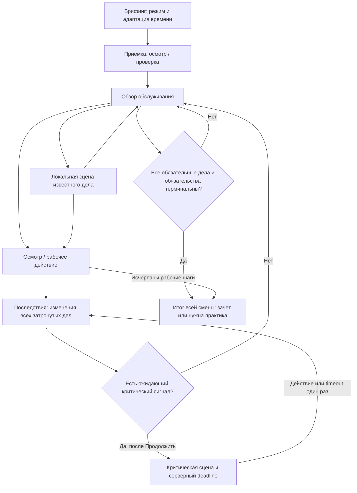

# РЕЙС 400 — выбранный геймплей

[Спецификация](SPECIFICATION.md) · [Предметная модель](DOMAIN-MODEL.md) · [ADR-001](adr/001-two-level-text-shift.md) · [Передача в реализацию и дизайн](GAMEPLAY-HANDOFF.md)

**Решение задачи 03 / #21, 26.09.2026. Статус: принято для реализации MVP.** Это проектное решение, а не утверждение о готовом новом движке. Исследованный `main`: `42ee32d456fc8a6627a6239e9134b66a36dfbd95`. Runtime — #26, дизайн — #24, приёмка — #27. Обязательность требований задают SPECIFICATION и REQUIREMENTS; этот документ её не меняет.

## 1. Во что играет человек — один абзац

**Игрок проходит короткую текстовую учебную смену проводника: проверяет готовность доступной части вагона, читает краткую обстановку, осматривает её и сам выбирает, чем заняться. Выбранная проблема открывается как короткая локальная сцена с профессионально осмысленными действиями. Пока игрок работает с ней, другие проблемы сохраняются и могут измениться после его рабочих действий. Нужно не только ответить, но и обнаружить, расставить приоритеты, получить подтверждение передачи, вернуться к обещанному и проверить результат. После завершения показывается причинный разбор всей смены, обе шкалы и освоенные/непродемонстрированные компетенции.**

Основной цикл — **двухуровневая текстовая смена**. Техническая основа — ограниченный набор независимых инцидентов M6; осмотр M7-lite и ветвящиеся сцены M2 — действия внутри этого цикла. Это не диспетчерская, не свободная симуляция всего поезда и не последовательный тест, переименованный в смену. Принят кандидат из [исследования #20, раздел 14](../research/gameplay/approaches.md).

## 2. Два уровня взаимодействия

### Обзор смены

На экране: стадия «приёмка / обслуживание», подпись вагона и класса, короткое описание обстановки, раскрытые наблюдения, известные незавершённые дела, обещания и две шкалы. Главные действия — крупные подписанные кнопки. «Осмотреть салон» доступно независимо от наличия скрытой проблемы; осмотр может вернуть нормальное контрольное наблюдение.

Пример после приёмки:

> У мест 18–19 пассажиры спорят о размещении. Остальная часть салона с вашего места подробно не осмотрена.
>
> **Подойти к пассажирам** · **Осмотреть салон**

Скрытый багаж не появляется как «необнаруженная проблема №2». Не показываются количество скрытых инцидентов, правильный порядок, будущая эскалация и оценки вариантов. Нейтральные признаки и отсутствие полного осмотра — не готовый ответ. Не каждое наблюдение является проблемой.

### Локальная сцена

Один объект внимания, короткий контекст, обычно 2–4 действия. Можно вернуться к обзору и переключиться на известное дело; локальный прогресс предыдущего инцидента сохраняется. Возврат и открытие уже раскрытой сцены — навигация. Осмотр, проверка документов, помощь, передача и ожидание подтверждения — рабочие действия.

«Подойти» может быть навигационной подписью, если ничего не раскрывает и не меняет. Если приближение раскрывает новый факт или расходует моделируемое время, автор оформляет его отдельным рабочим действием `costSteps: 1`, а не скрытым эффектом открытия экрана. Крупные смысловые действия не прячутся в словах длинного абзаца.

Постоянно доступна компактная сводка других известных дел, но не два диалога одновременно. Обычные изменения сообщаются между решениями и в обзоре. Критический сигнал получает отдельный фокус, а не незаметный таймер в фоновой карточке.

### Последствия

После рабочего действия видны наблюдаемый результат и фактическое изменение шкал. В обучении сразу объясняются причина и допустимые альтернативы; в оценочном режиме подробная педагогическая подсказка остаётся до финального разбора. Это не убирает мгновенные наблюдаемые последствия и обе обязательные шкалы.

## 3. Единица сессии и пределы MVP

**Одна попытка = одна короткая учебная смена `ShiftRun`**, не реальная смена, полный рейс или отдельный пассажир. Один профиль может иметь только одну незавершённую попытку, внутри которой существуют несколько инцидентов. Смысл существующего `ensureNoActive` сохраняется.

| Область | Принятая граница |
|---|---|
| Пространство | Один сидячий вагон и одна зона салона. Не три зоны из раннего §10 исследования: более поздний §14 принят как более узкая граница. |
| Стадии | Брифинг → содержательная приёмка → обслуживание → итог. Приёмка изменяет доступные сведения/действия позднее. |
| Параллельность | Два содержательных инцидента обслуживания; один объявлен наблюдаемым обращением, второй первоначально скрыт. До этого отдельная задача приёмки. |
| Действующие лица | Только необходимые синтетические участники; память ограничена попыткой. |
| Контент | Один сквозной эпизод; два заранее проверяемых варианта ситуации; минимум два разных исхода и timeout. |
| Последствия | Изменение оставленного дела, подтверждаемая передача и адресное обязательство возврата. |
| Время | Целые рабочие шаги, не фиктивные минуты. Одно критическое окно одновременно. |
| Завершение | В примере maxSteps=16; по достижении предела открытые дела получают явный незавершённый исход. Число — авторский предел, не норматив. |
| Внешний продуктовый цикл | Профиль, достижения, рейтинги бригады/депо/компании, уведомления, аналитика и API сохраняются; #23/#26 интегрируют новые результаты. |

**Один вагон в попытке не отменяет четыре класса обслуживания.** Конкурсный объём предусматривает `standard / comfort / business / first` с подтверждёнными различиями условий/действий, а не только подписи и цвета. Модель политик и критерий готовности зафиксированы в HANDOFF. Содержимое ZIP датасета в #21 не удалось получить для сверки. REQ-Q04/OQ-04 и методическая часть OQ-10 остаются открытыми до содержательной проверки #26/#27. Это явный разрыв контента, не перенос уточнения Q&A в «необязательное после хакатона».

За пределами MVP: свободное перемещение, несколько вагонов одновременно, автономные NPC, межсессионная память пассажиров, экономия вызовов помощи, LLM в runtime, голос, мультиплеер, произвольная генерация, визуальная панель авторинга. Минимальное управление публикацией/отключением версий, напротив, входит в план; см. HANDOFF.

## 4. Flow и независимые состояния

`overview/scene/feedback` — фазы отображения; `open/waiting/resolved/failed` — состояния инцидентов. Фокус на сцене не равен существованию/завершению проблемы. `hidden/revealed` — ось знания, `routine/urgent/critical` — ось срочности. Не объединяем всё в неоднозначный enum ACTIVE.

Запрос передачи не закрывает дело. Подтверждение принятия означает только «коллега принял указанное действие»; исполнение подтверждается отдельно. Закрытие инцидента не отменяет обещание вернуться к конкретному участнику. В MVP возврат выполняет сам игрок; автоматическая передача всех обещаний не разрешена. Терминальная failed-задача позволяет закончить попытку с незачётом, но не пройти условие полного успеха.

## 5. Семантика времени

Обычный рабочий выбор стоит один шаг. Чтение, открытие уже известной сцены, переход к обзору и чтение последствий стоят ноль. После рабочего действия сервер продвигает шаг и обрабатывает наступившие события во всех инцидентах. Ожидание коллеги выполняется действием «Дождаться ответа» и тоже стоит шаг; долгое чтение не изображается как ожидание поезда.

Критический сигнал сначала ставится в очередь предъявления. После текущей обратной связи команда «Продолжить» атомарно раскрывает критическую сцену и задаёт `deadline = serverNow + durationMs`. До команды варианты критического решения не выдаются клиенту. Это сохраняет смысл существующего feedback: новый таймер не расходуется на чтение прошлого разбора. Клиентской команды «запусти после того, как я уже увидел варианты» нет.

После открытия окна обычный рабочий цикл ждёт одного критического решения. Разрешены действия этого окна, учебная пауза, прерывание и синхронизация; продолжать несвязанную сцену нельзя. Одно решение или timeout расходует ровно один шаг; затем применяются другие последствия этого шага, без двойного списания времени.

**now >= deadline означает timeout, включая точное равенство.** GET, sweep, новая команда и повтор не применяют его дважды. Reload, закрытие приложения, потеря сети и restart не являются паузой. В обычной фазе за время отсутствия шаги не идут; в открытом критическом окне срок продолжает действовать. Транзакционные гонки, стабильный порядок событий и recovery описаны в DOMAIN-MODEL.

## 6. Обучение, оценка и повтор

| Правило | training — обучение | assessment — оценочная попытка демо |
|---|---|---|
| Последствия | Наблюдаемый итог + объяснение сразу | Наблюдаемый итог и шкалы сейчас; полный разбор в конце |
| Подсказка | Явная, сохраняется в истории; активное окно сначала ставится на учебную паузу | Нет педагогической подсказки во время решения |
| Пауза | Явная серверная команда, сохраняет остаток | Нет; можно прервать или восстановить то же состояние |
| Адаптация времени | Выбирается до старта | Выбирается до старта и входит в группу сравнения |
| Рейтинг | Не участвует | Только по правилам допуска #23; разные группы не смешиваются |
| Вариант повторной попытки | Можно выбрать проверенный вариант | Назначает сервер по опубликованной политике |

Политики примера: standard — 20 секунд; extended — 200 секунд; untimed — без deadline. Все числа авторские. Untimed сохраняет действия, но своевременность по реальному сроку не оценивается; такой результат не участвует в стандартном рейтинге. Возможность отключить/расширить время предлагается до таймера. Это не заявление о полном соответствии WCAG. Основание доступного времени: [W3C, SC 2.2.1](https://www.w3.org/WAI/WCAG22/Understanding/timing-adjustable), проверено 26.09.2026.

Исторический replay воспроизводит сохранённые события без новых наград. Повторная тренировка от развилки создаёт новый runId/training с originRunId/originEventSeq, не переписывая исходный результат. Seed без закреплённых контента, правил, начального состояния и журнала недостаточен для точного replay.

## 7. Шкалы, компетенции и завершение

Шкалы: loyalty — лояльность пассажиров в моделируемой ситуации; safety — рейтинг безопасности. Обе 0–100, старт примера 70/75, как в текущем движке. Это не проценты реального риска и не медицинская шкала. Отдельную числовую лояльность каждого пассажира не вводим.

Каждое последствие хранит причинную ссылку, заявленную дельту и фактические значения до/после clamp. CriticalErrors — сохраняемый набор с кодом и доказательством; criticalError вычисляется как непустой набор и не очищается поздним успехом. XP/достижения не компенсируют критическую ошибку; необходимая помощь не расходует монеты или дефицитные жетоны.

Сохраняем ключи empathy/protocol/speed/teamwork. Для v2 подпись speed — «своевременность действий», не «скорость чтения». Убираем правило половинной награды после половины таймера. ResponseMs остаётся ограниченной телеметрией: она включает восприятие, чтение, моторику и сеть, а не только профессиональное размышление.

Рубрика состоит из уникальных критериев с допустимыми группами действий и evidenceEventIds. Каждый засчитывается максимум один раз. Повторный осмотр/одинаковые вежливые реплики не создают новых возможностей. Возможности оценки закрепляются при старте варианта; пропуск важной сцены не уменьшает denominator. В untimed критерий реального срока имеет not_assessed, а не автоматически ноль.

В примере семь критериев по 1 единице: приёмка, раннее обнаружение, проверка документов (protocol); корректное признание обращения (empathy); подтверждённая передача и адресный возврат (teamwork); своевременное обеспечение безопасного исхода (speed). Последний засчитывается при предотвращении критического окна или допустимом действии до его deadline. EpisodePoints = 10 × число выполненных оцениваемых критериев, максимум 70 при timed-политике. Это демонстрационная рубрика, не утверждённый измеритель пригодности; постоянный XP регулирует #23.

Passed требует одновременно завершённую, не прерванную попытку; отсутствие criticalErrors; safety >=65 и loyalty >=55; успешную обязательную приёмку; все обязательные инциденты resolved и все обязательства fulfilled. Пороговые числа авторские и версионируются. Лимит шагов/abort дают явный незачёт. После критической ошибки можно закончить безопасные учебные действия и получить разбор, но зачёт уже недоступен.

Итог объясняет порядок, найденные/пропущенные признаки, запрос/подтверждение/завершение передачи, обещания, причинные изменения шкал, критические ошибки, критерии и рекомендацию на повтор. Разумная безопасная альтернатива не считается ошибкой лишь из-за несовпадения с одной авторской репликой.

## 8. Полный пример: две проблемы в одном салоне

**Авторская синтетическая ситуация для проверки архитектуры, не эксплуатационная инструкция.** A — спор о размещении у мест 18–19; B — багаж в проходе, не видимый из исходной позиции. Пассажир p1 участвует в обращении и возврате. Вариант blocked-aisle; standard в примере — метаданные, не подтверждённая модель сервиса класса.

Приёмка — сверить демонстрационную карточку готовности/сервиса. Успех сохраняет serviceInfoChecked=true. Пропуск оставляет проверку невыполненной: поздняя передача по A требует дополнительной проверки в один шаг, а полного зачёта без успешной приёмки нет. Не симулируем официальный допуск поезда или медосмотр сотрудника.

B усиливается на шаге 4, если ещё не решён: наблюдаемый критический сигнал, safety −10, подготовка окна. Коллега подтверждает запрос A на следующем шаге. Обещание вернуться к p1 создаёт обязательство со сроком шага 7; невыполнение к концу этого шага даёт loyalty −15. События проверяют актуальный статус: решённый B не ухудшается, исполненное обещание не штрафуется.

### Маршрут A — заметить и вернуться

| Шаг | Действие/событие | Изменение мира | Loyalty / Safety |
|---|---|---|---|
| 0 | Брифинг | Ничего не решено | 70 / 75 |
| 1 | Проверить готовность | Приёмка выполнена, A раскрыт, B скрыт | 70 / 75 |
| 2 | Признать обращение и обещать возврат | Память p1, обязательство return-p1 до шага 7; A открыт | 75 / 75 |
| 3 | Осмотреть салон | B обнаружен до вынужденного сигнала | 75 / 80 |
| 4 | Организовать освобождение прохода | B resolved, событие ухудшения пропущено по guard | 75 / 90 |
| 5 | Сверить данные A и запросить коллегу | A waiting, handoff requested, ответ на шаге 6 | 75 / 90 |
| 6 | Дождаться ответа | Handoff accepted, A ещё waiting, обещание открыто | 75 / 90 |
| 7 | Проверить исполнение и вернуться к p1 | A resolved, handoff completed, обещание fulfilled; штраф срока не применяется | 85 / 90 |
| — | Завершить смену | Зачёт, семь критериев, 70 episodePoints | 85 / 90 |

Позднее влияние не ограничивается шкалой: без приёмки на шаге 5 нужна дополнительная проверка; без подтверждения нельзя выполнить финальное действие; на шаге 7 проверяется обязательство именно перед p1, а не любой разговор.

### Маршрут B — отложить безопасное действие

Шаги 1–2 как выше; шаг 3 — сначала проверить A и запросить коллегу. На шаге 4 игрок ждёт: приходит ack A, затем усиливается B. A waiting, B revealed/critical, шкалы 75/65. Это два дела в одной попытке, не новый модуль.

После чтения результата игрок нажимает «Продолжить»: сервер открывает сцену B с deadline 20 секунд. Выбор «Отложить обеспечение безопасного прохода ради завершения сервиса» — авторская критическая ошибка unsafe_deferral: шаг 5, B failed, safety −30. На шаге 6 игрок возвращается к p1 и завершает A (+10 loyalty), но итог **«Нужна практика»**, 85/35, 50 episodePoints и сохраняемая criticalError. Успешно закрытый спор не возвращает зачёт.

### Timeout — тот же мир

Тот же префикс до окна. Открытие в 2026-09-26T12:00:00.000Z, deadline в 12:00:20.000Z. Команда, принятая сервером в 12:00:19.999Z, ещё успевает; в 12:00:20.000Z и позднее применяется только critical_timeout. B failed, шаг 5, safety 65 → 40. Присланный поздний выбор не исполняется поверх timeout. После возврата A на шаге 6 итог 85/40, 50 episodePoints, незачёт. Повтор/GET/sweep не списывают ещё 25.

### Восстановленный безопасный исход

В том же позднем критическом окне допустимое действие до deadline решает B и даёт +10 safety вместо ошибки. После возврата A итог 85/75, 60 episodePoints, зачёт без критической ошибки, но без критерия раннего обнаружения. Позднее обнаружение не предопределяет плохой финал; интерфейс не должен делать единственный плохой ход неизбежным.

Четыре ожидаемые трассы, checkpoint и публичное состояние находятся в [JSON](examples/shift-v2-contract.json). [Проверяющий скрипт](examples/validate-shift-example.mjs) проверяет согласованность примера, но не реализует и не тестирует production-движок.

## 9. Основание и открытые вопросы

Решение опирается на [SPECIFICATION](SPECIFICATION.md), [REQ-F02–F04/F07/F09, Q01–Q07, G03](REQUIREMENTS.md), shortlist и §14 [исследования](../research/gameplay/approaches.md), комментарии #21 и статическое чтение backend/engine.js, backend/service.js, src/app.js на указанном SHA. Статус проверки первичных источников сохраняется из #19.

OQ-05 разрешён на уровне дизайна: две шкалы и локальные последствия совместимы с разбором всей сессии. По OQ-04 приняты обнаружение, параллельность и приёмка; правила четырёх классов требуют источника. По OQ-07 принят минимум публикации/отключения версий, пока не реализованный. OQ-10 о методической валидности не закрывается авторским ADR. Статусы реализованности в REQUIREMENTS этим документом не повышаются.
