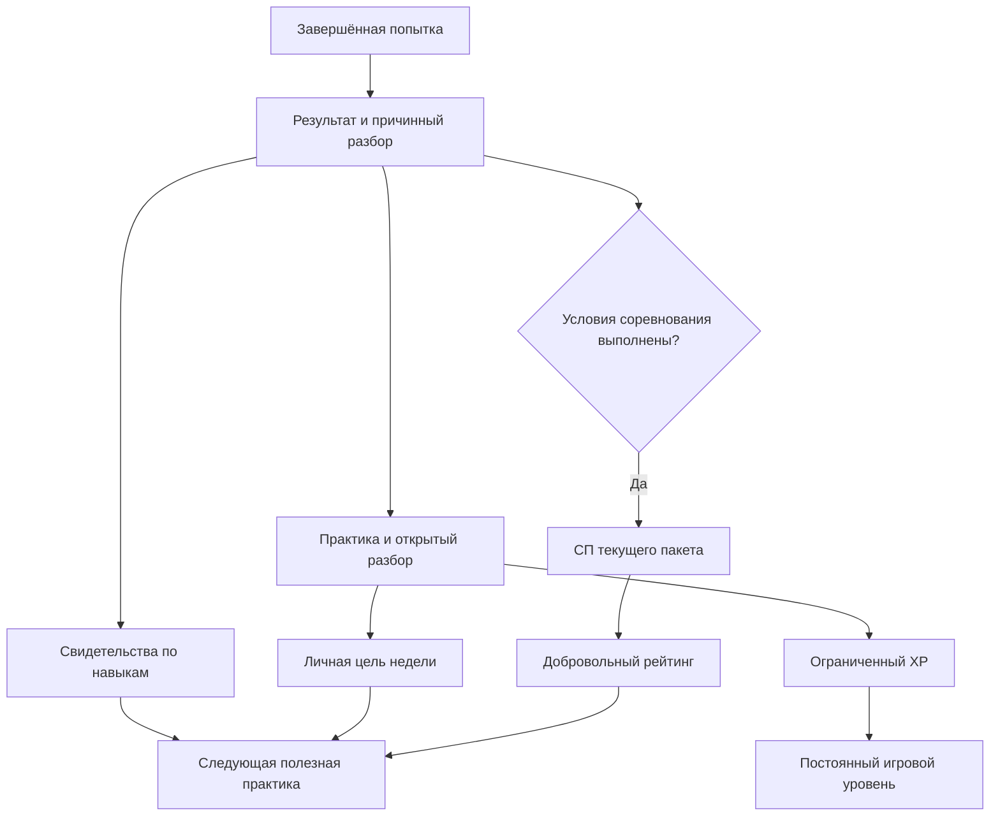
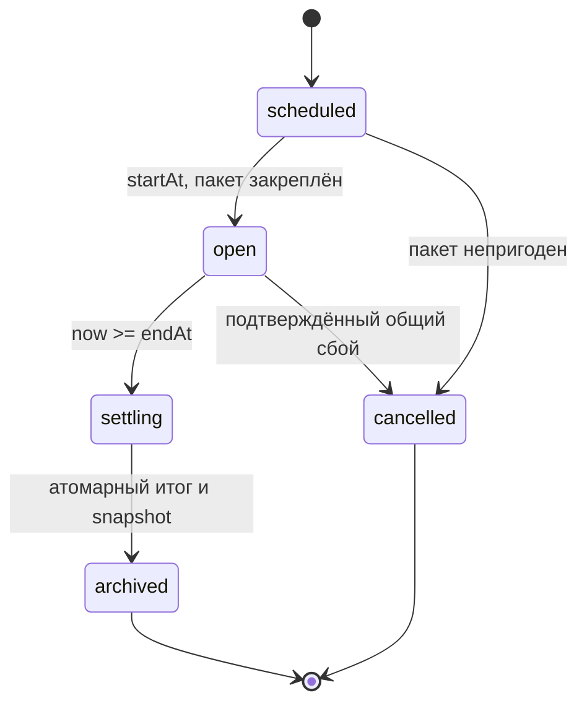

# РЕЙС 400 — правила мотивации

**26.09.2026 · решение [05 / #23](https://github.com/RomaGrach/mt-hackathon/issues/23) · `gamification-1`.**

[Главная](../README.md) · [Спецификация](SPECIFICATION.md) · [Требования](REQUIREMENTS.md) · [Gameplay](GAMEPLAY.md) · [Предметная модель](DOMAIN-MODEL.md) · [Исследование Duolingo](../research/duolingo-mechanics.md)

> Это продуктовая спецификация для реализации в [08 / #26](https://github.com/RomaGrach/mt-hackathon/issues/26), **не описание уже работающих функций**. Числа — выбранные параметры MVP, а не доказанные оптимумы или закрытые алгоритмы Duolingo. XP, уровень и место не определяют профессиональную пригодность, зарплату, премию или допуск к работе.

## 1. Решение и основания

Главный цикл: **полезная практика → причинный разбор → понятный следующий шаг → личная цель недели → добровольное ограниченное соревнование**. Главная кнопка ведёт в практику, а не в рейтинг.

Профиль, уровни/очки, достижения, три рейтинга и уведомления сохраняются из обязательного минимума #23 и матрицы REQUIREMENTS. Правила начисления, период, добровольность и защита новичка ниже — решения команды, не дословные требования заказчика. Рейтинги трактуются как сравнение участников внутри бригады, депо и компании; рейтинг самих команд — отдельное расширение.

Основа выбора — [исследование #22](../research/duolingo-mechanics.md) и [аудит входных исследований](../research/duolingo-input-audit.md). Duolingo описывает недельное сравнение, сходные привычки и возможность отключить соревнование [D1]. Исторический эксперимент разделения streak и дневной цели улучшил некоторые показатели возвращения, но уменьшил выполнение полной дневной цели [D2]. Качественное исследование описывает уход к оптимизации игровых стимулов вместо обучения; это свидетельство риска, не оценка его распространённости [D3]. Чужой retention-эффект не считается доказательством эффективности для проводников.

**Приоритет документов:** GAMEPLAY и DOMAIN-MODEL остаются источником игровых критериев и результата. Этот документ задаёт мотивационные начисления и допуск в рейтинг, отложенные в #21. В вопросах выбора мотивации он заменяет рекомендации [раннего исследования](10-retention-gamification.md): streak, страховки, валюты и лиги оттуда не становятся автоматически частью MVP. Рабочий код v1 сохраняет свою семантику до реализации и миграции #26.

| Решение | Цель | Проверяемое правило |
|---|---|---|
| Разделить учебные свидетельства, XP и сезонные очки | Не выдавать активность за компетентность | В API/UI нет их общей суммы |
| Недельная цель вместо обязательного ежедневного streak | Позволить выбрать удобные дни | Пропуск ничего не вычитает из постоянного прогресса |
| Общий ограниченный пакет соревнования | Убрать преимущество бесконечных повторов | 1–3 задания, максимум две зачётные попытки на каждое |
| Добровольность и потоки опыта приложения | Не заставлять новичка догонять ветерана | `optIn=false`; потоки не смешиваются |
| Без лиг и понижений в MVP | Не дробить неизвестную по размеру аудиторию | `divisionId=null`; перехода по месту нет |
| XP за завершённую практику с разбором, включая незачёт | Поддержать работу после ошибки | Критическая ошибка не запрещает учебную практику, но даёт 0 соревновательных очков |

## 2. Пять разных состояний

| Состояние | Что хранит и показывает | Чего не означает |
|---|---|---|
| Учебные свидетельства по компетенциям | Критерии `earned/possible`, evidenceEventIds, шкалы, режим, версия, дата | Не независимая аттестация и не процент профессиональной готовности |
| Постоянный игровой прогресс | Пройденные узлы, достижения, история, игровой уровень | Не место в соревновании |
| Опыт практики, XP | Ограниченное вознаграждение за завершённую учебную работу с разбором | Не качество решения и не деньги |
| Сезонные очки, СП | Результат ограниченного пакета текущей недели | Не весь накопленный опыт и не квалификация |
| Место | Ранг по СП среди сопоставимых добровольных участников | Не рейтинг «лучших сотрудников» |

Уровень — проекция накопленного XP, а не шестая валюта. Постоянный прогресс шире уровня. В MVP один сезон равен одной неделе; отдельного месячного счёта нет.

В разборе `episodePoints` называются **учебными баллами эпизода**. Семь оцениваемых критериев timed-примера GAMEPLAY дают максимум 70 таких баллов; это не 70% пригодности. XP и СП не переименовываются в «компетенции».

Карточка навыка показывает последнее наблюдение в конкретной сопоставимой группе, дату, режим и разбор. Без наблюдений — «не оценено», не 0%. Training и assessment не усредняются. Разные версии, варианты и политики времени без подтверждённой эквивалентности не сливаются. Повтор той же формы не изображается независимым доказательством переноса навыка.

Пропуск не удаляет результаты, критерии или достижения. Через 28 суток без полезной практики возможна рекомендация повторить, но не автоматический вывод «разучился». 28 суток — продуктовая эвристика, не педагогическая норма.



## 3. Полезная практика и связь с предметной моделью

**Полная практика:** завершённый, не прерванный run хотя бы с одним рабочим решением, доступным разбором и первым подтверждением его просмотра (`debrief-ack`). Незачёт и критическая ошибка не запрещают учебное вознаграждение. Подтверждение просмотра — наблюдаемое взаимодействие, не доказательство понимания.

**Целевая практика:** новый training от развилки или рекомендованное повторение, где выполнено рабочее решение, достигнут предусмотренный конец фрагмента и открыт разбор. Сервер знает origin, содержание и цель. Просмотр меню, ожидание, точный исторический replay и повторное открытие старого разбора не считаются новой практикой.

`creditFamilyId` объединяет семантически одно задание: косметическая правка, новый ID версии или смена режима не создают новое семейство. Ключ задаётся при публикации содержания. Ветки одного ShiftRun имеют общий ключ.

**Рабочий Task не равен мотивационной цели.** Обещание пассажиру уже создаёт обычный `Task(type=promise)` внутри ShiftRun. За создание обещания, число задач, повторный осмотр или получение ack отдельного XP/СП нет. В Result учитывается подтверждённое выполнение уникального критерия. Вся смена даёт один Result: нельзя дополнительно награждать её Incident как самостоятельные модули.

## 4. XP и постоянный уровень

Для пользователя `u`, семейства `f` и недели `w`:

```text
B(u,f,w) = максимум из:
  0  — нет подходящей практики;
  10 — завершён целевой фрагмент и открыт разбор;
  20 — завершена полная практика и открыт разбор.

deltaXP = max(0, B_new - B_saved)
lifetimePracticeXP += deltaXP
practiceLevel = 1 + floor(lifetimePracticeXP / 100)
levelProgress = lifetimePracticeXP mod 100
```

Вознаграждаются максимум **пять разных семейств за неделю**, в порядке первого подходящего завершения с разбором; суммарно не более 100 XP. Уже выбранному семейству можно поднять кредит с 10 до 20 даже после занятия всех пяти мест. Шестое семейство и дальнейшие повторы доступны для обучения, но не дают XP. В MVP с одним новым семейством фактический максимум — 20 XP за неделю, а не обещание недостижимых 100.

Пример: целевой фрагмент +10; полный run того же семейства ещё +10; двадцать повторов +0. Полный run первым даёт +20; последующее исправление ошибки — +0 XP, но сохраняет результат и может закрыть рекомендацию. Намеренная ошибка не создаёт дополнительный XP-бюджет.

Training и assessment делят один кредит. Правильность, скорость кликов, количество веток и включение рейтинга не дают множителей. Abort, технически недостоверный результат и точный replay дают 0. Начисления только серверные; открытие профиля не является награждаемым событием.

Неделя XP определяется временем **первого принятого debrief-ack**. У run/фрагмента только одно исходное подтверждение за всю историю. Повтор ack в новую неделю не создаёт кредит; для нового недельного начисления нужен новый run. Пять семейств, изменение кредита и запись receipt проверяются в одной транзакции. Коррекция ошибочного начисления возможна с аудитом, но не как наказание за отсутствие.

Уровень и очки не ограничивают необходимую помощь или обязательные сценарии. Каталог и прямой демонстрационный путь доступны без прокачки. Ни платных попыток, ни платного восстановления, ни множителей XP нет.

## 5. СП и антифарм

### 5.1. Общий пакет и сопоставимость

Период публикует неизменяемый `packId` с **1–3 слотами**, по одному семейству на слот, равный вес — 100 СП. У всех в группе одинаковые задания и число попыток. Пакет фиксирует `scenarioId`, `contentVersion`, `rulesVersion`, `variantId`, `servicePolicyId`, `timingPolicy` с durationMs, `engineVersion`, `gamificationVersion`. Полный закреплённый набор образует `comparisonKey`.

Первый демонстрационный пакет содержит один слот — v2-смена с двумя инцидентами из GAMEPLAY, вариант `blocked-aisle`, standard 20 секунд. Его реальный manifest создаётся в #26 после публикации исполняемого сценария. JSON-checkpoint из #21 сам по себе не является сценарием и не даёт допуска в рейтинг.

`extended` и `untimed` имеют отдельные пакеты/группы, без штрафного коэффициента и без сравнения со standard. Legacy v1 не складывается с v2. Совпадение максимальных баллов не доказывает эквивалентность разных вариантов или servicePolicy. Пока нет закреплённого пригодного пакета, `rankingEligible=false` с причиной.

### 5.2. Ровно две соревновательные попытки

Участие выбирается **до** начала. Сервер связывает run со слотом и при `begin`, до раскрытия рабочей сцены, атомарно резервирует номер 1 или 2. Создание briefing без begin место не расходует. Abort, timeout и незачёт после begin расходуют попытку. Reload, новое окно и новый requestId лимит не восстанавливают. Третья соревновательная попытка отклоняется, но практика остаётся доступной.

Нельзя задним числом превратить удачный training в assessment. Обычное обучение доступно между попытками: соревнование открытое учебное, не защищённый экзамен. Общий вариант можно заранее изучить; это ограничение интерпретации результата, не проступок пользователя.

Подтверждённый технический сбой исключает результат. Замена испорченной попытки допускается только аудируемой служебной операцией: старый результат аннулируется, номер остаётся тем же, две версии одновременно не учитываются. Пользовательская кнопка «сбой» не выдаёт дополнительные попытки.

### 5.3. Допуск и формула

```text
eligible(r) =
  optIn и корректно зарезервированная попытка 1/2 слота периода
  AND завершённый assessment от начала, origin=null
  AND passed=true, criticalErrors пусты, technicalIssue=false
  AND нет hints/учебной pause, точное совпадение comparisonKey
  AND period.start <= result.acceptedAt < period.end

q(r) = sum(earned) / sum(possible) по assessed-критериям закреплённой рубрики
slotSP(u,s,w) = max({floor(100*q(r)) | eligible(r) в двух попытках} ∪ {0})
seasonPoints(u,w) = sum(slotSP по слотам пакета)
0 <= seasonPoints <= 100 * число_слотов <= 300
```

`passed` вычисляет движок по GAMEPLAY, включая обе шкалы, обязательную приёмку, Incident/Task и критические ошибки. Геймификация не подменяет этот расчёт. При критической ошибке — **0 СП**, даже если выполнены другие критерии.

В MVP используются целые единицы критериев. Валидатор проверяет уникальность ID, точное соответствие manifest, `0 <= earned <= possible`, ненулевой суммарный denominator. Пропуск сцены не уменьшает denominator; not_assessed допускается только там, где это закреплено политикой. Ошибка рубрики — ошибка конфигурации, не нулевой навык игрока.

Скорость сверх допустимого срока, число сессий, lifetime XP, квесты и бейджи не входят в СП. Это результат конкретного учебного соревнования, не универсальный показатель компетенции.

| Случай для timed-примера GAMEPLAY | Учебный результат | СП |
|---|---|---|
| Раннее обнаружение и безопасное завершение | 7/7, 70 episodePoints, passed | 100 |
| Поздний, но безопасный исход | 6/7, 60 episodePoints, passed | 85, округление вниз |
| Первая попытка 6/7, вторая 7/7 | Оба разбора сохраняются | 85 → 100; прирост 15, не 100 |
| Критическая ошибка при 5/7 | 50 episodePoints, not passed | 0 |
| Первая попытка 7/7, вторая хуже | Обе попытки в истории | Остаётся 100 |
| Третья попытка или 50 повторов training | Обучение доступно | Дополнительно 0 |
| Два Incident и несколько Task в одной смене | Один Result | Один слот, не несколько наград |

Две попытки и недельный потолок ограничивают фарм **очков**, но не гарантируют равные способности или защиту от всех вторых аккаунтов/скриптов. Известный один вариант легко запомнить. При большом числе идеальных результатов допускаются общие места; не добавляем гонку скорости только ради различения участников.

## 6. Календарь и состояния периода

Выбранная зона продукта — **Europe/Moscow**, не зона устройства. Неделя: понедельник 00:00 включительно → следующий понедельник 00:00 исключительно. Храним UTC startAt/endAt и IANA-зону; показываем срок с обозначением зоны. Изменение timezone телефона ничего не продлевает.

Тестовый период: `2026-09-21T00:00:00+03:00` → `2026-09-28T00:00:00+03:00`, то есть `[2026-09-20T21:00:00Z, 2026-09-27T21:00:00Z)`. Это наш пример, не календарь Duolingo.



`scheduled`: пакет проверен, очки не выдаются. `open`: можно вступать и принимать результаты. `settling`: старые результаты больше не принимаются; сервер идемпотентно завершает расчёт через sweep или первое обращение. `archived`: итог зафиксирован. `cancelled`: соревнование не состоялось, мест нет, учебная история сохранена.

Серверный `acceptedAt` итогового перехода, не часы клиента, определяет период. Запись результата и закрытие периода сериализуются: принятый до endAt результат учитывается перед snapshot. При равенстве сроку результат уже не относится к старому периоду. Run, начатый до границы и завершённый после неё, сохраняет учебный результат, но не получает СП ни в старом, ни автоматически в новом периоде. XP по debrief-ack рассчитывается отдельно.

В конце недели **активные СП истекают**; в следующей неделе счёт начинается с 0. Архив сохраняет scoreAtClose, rankAtClose, состав, пакет и версии. XP, уровень и достижения остаются. Исправление ошибочного архива — новая аудируемая revision, не тихое переписывание.

Состояние участия: `not_joined → joined → active → completed/expired`; возможен `withdrawn`. Следующая неделя требует отдельного согласия. Выход скрывает публичную строку, но не возвращает попытки. Повторный вход в ту же неделю использует старую запись и лимит. Snapshot включает согласившихся к закрытию. Поздний отзыв скрывает человека без перераспределения исторических наград остальным.

## 7. Рейтинги, новичок и возвращение

### 7.1. Три обязательные области

| Вкладка | Кого сравниваем |
|---|---|
| Бригада | Участников своей учебной бригады |
| Депо | Участников бригад своего учебного депо |
| Компания | Участников своей учебной компании |

Во всех вкладках один ключ: **период + пакет/политика/версия сравнения + поток опыта приложения**. Организационная принадлежность закрепляется при входе в период; изменения действуют со следующего периода. Переключение вкладки не создаёт новые очки. Рейтинг самих бригад/депо не подменяет эти фильтры.

### 7.2. Потоки

**Стартовый:** менее двух прошлых завершённых активных соревновательных периодов. Активный период содержит хотя бы один завершённый нетехнический assessment с зарезервированным номером, включая незачёт. Календарный пропуск опыт участия не увеличивает.

**Основной:** два и более таких периода. Переход со следующей недели, не в середине. Профессия, возраст человека и lifetime XP не определяют поток.

**Возвращение:** участник основного потока после 28 полных суток без полезной практики получает один активный период возвращения, затем снова основной. При первом возобновлённом посещении сервер фиксирует `returnPending` **до** записи новой практики, чтобы занятие перед вступлением не отняло предложение. Неактивный/пропущенный период его не расходует. Следующий такой допуск требует нового полного перерыва после новой практики; повторный вход не создаёт его. Новичок после паузы остаётся в стартовом.

Поток фиксируется при входе и не меняется до конца периода. Две активные недели остаются в истории после выхода. Это разделение знакомства с приложением, не медицинская/кадровая классификация и не гарантия равенства способностей. Вторые аккаунты в синтетическом демо надёжно не исключаются; корпоративная идентификация — отдельная задача пилота.

Соревнование выключено по умолчанию. Без него доступны вся практика, XP, достижения и цель. Новичок сначала видит личный следующий шаг, а не общекорпоративную таблицу. Не показываем «лучшего сотрудника» и список «худших проводников».

### 7.3. Малые группы, ничьи, поздний вход

Место публикуется при **не менее пяти** сопоставимых согласившихся участниках с ненулевым зачтённым СП. Иначе — собственный результат и «недостаточно участников для места». Не подмешиваем другой поток/политику и не создаём фиктивных соперников. Нулевые результаты не публикуются как список неуспешных сотрудников. Все демонстрационные профили явно синтетические.

```text
rank(u) = 1 + count(score(v) > score(u))
100, 100, 85 → места 1, 1, 3
```

Нет тай-брейка по скорости, раннему входу или возрасту аккаунта. Стабильная сортировка по непрозрачному ID внутри ничьей — только отображение. Обязательны пагинация и строка «вы» вне top-50. При нулевом личном СП места нет даже в большой группе.

Вступить можно в любой момент open, но срок общий. Перед согласием показываем оставшееся время и возможность «практика сейчас, соревнование со следующей недели». Поздний вход не выдаёт дополнительных попыток. Добровольность не доказывает отсутствие психологического давления — это проверяется отдельно.

### 7.4. Решение о лигах

**Дополнительные лиги/дивизионы в MVP не нужны.** Уже есть организационные области и потоки, а реальный размер аудитории неизвестен. Нет постоянной лестницы, повышения/понижения по месту и турнирных квот; это сознательный отказ, не пропущенный алгоритм.

Временные малые когорты и подбор по поведению — backlog. До запуска нужны данные о наполнении существующих групп и отдельное решение о размере, позднем входе и манипуляции активностью. #26 не должен реализовывать полузаданную лестницу или копировать квоты Duolingo. Изменение этого решения требует новой версии правил.

## 8. Личная цель, серия и пропуски

По умолчанию цель — **полезная практика в два разных дня недели**. Пользователь выбирает 1, 2 или 3 дня либо паузу. Величина фиксируется до первой зачтённой практики; повышение допустимо, понижение — со следующей недели. Новичку, впервые вошедшему в воскресенье, и вернувшемуся после 28 дней предлагается один день на остаток недели. СП не зависят от сложности личной цели.

В цель входит полный новый контекст либо назначенное повторение с новым run и открытым разбором, максимум один зачётный день на дату продукта. Дата — дата завершения практики; ack должен прийти до конца той же недели. Старый разбор не переносит занятие в новый день/период. Незачёт с разбором подходит, но не превращает критерий в освоенный. Повторение может закрыть день без нового XP, если кредит семейства исчерпан.

Выполнение сохраняет `goalCompleted` и счётчик **всего успешных учебных недель**, не обязательно подряд. Дополнительных XP/СП за цель нет. Невыполнение не вычитает прошлые недели и не создаёт долг.

Ежедневный streak, Freeze, платный Repair и страховки **отклонены**. Показываем дни текущей недели и историю целей, не хрупкую цепочку. Пауза выключает автоматические мотивационные напоминания; цель paused, не failed. Пауза не выдаёт фиктивного занятия. Внутриигровые показатели не связаны с реальными премиями, зарплатой, графиком работы или допуском.

## 9. Повторение ошибок и квесты

После разбора предлагается **одна следующая практика**: критическая ошибка → обязательный пропущенный критерий → другой недостигнутый критерий → повтор пройденного. При равном приоритете — наиболее старая рекомендация, затем стабильный ID.

Это `ReviewItem` метаобучения, не рабочий Task пассажира. У одного семейства одновременно одна открытая рекомендация: новые ошибки уточняют её, не плодят срочные квесты.

После ошибки практика доступна сразу; календарное напоминание — со следующей даты продукта. После успешного прохождения предлагается повтор через 7 календарных дней. Интервалы — параметры MVP, не доказанная модель забывания. Сложная интервальная персонализация отложена.

Рекомендация закрывается, если новая практика даёт целевой assessed-критерий в полном объёме без относящейся к нему критической ошибки и открыт разбор. Это исправление в учебном контексте, не аттестация. При наличии иного содержательного варианта он предпочтителен; иначе явно показываем «тот же контекст». После повторной ошибки остаётся та же рекомендация, reminder не раньше следующего дня.

Нет дополнительного СП за ошибку/её исправление; XP ограничен кредитом семейства. Схема «специально провалить ради бонуса» не приносит больше очков.

## 10. Достижения

Каждая награда: `achievementId + ruleVersion`, earnedAt, evidence. Повтор не создаёт новый экземпляр/СП. Полученное сохраняется, а не вычисляется заново по текущему каталогу. Исправление ошибочной выдачи аудируется; отпуск ничего не отзывает.

| Награда | Проверяемое условие | Объём |
|---|---|---|
| Первый рейс | Первый passed полного run без origin/technicalIssue; режим записан в evidence | MVP |
| Надёжные руки | Такой же passed, safety >= 90, без criticalErrors | MVP; достижимо ранним маршрутом GAMEPLAY |
| Работа над ошибками | После полного незачёта семейства новый полный passed того же семейства; обе попытки в evidence | MVP; без дополнительного XP/СП |
| Свой ритм | Личная цель выполнена в двух разных периодах, не обязательно подряд | MVP |
| На стороне комфорта | Passed, loyalty >= 90, без criticalErrors | Сохранить прежние v1-награды; новый v2-бейдж не обещать до появления достижимой формы |
| Единый экипаж | Passed и подтверждённая передача с адресным возвратом | Backlog новой версии; старый v1-бейдж сохраняется |
| Своевременное действие | Passed и критерий безопасного предотвращения/разрешения критического события | Backlog; без бонуса за более быстрые клики |
| Полная смена | Passed по фиксированному manifest каталога версии награды | Backlog; новый сценарий не отзывает полученное |

Нельзя делать недостижимый бейдж ближайшей целью: ранний v2-маршрут заканчивается loyalty=85, поэтому прежний порог 90 не объявлен доступным в единственном демонстрационном слоте. Не снижаем порог скрыто. Названия наград игровые, с видимым условием; они не кадровая квалификация.

## 11. Уведомления

Три обязательных типа сохраняются **внутри приложения**. Push, email и виджеты не входят в MVP. Новости и челленджи не прерывают сцену или критическое окно: сначала завершение/разбор, затем сводка.

| Тип | Условие | Дедупликация и содержание |
|---|---|---|
| Новый сценарий | Опубликована доступная версия; старый каталог при первом входе объединяется | `new:<scenario>:<version>`; что изменилось, переход к briefing |
| Челлендж | Открыт пригодный пакет/личная цель | `challenge:<period>`; условие, максимум СП, срок, добровольность |
| Истечение баллов | Есть active СП и посещение в последние 48 часов периода | `expiry:<period>`; «85 СП перестанут быть активными после конца недели. Итог сохранится; XP, уровень и навыки не сгорают» |
| Достижения | Появились новые award-ключи | Одна сводка после разбора |
| Повторение | Наступил due ReviewItem, нет паузы | `review:<item>:<dueDate>`; одна следующая практика |

Прочитанное не появляется заново после reload. Автоматический мотивационный показ: максимум один за посещение и три за неделю; остальное доступно в inbox по инициативе пользователя. Посещение для лимита — серверная сессия после не менее 30 минут отсутствия активности, не обновление вкладки. Приоритет: истечение СП → новый сценарий → challenge → review. Сводка достижений в результате не становится дополнительным модальным напоминанием.

Пауза отключает автоматические мотивационные показы. Последствия действия и техническая ошибка не скрываются этим бюджетом. После endAt приходит обычный архивный итог, не запоздалая угроза потери. Запрещены сообщения «ты подвёл бригаду», «теряешь профессию», «срочно обгони коллегу». Точный срок доступен на карточке СП независимо от уведомлений.

## 12. Полные пользовательские циклы

### Новичок

Синтетический профиль → простая практика без рейтинга → разбор и +20 XP за первое полное семейство → видимый критерий для улучшения → цель на два дня (один при первом входе в воскресенье) → назначенное повторение. Новый XP за тот же материал на этой неделе не обещается. После безопасного зачёта — «Первый рейс».

Добровольное соревнование: стартовый поток, известный пакет, две попытки. За 6/7 — 85 СП; за вторую попытку 7/7 — итог 100 СП. Ветеран с большим lifetime XP не добавляется в таблицу новичка. При менее пяти подходящих участниках виден результат без выдуманного места. Следующая неделя: 0 активных СП, прежние XP и награды на месте. После двух активных завершённых периодов следующий поток — основной.

### Активный пользователь

В начале недели видит due-повторение и личный план, не требование превысить вчерашний счёт. Практикует разные ситуации, получает ограниченный XP и новые свидетельства. Добровольно проходит общий пакет; три слота существуют только при наличии трёх реально опубликованных заданий. После двух попыток каждого слота большее свободное время не создаёт СП. Обучение продолжается без очков. Низкое место не отменяет цель, исправленную ошибку или достижение. Итог сохраняется, следующая неделя — отдельное участие.

### Возвращение после паузы

Через 28+ суток: «Продолжим с короткой практики» → старая история на месте → цель на один день остатка недели → один рекомендованный повтор. Нет долга, покупки восстановления или вывода о потере квалификации. Новая практика обновляет свидетельство, не переписывая старое. По желанию — один активный период потока возвращения, затем основной; при малом составе только собственный результат. Отказ от рейтинга не мешает возвращению.

## 13. Duolingo → принять, адаптировать, отклонить

Факты о Duolingo — в исследовании #22. Таблица содержит **решения РЕЙС 400**, не универсальную конфигурацию Duolingo на 2026 год.

| Механика | Решение | Наше правило и цель |
|---|---|---|
| Раздельные progression и XP | Принять принцип | Свидетельства, карта, XP и СП разделены (§2) |
| XP за занятия | Адаптировать | Кредит 10/20, до пяти семейств в неделю (§4) |
| XP как счёт лидерборда | Отклонить | Вместо бесконечного объёма — ограниченный пакет (§5) |
| Недельный reset | Адаптировать | Истекают только active СП, архив сохраняется (§6) |
| Локальное сравнение | Адаптировать | Своя область/поток/пакет; малый набор без места (§7) |
| Лестница лиг и demotion | Отклонить для MVP | Нет понижения и лишнего дробления аудитории (§7.4) |
| Поведенческий matchmaking | Отложить | Требует данных пилота и отдельного решения |
| Daily streak | Отклонить | Личная недельная цель без цепочки потерь (§8) |
| Freeze/Repair/страховки | Отклонить | Бесплатная пауза; компетенции не покупаются обратно |
| Daily Quests | Адаптировать | Одна полезная следующая практика, не набор срочных счётчиков |
| Месячные квесты | Отложить | Сначала проверить недельный цикл |
| Friends Quest | Адаптировать в backlog | Добровольная общая цель без штрафа за чужой пропуск |
| Friend Streak и nudges | Отклонить для MVP | Не делать занятие обязанностью перед другим человеком |
| Achievements и рекорды | Адаптировать | Условия, версии, evidence; сравнение одинаковых форм |
| Повторение ошибок | Принять цель, адаптировать награду | ReviewItem и общий кредит без бонуса за созданную ошибку |
| XP boosts и гонки на время | Отклонить | Нет 2×/3×, фарма скорости и стимула откладывать помощь |
| Турниры | Отложить | Не входят в одобренный MVP |
| Сезонные события | Адаптировать | Тематическая версия пакета, не дополнительный множитель |
| Notifications/widgets | Адаптировать только in-app | Полезный срок/новизна/следующий шаг, частотный бюджет |
| Comeback | Адаптировать без потерь | Короткий повтор, история сохранена, отдельный поток |
| Монетизация практики/помощи | Отклонить | Нет платных попыток, блокировки помощи и связи с зарплатой |

## 14. MVP и backlog

**Для #26:** разделённый профиль; версионированные начисления; XP-кредит/уровень; один реальный v2-пакет и две попытки; период/архив; три фильтра рейтинга, согласие/потоки/малые состояния; личная цель и пауза; простая рекомендация; четыре достижимых награды; три обязательных типа уведомлений; сохранение v1; тесты границ и идемпотентности. Создавать три сценария ради максимума 300 СП не требуется.

**После хакатона:** разнообразие содержания и независимые формы для проверки переноса; валидация рубрик; временные малые когорты после достаточного набора; командные цели; агрегированные рейтинги команд; дополнительные бейджи; интервальная персонализация; opt-in внешние напоминания; тематические события. Турниры и постоянные дивизионы требуют отдельного решения.

Командная цель-кандидат: добровольный состав N закреплён до начала; каждый участник может внести максимум две единицы полезной практики в разные дни. Условие — хотя бы одну единицу внесли `ceil(0.7*N)` разных участников. Один человек не закрывает цель за всех; награда символическая, без СП/XP; нет штрафа и публичного списка «подведших». Порог 70%, минимальный состав и безопасное раскрытие агрегатов требуют отдельного пилотного решения. В #26 эту механику не реализовывать.

## 15. Перечень изменений для [08]

Основание gap analysis: статически прочитан `backend/progress.js`, blob `9211a8e88a78c99da56f37ef3fe70aa691566d06`, и контракты #21. Это не повторный запуск всего приложения.

| ID | Сейчас / риск | Изменение |
|---|---|---|
| G01 | profileView: сумма лучших passed по scenarioId задаёт totalPoints и level | Разделить practiceXP/level, episodePoints/evidence, СП и архив; не суммировать v1/v2 |
| G02 | weekWindow: понедельник UTC | Для v2 закрепить Europe/Moscow, startAt/endAt/zone/version |
| G03 | leaderboard: lifetime-best и тай-брейки по completed/created_at | Период, пакет, политика, поток, org snapshot; СП, общие места, me вне top-50 |
| G04 | refreshMotivation: два разных passed дают отдельные 100 бонусов | В v2 заменить пакетом; цель не выдаёт дополнительные СП. Legacy-бонусы доистекают отдельно |
| G05 | Допуск v2 отложен до #23 | Условия §5 и атомарный резерв при begin; один Result всей смены |
| G06 | Нет нового XP-контракта | Кредит после первого debrief-ack, одна квитанция на run; replay без наград |
| G07 | Достижения вычисляются по текущему каталогу; fast требует три timed-решения | Сохраняемые award-ключи/версии/evidence; новые достижимые условия; не поощрять создание кризисов |
| G08 | Нет личной паузы, потоков и ReviewItem | Предпочтения профиля, server-derived band, цель и одна следующая практика; не добавлять мотивационный Task в ShiftRun |
| G09 | Уведомления отдельными карточками | Дедупликация, три обязательных типа, частотный бюджет и сводка |
| G10 | Есть действующие v1 run и прогресс | Миграция без drop/reset; старый уровень/награды/результаты сохраняются отдельной историей |
| G11 | API не содержит новых контрактов | Обновить backend/service.js, progress.js, storage.js, http.js; src/api.js, views.js; API.md и openapi.json |
| G12 | Документ не доказывает реализацию | Контрактные, транзакционные, HTTP и e2e-проверки, затем приёмка #27 на конкретном commit |

### Данные и атомарность

Логические записи: `MotivationPeriod`, `PeriodEntry`, `CompetitionAttempt`, `PracticeCredit`, `DebriefReceipt`, `AchievementAward`, `GoalProgress`, `ReviewItem`, `Notice`. Это не замена Incident/Task/Result и не требование отдельной SQL-таблицы для каждого имени.

Уникальные ключи: `(profileId,periodId)` входа; `(profileId,periodId,slotId,ordinal)` попытки; `runId` результата и связи с попыткой; `(profileId,periodId,creditFamilyId)` кредита; `(profileId,runId)` первого ack; `(profileId,achievementId,ruleVersion)` награды; `(profileId,noticeKey)` уведомления. Допустимый ordinal 1/2 проверяется сервером. Проверка cap семейств и начисление сериализуются. Клиент не присылает доверенные score, band или ordinal.

Завершение run атомарно сохраняет Result и его соревновательное следствие. XP/цель записываются отдельной идемпотентной транзакцией после debrief-ack. Падение между этапами не теряет возможность подтверждения и не удваивает результат. Ack не меняет качество решений и место. Ответ содержит `noAdditionalXP`/`rankingIneligibleReason`.

При миграции старые полученные достижения фиксируются в legacy-снимке. Старый уровень не перезаписывается новым меньшим числом: новый XP обозначается как «опыт практики v2», история v1 остаётся доступной. Не выдумываем старые debrief-ack и не начисляем по ним новый XP. Текущие v1 run завершаются по прежней версии.

### Предлагаемый API v2, пока не реализован

- `GET /api/v2/motivation`: версия, serverNow, evidence, XP/level, период/пакет/участие, цель, nextReview, awards.
- `POST /api/v2/motivation/preferences`: requestId, следующая цель, pause, разрешённые in-app показы.
- `POST /api/v2/periods/:id/entry`: requestId, join/withdraw; сервер фиксирует band/org/comparisonKey без сброса лимитов.
- `POST /api/v2/runs`: добавить необязательный competitionSlotId для assessment; резерв при begin.
- `POST /api/v2/results/:runId/debrief-ack`: requestId; первая квитанция или её идемпотентный повтор.
- `GET /api/v2/leaderboards?scope=crew|depot|company&periodId=...`: только своя область, свой band/pack, pagination, me, maxScore, insufficientParticipants.

Сохранить requestId/revision и проверку владельца из DOMAIN-MODEL; не вводить конкурирующий commandId. Экспорт HR/LMS различает evidence, practiceXP и СП, содержит `notForEmploymentDecisions=true`. Это продуктовое ограничение/предупреждение, не гарантия поведения внешней системы. Зарплатной интеграции нет.

## 16. Проверка правил и приёмка реализации

[Эталон арифметики и ограничений](examples/validate-gamification-rules.mjs):

```sh
node docs/examples/validate-gamification-rules.mjs
```

Скрипт не импортирует production-модули и **не доказывает готовность #26**. Проверяет формулы, допуск, две попытки, границы периода, credit/cap, повтор ack, общие места, потоки и сохранение XP при новой неделе. Перебор целых earned/possible проверяет границы и монотонность СП.

| Приёмочный сценарий #26 | Ожидаемое поведение |
|---|---|
| Параллельные begin на последний номер | Только одна дополнительная попытка |
| Потерян ответ, повтор requestId, restart | Та же квитанция, не новые очки |
| Два разных ключа ack одного run | Один исходный ack и одно начисление |
| Параллельные новые семейства после cap | Ни шестое, ни седьмое не получают XP |
| Reload/abort/withdraw/rejoin | Потраченный номер не возвращается |
| Техническая замена | Старая версия исключена; ordinal учитывается один раз |
| Run пересекает endAt, ack позже | СП не переносятся; XP-ack только один |
| Ничья, пользователь вне top-50 | Общий ранг и своя строка |
| Мало участников/другая политика/другой поток | Нет искусственного смешивания |
| Невалидная/пустая рубрика, not_assessed | Нет NaN, выдуманной компетенции и допуска |
| Критическая ошибка и успешно закрытый другой Task | СП=0; история и возможность учебного XP сохранены |
| Старый бейдж, новый каталог | Награда не исчезает |
| 48 часов/endAt/pause/reload | Один notice, точный срок, без угроз задним числом |
| 28+ суток паузы, занятие перед join | returnPending сохраняется до активного периода |
| Демонстрация без прокачки | Прямой путь в смену; все профили помечены синтетическими |

## 17. Проверка продуктовой гипотезы

Гипотеза: пользователь возвращается к полезной практике без необходимости бесконечно фармить. Из документа её истинность не следует.

События: practice_completed, debrief_ack, review_due/completed, goal_completed, competition_joined/withdrawn, ranking_viewed, notice_shown/dismissed. В демо — только необходимые синтетические ID, версии и контекст. Профессиональные ошибки и ответы не публикуются в лидерборде.

Основная метрика: доля активированных пользователей с полезной практикой в двух разных днях второй недели, дни 7–13 после первой практики; знаменатель — активированные с полностью наблюдённым окном. Дополнительно: due-повторение в течение 7 дней, открытые разборы, повтор той же ошибки в новом сопоставимом run, перенос на другой проверенный вариант отдельно от знакомого.

Защитные метрики: выходы/жалобы на давление, однообразные повторы после исчерпания СП, избегание трудной практики ради очков, технические исключения, малые группы, понимание различий XP/СП/компетенций. Длительность сессии не равна пользе. Before/after без контроля не выдаётся за причинный эффект. Пороги успеха и размер эксперимента определяются после базовых наблюдений, не произвольным обещанием «+20% retention».

## 18. Источники, ограничения и закрытие #23

Источники проекта: исследование #22 и его аудит; SPECIFICATION; REQUIREMENTS; GAMEPLAY; DOMAIN-MODEL; README; статически прочитанный backend/progress.js. Исследование Duolingo не переписано и не дополнено выдуманными внутренними алгоритмами.

Дополнительно проверенные первичные публикации, 26.09.2026:

- **D1:** [Duolingo — How Duolingo Leaderboards and Leagues Work](https://blog.duolingo.com/duolingo-leagues-leaderboards/). Недельные группы, сходные привычки, отключение. Не источник наших ставок/порогов.
- **D2:** [Duolingo — Improving the streak](https://blog.duolingo.com/improving-the-streak/). Исторический эксперимент разделения streak и полной дневной цели. Не доказательство эффективности нашей недельной модели.
- **D3:** [Mogavi et al., 2022 — When Gamification Spoils Your Learning](https://arxiv.org/abs/2203.16175). Проверены аннотация и описание дизайна: анализ форума и 15 интервью. Риск misuse, не популяционная частота.

Один демонстрационный сценарий доказывает только сквозной цикл, не долгосрочное удержание и не перенос в работу. Для длительного использования нужны содержательно новые формы, методическая проверка и наблюдение за добровольными участниками. Простой ReviewItem не является готовой адаптивной LMS.

### Соответствие задаче

- [x] Пять разных состояний и отсутствие связи с профессиональной пригодностью: §§2–5.
- [x] Три рейтинга, новичок, возвращение и явное решение о лигах: §7.
- [x] Антифарм, формулы, примеры и состояния периода: §§3–6.
- [x] Недельные цели, streak, quests, повторение, события и командные задачи: §§8–14.
- [x] Пропуск не уничтожает постоянный прогресс; реальные зарплаты/премии не связаны с очками: §§2, 8, 15.
- [x] Полные маршруты новичка, активного и вернувшегося: §12.
- [x] Таблица адаптации, MVP/backlog, конкретные изменения для #26: §§13–15.
- [x] Выбранные механики имеют цель, правило и способ проверки: §§1, 16–17.

**Граница завершения #23:** проектирование и эталонные проверки правил. Работающий движок, хранение, миграция, API, UI и интеграционные тесты относятся к #26; приёмка релиза — к #27.
