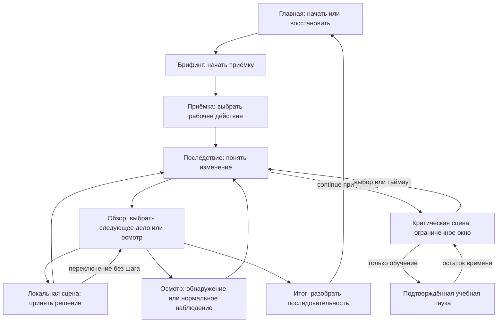

# User Flow — рабочий интерфейс и новая смена

Версия 2.1 · 26.09.2026 · #24. [Требования к UX](DESIGN-REQUIREMENTS.md) · [Модель](DOMAIN-MODEL.md) · [Прототип](design/README.md).

## 1. Что доступно сейчас

`/` — работающий интерфейс пяти серверных модулей v1: вход → домашняя страница → брифинг → решение → последствия → разбор → профиль / целевая практика. Прогресс, достижения, аналитика, уведомления и рейтинги трёх уровней используют прежний backend. Доступны восстановление активной попытки, тренировка и переигрывание развилки. Новая вёрстка не превращает эти отдельные модули в общий v2-движок.

`/preview.html` — отдельный интерактивный UX-прототип выбранной двухуровневой смены. Семь фаз ниже воспроизводимы локально. Он не пишет в профиль, не начисляет награды и не подтверждает серверную оценку. После #26 тот же PublicRun-renderer должен получать реальные серверные данные. Профиль и соревновательные разделы намеренно не встроены в активное решение новой смены.

### Изменение после просмотра пользователем

На главной одна следующая тренировка; остальные модули — под «Выбрать другую ситуацию», профиль/рейтинги/уведомления — через «Меню». В обзоре вся карточка обращения открывает дело. Осмотр, известные активные дела и адресная задача возврата остаются видимыми; решённые обращения раскрываются отдельно. «Управление сменой» объединяет завершение, перезапуск прототипа и параметры. Ни один доступный профессиональный вариант не скрывается в этом меню. В критической сцене остаются только контекст, срок, варианты и разрешённая учебная пауза. Подробности — [review-2](../research/ux/review-2.md).

## 2. Целевой маршрут новой смены

## 3. Одна главная цель в каждом состоянии

| Состояние | Цель человека | Главное управление и сохранение |
|---|---|---|
| Вход | Открыть синтетический учебный профиль | Одна кнопка входа; бригада имеет значение по умолчанию. Не нужны реальные имя/контакты. |
| Главная | Начать полезную следующую попытку | Активная попытка имеет приоритет над новой. Каталог и текущий прогресс вторичны. |
| briefing | Понять контекст и начать работу | Начать приёмку; параметры попытки доступны отдельно, без обязательной лекции. |
| inspection | Выполнить или осознанно пропустить проверку | Равноправные варианты; эффект решения появится позже, а не в цвете кнопки. |
| overview | Выбрать, чем заняться сейчас | Известные обращения, наблюдения и адресные задачи; осмотр не выдаёт число скрытых проблем заранее. |
| scene | Принять профессиональное решение | Контекст и варианты без рейтингов/награды поверх текста. Возврат к обзору не сбрасывает курсор и не расходует шаг. |
| critical scene | Отреагировать в срочном окне | Выбор и оставшееся время; нельзя переключиться на несвязанное дело. Обучение допускает явную паузу. |
| feedback | Увидеть, что изменилось | Одна кнопка продолжения. Следующее критическое окно не идёт во время чтения. |
| paused | Возобновить с сохранённым остатком | Продолжить; не перезапускать полный срок. В assessment эта фаза недоступна через управление. |
| result | Связать результат со своими действиями | Причинная история, критические ошибки, незавершённые дела; целевая практика — следующий шаг, не переписывание истории. |
| Профиль | Понять прогресс и выбрать практику | Навыки, рекомендации, история, достижения и аналитика в одном разделе. Настройки аккаунта ниже. |
| Рейтинг | Увидеть своё место в выбранном контексте | Переключатель бригада/депо/компания, собственная строка и реальные результаты. Новые лиги #23 пока не имитируются. |
| Уведомления | Узнать об изменении | Источник и содержание уведомления, отметка прочтения; без модальных прерываний решения. |
| Восстановление | Получить достоверное текущее состояние | Повтор точного неподтверждённого запроса, затем GET. При stale — новое осмысленное решение, не автоповтор с новой revision. |

## 4. Знакомство через действие и сохранение контекста

Первое действие — приёмка. В обзоре человеку объясняется только управление: открыть известное обращение или провести осмотр. Интерфейс не сообщает, какой профессиональный ответ лучше. Кнопка осмотра меняет рабочее состояние; переход между раскрытыми делами сам по себе ничего не решает. Возвращение из локальной сцены восстанавливает фокус на соответствующем известном деле. После обещания появляется Task с адресатом; остальные обращения остаются открытыми. Слова «запрос отправлен», «принят» и «исполнен» не взаимозаменяемы.

В новой смене чтение обычного текста не расходует шаг. Реальный срок появляется только после предъявления критического окна. Уход в фон, потеря сети и закрытие страницы не являются паузой. Увеличение текста может потребовать вертикальной прокрутки: варианты не обрезаются ради одной высоты экрана. В прототипе предлагается untimed по умолчанию; скорость в этом режиме не оценивается.

## 5. Ошибки и границы

Loading показывает проверку сессии, а не ложный пустой профиль. Offline предупреждает о продолжающемся серверном сроке. После неясного результата запроса нельзя отправлять другой выбор; восстановление повторяет сохранённый requestId/body. При ошибке фокус переносится к действию восстановления. При истечении сессии pending очищается. Неподдерживаемая версия смены требует обновления интерфейса, но не уничтожения исходной попытки. Прерывание, удаление профиля и сброс прототипа требуют явного подтверждения.

В рабочем v1 нет учебной паузы v2, общего рабочего шага и независимой очереди инцидентов — интерфейс не обещает обратного. Фазы и действия новой смены показаны в локальном прототипе; полнота серверной интеграции проверяется в #26. Понятность первого маршрута без объяснения проверяется 3–5 людьми по [протоколу](../research/ux/first-session-test.md), а не выводится из успешных автотестов.
