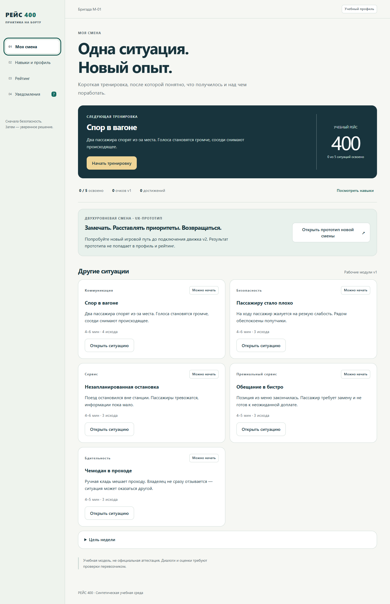
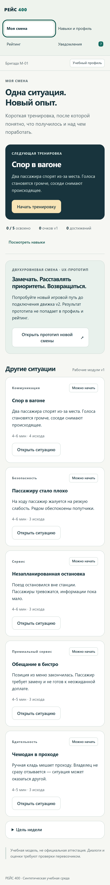

# Дизайн #24: рабочая вёрстка и интерактивный прототип

[Требования](../DESIGN-REQUIREMENTS.md) · [User Flow](../USER-FLOW.md) · [Проверки и пользовательский протокол](../../research/ux/first-session-test.md)

## Открыть и проверить

С Node.js 24 выполните `node server.mjs` из корня репозитория. Рабочие модули: `http://127.0.0.1:3000/`. Новая смена: `http://127.0.0.1:3000/preview.html`. Если задан другой PORT/HOST, используйте адрес из консоли. Это инструкция для локального сервера, не подтверждение обновления внешнего deployment.

Прототип работает без создания профиля и явно помечен как локальный. В нём доступны briefing, inspection, overview, scene, feedback, paused и result; пауза показывается только в обучении при открытом критическом окне. В настройках до старта выбираются обучение/проверка и untimed/20/40 секунд. Условные 20/40 секунд не являются нормативом. По умолчанию время не ограничено.

После начала есть приёмка, обращение у мест 18–19, осмотр салона, второе обнаруживаемое дело, адресное обещание, передача коллеге и причинный разбор. При перезагрузке восстанавливается локальное состояние этой вкладки. Сброс требует подтверждения. Нельзя использовать клиентское состояние как доказательство защиты ответов или зачёта: правила видны в исходном коде, награды отсутствуют, полноценный серверный маршрут — #26.

## Файлы и границы компонентов

`src/ui.js` — безопасные текстовые примитивы; `src/ux.js` — новые рабочие экраны; `src/views.js` — профиль/аналитика/рейтинги/уведомления и сборка; `styles.css` — общая система оформления. `src/recovery.js` хранит точную неподтверждённую команду, `src/api.js` отвечает за таймаут и допустимый повтор. `src/shift-view.js` принимает публичную проекцию v2, `src/shift-client.js` предоставляет транспорт для последующей интеграции. Только `preview.html` загружает `src/preview-app.js` и `src/preview-state.js` с локальным демонстрационным сценарием.

В v2-адаптере поддержаны команды из DOMAIN-MODEL, включая inspect/focus/choose, wait, hint, pause/resume и finish/abort, если сервер предлагает их в actions. Сам факт наличия renderer/adapter не означает, что эти endpoints уже реализованы. Переигрывание серверных развилок работает в прежних модулях; v2 replay и новые правила мотивации подключаются в #26.

## Скриншоты из настоящего браузера

Сняты Playwright в Microsoft Edge. Это не нарисованные картинки и не пользовательские тесты. `home-mobile` использует профиль устройства Pixel 7 в эмуляции; оба overview-снимка сделаны при ширине 360 CSS px. Полная высота намеренно показывает вертикальную прокрутку. Контур на домашней навигации демонстрирует клавиатурный фокус.

| Рабочая главная, desktop | Рабочая главная, mobile |
|---|---|
|  |  |

[Обзор новой смены, 360 px](screenshots/overview-mobile.png) · [Обзор в desktop-контексте при 360 px](screenshots/overview-desktop.png)

Обновление снимков: `UX_CAPTURE=1 BROWSER_CHANNEL=msedge npx playwright test tests/e2e/ux.e2e.js` в оболочке с такой записью переменных; в PowerShell сначала задайте `$env:UX_CAPTURE='1'` и `$env:BROWSER_CHANNEL='msedge'`. Без переменных используются обычные настройки Playwright. Установка dev-зависимостей: `npm ci`; браузера: `npx playwright install chromium` либо установленный поддерживаемый канал. Скрипт `node scripts/measure-ux.mjs` отдельно записывает явно обозначенный синтетический замер, не результаты живых людей.
