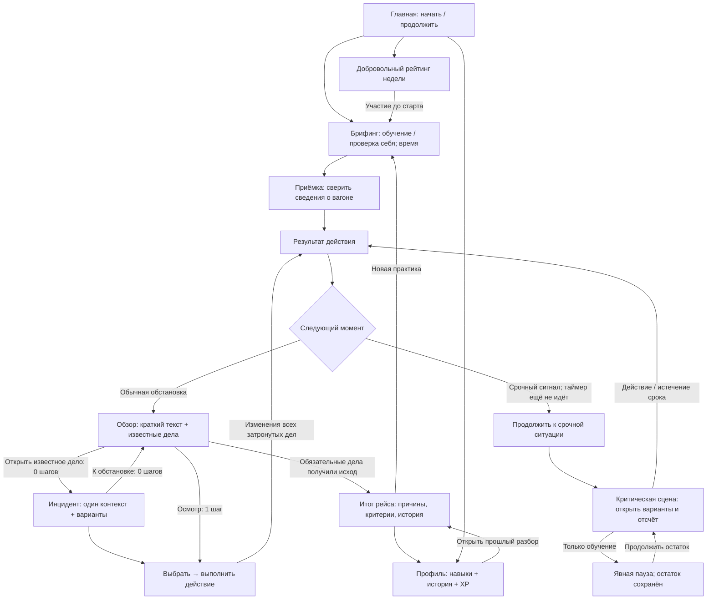

# User Flow · РЕЙС 400

Предложение для согласования, 26.09.2026. Основа: [GAMEPLAY](../GAMEPLAY.md), [DOMAIN-MODEL](../DOMAIN-MODEL.md), [ADR-001](../adr/001-two-level-text-shift.md), [GAMIFICATION-RULES](../GAMIFICATION-RULES.md). Это контекст проекта, а не поручение реализовать описанный backend.

## Основной цикл

Слово «рейс» остаётся пользовательским названием короткой учебной смены. Это один вагон и одна зона, а не имитация полного маршрута. «Инцидент» в интерфейсе обычно называется конкретно: «Спор о месте», «Багаж в проходе». Фраза «Следующая ситуация» заменена на «К обстановке в вагоне» или «Перейти к срочной ситуации».

## Пример для кликабельного прототипа

1. Главная → «Начать учебный рейс» → обучение и обычное время → приёмка.
2. Сверить сведения → прочитать результат → обстановка. Открыто только одно известное обращение; наличие скрытого дела не раскрывается.
3. Открыть «Спор о месте» → выбрать «Признать обращение и обещать вернуться» → выполнить. Появляется самостоятельное напоминание адресату, место 18.
4. Из обстановки выполнить осмотр. Теперь появляется «Багаж в проходе»; спор и обещание сохраняются.
5. Открыть багаж → организовать освобождение прохода. Результат объясняет изменение безопасности и напоминает об обращении.
6. Открыть спор → сверить билеты и запросить коллегу. Статус «Запрос отправлен».
7. Открыть спор → дождаться ответа. Статус «Коллега принял задачу», но дело ещё не закрыто.
8. Проверить исполнение и вернуться к пассажиру. Дело и адресное обещание завершаются.
9. Обстановка → итог рейса → разбор → профиль / новая практика.

Обратный путь всегда ведёт к той же обстановке. Открытие и закрытие экрана не сбрасывает локальный прогресс, шкалы, передачу или обещание.

## Позднее обнаружение и срочность

После обещания сначала запросить коллегу, затем дождаться ответа. На шаге 4 приходит критический сигнал по багажу. На результате прошлого действия ещё нет таймера и нет будущих вариантов ответа. Кнопка прямо сообщает переход в срочную ситуацию. Только после неё открываются варианты и отсчёт.

В срочной сцене одно нажатие сразу выполняет действие: подтверждающая кнопка здесь не добавляется. Несвязанные действия временно недоступны. Обучение допускает явную паузу с остатком; проверка себя — нет. Из двух открытых дел только одно получает срочный фокус. После решения или timeout показывается одно последствие, затем та же обстановка.

## Иерархия параллельных дел

| Объект | Как виден | Что не должно происходить |
|---|---|---|
| Пока не обнаруженное дело | Не видно, не входит в счётчик, осмотр доступен всегда | Нельзя показать «найдено 1 из 2» или силуэт скрытой проблемы |
| Известный инцидент | Название, место, статус, одна строка контекста | Нельзя разворачивать два полноценных диалога одновременно |
| Переданный запрос | Сначала «Запрос отправлен», затем «Коллега принял задачу» | Нельзя сразу показывать зелёное «Выполнено» |
| Обещание пассажиру | Отдельное «Вернуться к пассажиру · место 18 · до шага 7» | Нельзя скрыть вместе с переданным инцидентом |
| Закрытое дело | «Выполнено» после проверки результата, доступно для просмотра | Не должно исчезать без подтверждения изменения |
| Срочное дело | Сначала сигнал на feedback, затем отдельный фокус | Нельзя запускать таймер скрыто на фоне чтения |

На desktop другие дела показаны в короткой боковой сводке. На mobile — в раскрываемом блоке над локальной сценой. В обзоре они видны полностью. Сортировка меняется только на границе действий, не под пальцем во время выбора. Цвет всегда дополняется словами.

## Продуктовая навигация

Главная, Профиль, Рейтинг — три постоянных подписанных раздела. Уведомления находятся в шапке с доступным названием; на телефоне остаётся знакомый колокольчик, который не заменяет основной раздел. В игровом фокусе нижнее меню скрыто: используются «К обстановке» и явный выход к главной из обзора. Desktop показывает текущий рейс отдельно. Выход в обычной фазе сохраняет попытку; открытое срочное окно не обещает автоматическую паузу.

Профиль: последняя сопоставимая попытка → конкретные свидетельства навыков → история → повтор. Без данных — «не оценено». XP — отдельный блок. Рейтинг: добровольность → область бригада/депо/компания → единый период и сопоставимая группа времени → сезонные очки. История, XP и место не складываются в один балл.
