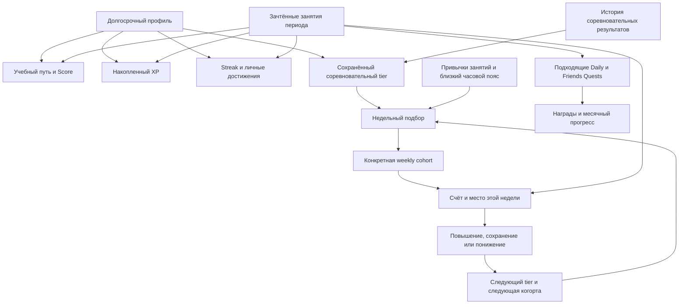
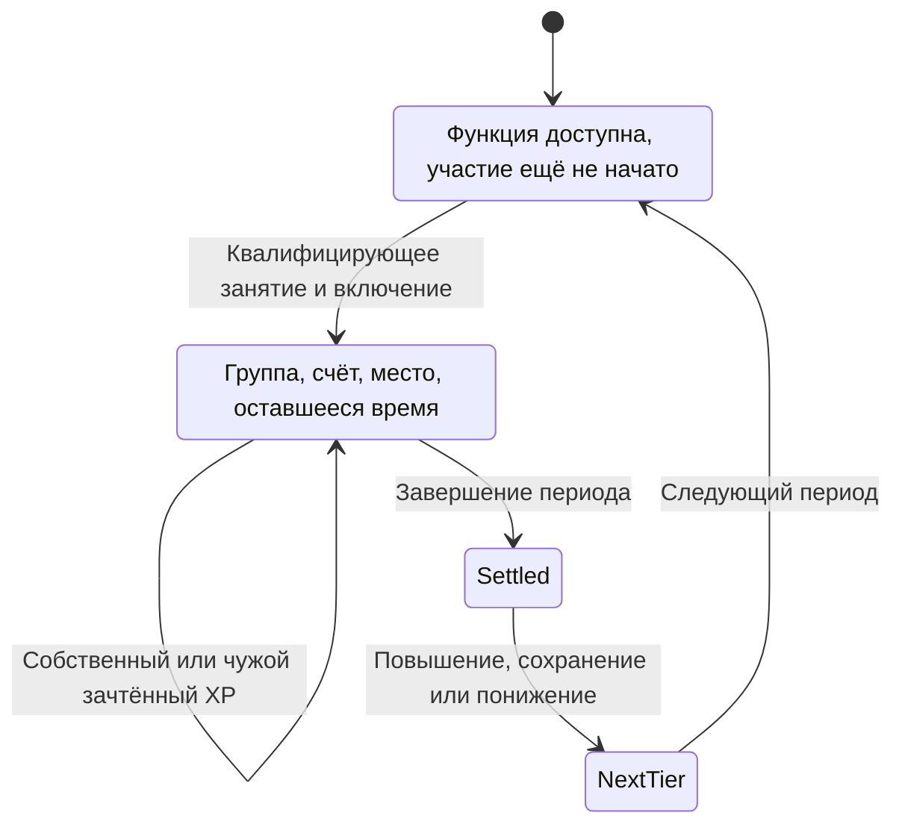

# Duolingo: механики геймификации, соревнование и удержание

**Исследование для задачи [04] / [#22](https://github.com/RomaGrach/mt-hackathon/issues/22).**  
**Дата проверки открытых источников: 26 сентября 2026 года.**  
**Область:** сам Duolingo. Адаптация к РЕЙС 400, выбор формул и изменения приложения относятся к [#23](https://github.com/RomaGrach/mt-hackathon/issues/23) и здесь не выполняются.

> Главный результат: Duolingo уменьшает необходимость догонять чужой многолетний игровой капитал, но не гарантирует новичку отсутствие сильных соперников. Недельное соревнование, учебное продвижение, серия занятий и личные достижения — разные системы. XP измеряет вознаграждённую активность, а не профессиональную или языковую компетентность.

## Навигация

1. [Метод и достоверность](#1-метод-и-достоверность)
2. [Независимые состояния продукта](#2-независимые-состояния-продукта)
3. [Учебный путь и Duolingo Score](#3-учебный-путь-и-duolingo-score)
4. [Лиги, группы и недельный цикл](#4-лиги-группы-и-недельный-цикл)
5. [Что известно о matchmaking](#5-что-известно-о-matchmaking)
6. [Почему новичок может участвовать](#6-почему-новичок-может-участвовать)
7. [XP: источники, бусты и неодинаковые условия](#7-xp-источники-бусты-и-неодинаковые-условия)
8. [Фарм и его реальные ограничения](#8-фарм-и-его-реальные-ограничения)
9. [Streak, Freeze, Repair и возвращение](#9-streak-freeze-repair-и-возвращение)
10. [Daily Quests, месячный прогресс и кооперация](#10-daily-quests-месячный-прогресс-и-кооперация)
11. [Социальные поощрения и достижения](#11-социальные-поощрения-и-достижения)
12. [Турниры и ограниченные события](#12-турниры-и-ограниченные-события)
13. [Уведомления и виджеты](#13-уведомления-и-виджеты)
14. [Публичные эксперименты и метрики](#14-публичные-эксперименты-и-метрики)
15. [Монетизация и негативные эффекты](#15-монетизация-и-негативные-эффекты)
16. [Три пользовательских маршрута](#16-три-пользовательских-маршрута)
17. [Схема системы](#17-схема-системы)
18. [Неизвестные параметры и границы вывода](#18-неизвестные-параметры-и-границы-вывода)
19. [Итог и готовность следующего этапа](#19-итог-и-готовность-следующего-этапа)
20. [Реестр источников](#20-реестр-источников)

## 1. Метод и достоверность

Основа работы — шесть предоставленных командой исследований, задача #22, материалы репозитория и дополнительная проверка первоисточников. Исходные отчёты использованы как карта вопросов, а не как доказательства: во всех шести отсутствуют URL, а обозначения FACT, CURRENTLY VERIFIED и EXPERIMENT местами сопровождают несовместимые утверждения. Исправления и контрольные суммы файлов вынесены в [аудит исходных исследований](duolingo-input-audit.md).

Предшествующий документ [docs/10-retention-gamification.md](../docs/10-retention-gamification.md) содержит продуктовые рекомендации. Этот отчёт не заменяет их автоматически: он уточняет фактическую базу, на которой отдельная задача #23 должна принять решения.

### Шкала доказательств

| Метка | Как читать |
|---|---|
| **ОФ** | Правило или изменение прямо описано Duolingo. Действует оговорка о дате, версии и охвате публикации. |
| **ЭКС** | Компания или авторы исследования описали эксперимент и сравнение. Это не означает доступность сырых данных или независимую репликацию. |
| **НАБ** | Пользовательское наблюдение, внешний обзор или публичный скриншот. Подтверждает конкретный наблюдавшийся вариант, не весь продукт. |
| **СВЯЗЬ** | Корреляция в данных компании; причинность без дополнительных сведений не установлена. |
| **АНАЛИЗ** | Наше объяснение следствий правил или условный пример. Не внутренний алгоритм Duolingo. |
| **НЕИЗВ** | В проверенных источниках нет достаточного подтверждения. Это не доказательство отсутствия функции. |

**Что действительно проверено:** тексты официальных публикаций, первичная научная статья об уведомлениях, публичные заявления сотрудников, письмо акционерам за II квартал 2026 года, опубликованные изображения интерфейса. Таблица результатов KDD и страницы письма акционерам проверены также по изображениям PDF.

**Что не выполнялось:** вход в тестовые аккаунты Duolingo на iOS/Android/Web, воспроизведение начислений, перехват API, анализ внутренних данных компании. Динамическая справка Duolingo не предоставила пригодной для проверки полной таблицы правил. Поэтому ниже нет выдуманной «единой конфигурации на 2026 год».

При конфликте старого объявления и более позднего прямого сообщения компании приоритет имеет позднее сообщение в пределах заявленного охвата. Дата проверки страницы не превращает исторический rollout в действующее ограничение.

## 2. Независимые состояния продукта

Это аналитическая модель наблюдаемого поведения, **не схема базы данных Duolingo**. Основания: [S04–S08], [S13], [S18], [S22].

| Состояние | На какой вопрос отвечает | Что его изменяет | Чего оно не означает |
|---|---|---|---|
| Реальное владение языком | Что человек способен понять и сказать вне приложения? | Обучение, практика, забывание; проверяется отдельными заданиями | Не выводится из одного XP или streak |
| Course progress | Где человек находится в программе? | Прохождение соответствующих узлов и разделов | Не место среди других пользователей |
| Duolingo Score | Какой участок языкового курса пройден в шкале, связанной с CEFR? | Продвижение по соответствующему курсу | Не Duolingo English Test и не независимая аттестация |
| Накопленный XP | Сколько вознаграждённой активности накоплено? | Начисления за учитываемые занятия | Не сумма знаний и не стартовый счёт следующей недели |
| XP текущего соревнования | Сколько зачтено в данном периоде? | Зачтённые системой начисления периода | Не весь XP за жизнь аккаунта |
| League tier | На какой ступени соревновательной лестницы находится пользователь? | Итоги предыдущих соревнований; возможные специальные восстановления | Не CEFR и не возраст аккаунта |
| Weekly cohort и rank | С кем и на каком месте человек соревнуется сейчас? | Включение в группу, собственная и чужая активность | Не глобальное место среди всех пользователей Duolingo |
| Streak и запас Freeze | Сохранена ли цепочка регулярности и защищён ли пропуск? | Квалифицирующее занятие, пропуск, защита или восстановление | Не объём практики за день |
| Quest progress | Насколько выполнено ограниченное задание? | Только действия, подходящие под условие квеста | Не обязательно все действия, дающие XP |
| Gems, награды, рекорды | Какие ресурсы и символические достижения получены? | Награды, покупки, расходы, достижение условий | Не дополнительный учебный уровень |

**Практический тест разделения:** проигрыш в недельном соревновании сам по себе не означает потерю пройденного курса; восстановление серии не означает повторного изучения забытых слов; рост XP на знакомом материале не обязательно сдвигает учебный путь. Последнее — логическое следствие разных оснований начисления, а не оценка пользы любого повторения.

## 3. Учебный путь и Duolingo Score

**ОФ.** С ноября 2022 года Duolingo переводила всех пользователей на новый главный экран с учебным путём: уроки и повторение встроены в последовательность; истории также интегрированы в обучение. Старое дерево навыков с crowns нельзя использовать как универсальное описание текущей навигации. Число уроков в узле, разделов в курсе и доступность дополнительных режимов зависят от курса и его версии. [S05]

**ОФ.** Duolingo Score отражает продвижение по языковому курсу с привязкой содержания к уровням CEFR. В первоначальной публикации описывался ограниченный запуск; в итогах 2025 года компания сообщила о распространении Score на все языковые курсы. Старые перечни из нескольких поддерживаемых языков поэтому не являются актуальным ограничением. [S06; S07]

**АНАЛИЗ.** Даже такая шкала ближе к освоенному участку программы, чем к результату независимого экзамена. У двух людей с одинаковым Score могут различаться разговорная уверенность, устойчивость навыка и результат в новой ситуации. Нельзя ни переводить XP в CEFR по собственной формуле, ни считать лигу заменой Score.

**ОФ.** Уже при объединении языков, математики и музыки Duolingo описывала общие streak, XP и участие в лигах через разные предметы. Поэтому набор XP не обязательно означает практику именно того языка, прогресс которого рассматривается. Отдельный рейтинг Elo в шахматном PvP, показанный в итогах 2025 года, не является доказательством использования Elo для языковых недельных лиг. [S08; S07]

## 4. Лиги, группы и недельный цикл

### 4.1. Лига — не одна огромная таблица

**ОФ.** Компания описывает десять лиг, недельный цикл с границей в воскресенье с учётом часового пояса и подбор соперников со схожими привычками занятий. Соревнование не ограничивается изучающими один язык. [S01]

**НАБ.** Устойчивая в публичных описаниях последовательность ступеней:

```text
Bronze → Silver → Gold → Sapphire → Ruby → Emerald
       → Amethyst → Pearl → Obsidian → Diamond
```

**НАБ.** Типичная обычная группа — около 30 участников. Это ориентир по наблюдавшимся интерфейсам, а не доказанный предел для любой версии, эксперимента или турнира. Один tier содержит множество независимых групп, а не единственный всемирный рейтинг. [S03]

### 4.2. Включение новичка и начало новой недели

Рабочая реконструкция: после открытия соревновательной функции новичок начинает с нижней ступени; квалифицирующее занятие включает его в недельную группу; дальше учитываемые начисления изменяют счёт внутри этой группы. Автоматический, малотренийный вход в соревнование описан в ретроспективе бывшего CPO. Нынешняя инженерная публикация прямо подтверждает когорты и начисление XP за сессии. [S02; S04]

**НЕИЗВ.** Не установлен единый действующий порог открытия Leaderboards: «сразу после первого урока», «после десяти уроков» и ограничения определённых категорий аккаунтов нельзя считать одной универсальной нормой. В частности, нельзя молча переносить старый пользовательский порог на все новые аккаунты сентября 2026 года.

Следует различать **границу периода** и **момент включения конкретного пользователя**. Из того, что пользователь начал позже, не следует, что для него начинается личная полная неделя или что он будет добавлен к уже давно заполненной группе. Длительность окна набора, закрытие группы, последний допустимый момент вступления и обработка неукомплектованной группы публично не восстановлены.

### 4.3. Повышение, сохранение и понижение

Наблюдаемая базовая логика — верхняя зона повышается на следующую ступень, средняя сохраняет tier, нижняя понижается. Оказаться в нижней зоне посреди недели — ещё не итоговое понижение. Diamond не имеет обычной следующей ступени над собой; Bronze является нижней ступенью. [S03]

**Числа нельзя смешивать между версиями.** Во внешней таблице [S03] указаны, например, 20 повышений в Bronze, 15 в Silver, 10 в Gold, 7 в части средних лиг и 5 в Obsidian. Но размещённый там же скриншот Emerald показывает границу повышения после пятого места, а не после седьмого. Причина расхождения не установлена: версия, эксперимент, устаревшая таблица или ошибка автора. Это не доказательство конкретного A/B-теста.

Поэтому **не принимаются за действующее правило** ни «во всех лигах повышаются 3–5 человек», ни «из Diamond всегда вылетают ровно четыре». Для конкретного соревнования существенны показанные в нём зоны и финальный результат. Награда первой тройке, зона повышения и отбор в турнир — также не обязательно один набор мест.

### 4.4. Минимальная модель расчёта

Ниже математическая запись смысла соревнования, не восстановленный код:

```text
W(u, p) = сумма зачтённых начислений пользователя u в периоде p
rank(u, c, p) = место по W среди участников когорты c

Если финальное место входит в зону повышения → следующий tier.
Если входит в зону сохранения → тот же tier.
Если входит в зону понижения → предыдущий tier.

Для следующего соревнования формируется новый счёт периода;
прошлые знания, пройденный курс и lifetime XP не становятся его форой.
```

Пограничные случаи — одинаковый XP, задержавшаяся синхронизация, изменение наград и специальные восстановления — требуют дополнительных правил, которых эта абстракция не выдумывает.

**ОФ.** Инженеры объясняют, что экран после урока может показывать предсказанные клиентом XP и место до завершения серверного расчёта. Несовпадение активного буста или оценки ответов может вызвать расхождение. Разные варианты согласования состояния уже использовались. Поэтому отдельный скачок или исправление места не доказывает мошенничество. [S04]

### 4.5. Что происходит при отсутствии

Нужно разделить две ситуации:

- Пользователь уже участвует и перестал заниматься: его место может ухудшиться из-за активности соперников, а период завершиться понижением.
- В следующие периоды пользователь вообще не включался: из первого правила **не следует** автоматическое новое понижение за каждую календарную неделю отсутствия.

**НЕИЗВ.** Универсальная современная политика для второго случая не подтверждена. Утверждение «после месяца отсутствия любой ветеран обязательно оказывается в Bronze» исключено. В маршруте возвращения текущий tier определяется фактическим состоянием аккаунта, а не предполагаемой лестницей штрафов.

## 5. Что известно о matchmaking

| Возможный фактор | Статус | Что можно утверждать |
|---|---|---|
| Текущая ступень лиги | ОФ / НАБ | Недельное соревнование встроено в лестницу tier; не следует смешивать всех пользователей в одну таблицу. [S01; S03] |
| Схожие привычки занятий | ОФ | Прямо названо компанией. Слово «схожие» не раскрывает расстояние между профилями или гарантию равной нагрузки. [S01] |
| Близкий часовой пояс | ОФ | Прямо названо компанией; это не обязательно одинаковая страна или гражданство. [S01] |
| Вовлечённость на предыдущей неделе | Историческое заявление участника разработки | Бывший CPO описывает такой подход в ретроспективе. Нельзя считать установленным, что ровно семь дней — неизменное окно алгоритма 2026 года. [S02] |
| Изучаемый язык | ОФ | Один и тот же язык не является обязательным условием. [S01] |
| Время первого занятия после reset | НАБ / НЕИЗВ | Влияет на момент обращения к системе, но его точная роль в подборе и сила эффекта не опубликованы. |
| Lifetime XP, возраст аккаунта | НЕИЗВ для подбора | Не являются счётом текущей недели. Из этого не следует доказательство полного отсутствия таких признаков внутри закрытого алгоритма. |
| CEFR, Score, качество ответов | НЕИЗВ | Нет основания объявлять их главным критерием подбора соперников. |
| Подписка, платформа, прошлое место, длительность паузы | НЕИЗВ | Отдельные различия в условиях получения XP не доказывают группировку по этим признакам. |
| Elo языковой лиги, скрытый «рейтинг силы», гарантированная защита новичков | НЕИЗВ | Публичной формулы или подтверждения такой конкретной системы не найдено. |

**АНАЛИЗ.** Подбор по недавнему поведению уменьшает вероятность крайнего несоответствия нагрузки, но прошлое поведение не ограничивает будущую активность. Умеренный пользователь может внезапно заниматься намного больше; человек с большим свободным временем может вернуться после паузы; участник может найти более эффективный по XP режим. Поэтому даже хороший поведенческий подбор не гарантирует «равных сил» на следующую неделю.

Совет «вступай во вторник и гарантированно получишь лёгкую группу» не доказан. Обратное категорическое утверждение «время вступления точно не влияет» тоже не доказано. Без контролируемого сравнения похожих аккаунтов нельзя отделить время входа от их истории, региона и доступного пула соперников.

## 6. Почему новичок может участвовать

**АНАЛИЗ на основании §§2–5.** Здесь работают четыре разных ограничения преимущества ветерана, а не один секретный алгоритм:

1. **Не требуется догонять lifetime XP.** Соревновательный долг ограничен текущим периодом.
2. **Сравнение локальное.** Значимы участники своей группы, а не самые активные пользователи мира.
3. **Лестница и похожие привычки разделяют нагрузку.** Это вероятностное смягчение, не запрет встретиться с ветераном.
4. **Успех имеет несколько форм.** Повышение, удержание ступени, личный рекорд, закрытый квест и новый раздел курса не сводятся к первому месту.

Однако пользователь с большим опытом приложения сохраняет другие преимущества: знает выгодные режимы, быстрее выполняет знакомые упражнения, может иметь больше доступного контента, времени и ресурсов. Еженедельный reset убирает накопленную фору в счёте, **но не выравнивает XP в минуту, свободное время или учебную сложность**.

Условный пример: у A за всё время 200 000 XP, у B — 2 000. Если в одной недельной группе B получает 900 зачтённых XP, а A — 700, B выше A по этому показателю. Пример иллюстрирует правило счёта; он не предсказывает попадание этих людей в одну группу, язык, CEFR или вероятность победы.

При слишком сильном лидере цель «первое место» может стать недостижимой, но ещё оставаться достижимыми повышение или сохранение. Если и они недостижимы, личный учебный путь остаётся альтернативным источником прогресса. Это структурная возможность системы, а не доказательство отсутствия тревоги у проигрывающих.

## 7. XP: источники, бусты и неодинаковые условия

### 7.1. Что можно считать установленным

**ОФ.** XP начисляется за учитываемые сессии; сервер рассчитывает награду с учётом нескольких факторов, включая ответы, внутрисессионные бонусы и XP boosts. Следовательно, формула «любой урок = 10 XP» не является достаточным современным описанием. [S04]

Следующая таблица — **карта источников**, а не прайс-лист сентября 2026 года. «Не установлено» означает отсутствие проверенной единой ставки, а не нулевую награду.

| Активность | Что подтверждено | XP и ограничения |
|---|---|---|
| Новый урок на пути | Основная учебная активность; продвигает соответствующий путь | Единой ставки для всех предметов, уровней и версий не установлено. [S04; S05] |
| Повторение пройденного узла | Доступный способ практики | В официальной иллюстрации [S09] есть Review за 5 XP. Это пример экрана, не тариф всех повторений. |
| Встроенное повторение на пути | Часть учебной последовательности | Не следует приравнивать к добровольному повтору старого узла. [S05; S28] |
| Ошибки, слова, speaking/listening practice | Дополнительная целевая практика | Состав Practice зависит от курса; универсальные XP и лимиты не установлены. [S09; S10] |
| Stories | Учебный формат, интегрированный в путь | Нет основания назначать всем историям 10 XP или объявлять их одноразовыми. [S05; S09] |
| Legendary | Усложнённое прохождение знакомого материала, с меньшей поддержкой | В официальной иллюстрации [S09] показано 40 XP; не универсальная стоимость всех вариантов. |
| Timed challenges, Match Madness, Rapid Review | Быстрая практика с ограничением времени; Match Madness — сопоставление слов | Ставки, уровни, доступ и расход ресурсов различаются. Не установлено, что режимы полностью заменены Lightning Round. [S09] |
| Video Call и другие новые форматы | Компания меняла цели и награждение разговорной практики | В итогах 2025 года прямо описана XP-цель звонка. Нет постоянного универсального отношения XP к минутам. [S07] |
| Daily / Friends Quests | Дают собственные награды, в том числе усилители | Нельзя автоматически прибавлять «50 XP за любой Friends Quest»: выдача предмета-буста и прямое начисление — разные события. [S18] |
| Другие предметы | Существуют общие механики активности | Дополнительный предмет может участвовать в общей экономике, не продвигая выбранный языковой курс. [S08] |

Числа с иллюстраций не нужно использовать для расчёта доходности без версии приложения, типа задания, активных бонусов и времени полного цикла.

### 7.2. Усилители и события

**ОФ.** Бусты существуют; их влияние участвует в серверном расчёте, а подарки и награды Friends Quests могут включать XP boost. [S04; S18]

**НАБ.** В описаниях использования в 2025 году встречаются 1,5×, 2× и 3×, неодинаковые длительности и изменение момента получения награды. Это подтверждает существование наблюдавшихся конфигураций, но не правило «каждый из трёх квестов всегда даёт 10 минут 3×». [S33]

| Вопрос | Результат проверки |
|---|---|
| Что означает множитель? | Усиление учитываемых наград на ограниченных условиях, а не увеличение знания или числа дней streak. |
| Можно ли складывать время? | Такие варианты описываются пользователями, но единая текущая политика продления, замены и очереди не подтверждена. [S33] |
| Даёт ли 2× вместе с 3× обязательно 6×? | Нет оснований так считать. Наличие двух наград не доказывает перемножение их коэффициентов. |
| Early Bird / Night Owl | Исторически описывавшиеся временные награды; их наличие, окна получения и расходования надо проверять на конкретном аккаунте. Не подтверждены ни вечная доступность, ни всемирное окончательное удаление. |
| Happy Hour и добавочные XP | Упоминания нельзя превращать в неизменное еженедельное расписание и общую формулу. Текущий порядок сложения с бустом не установлен. |
| Friends Quest: 30 минут 2× | Описанный внешним руководством вариант награды, а не подтверждённая ставка для всех пользователей 2026 года. [S32] |
| Постоянный 2× для Super | В проверенных официальных описаниях не подтверждён. Отсутствие рекламы или ограничения ресурса — не то же самое, что вечный множитель. [S12] |

**АНАЛИЗ.** Для расчёта эффективности сравнивать нужно не номинальный XP за экран, а ожидаемый зачтённый XP за полный цикл: выполнение, загрузки, реклама, ошибки, ограничения ресурса и доступ к бустам. Даже одинаковый множитель не делает разные действия одинаково выгодными.

## 8. Фарм и его реальные ограничения

### 8.1. Три явления, которые нельзя смешивать

| Тип поведения | Отличие |
|---|---|
| Полезное повторение | Возвращение к материалу ради закрепления, исправления ошибки или поддержания практики. Наличие XP не делает его злоупотреблением. |
| Оптимизация игровой метрики | Выбор знакомых быстрых действий преимущественно ради XP, места или квеста, даже если новое содержание почти не осваивается. Может происходить без нарушения технических правил. |
| Техническое злоупотребление | Автоматизация, ошибочные или нелегитимные начисления. Не следует обвинять в этом пользователя только по большому счёту. |

**ОФ.** Duolingo сама описала проблему: оптимизация числа сессий делала короткие лёгкие занятия привлекательными, хотя они не обязательно давали больше учебной ценности. Компания ввела внутреннюю метрику **Time Spent Learning Well**, уделяющую особое внимание содержательному продвижению по пути. Это не новый вид leaderboard XP и не измеренная языковая компетентность. [S28]

**ИССЛЕДОВАНИЕ.** Работа Mogavi и соавторов изучает сообщения форума за девять лет и интервью с 15 международными пользователями. Она описывает избыточную конкуренцию, давление и смещение внимания к игровым показателям. Это качественное исследование механизмов и опыта, а не оценка доли всех пользователей Duolingo в 2026 году. [S30]

### 8.2. Почему система не полностью превращается в фарм

**АНАЛИЗ.** Участники решают разные задачи. Не все стремятся к первому месту; часть людей ориентируется на учебный путь, личный streak, друзей или месячную награду. Поведенческое разделение групп может концентрировать интенсивную гонку в некоторых когортах. Ограниченное время и ресурсы также влияют на поведение.

Но ни один из этих факторов не доказывает, что **оптимальная стратегия максимизации XP совпадает с оптимальной стратегией обучения**. Если известное лёгкое действие даёт больше XP в минуту, пользователь, максимизирующий только место, имеет стимул выбирать его. Недельный reset ограничивает длительность накопления, но не устраняет этот стимул внутри недели.

### 8.3. Какие защиты подтверждены, а какие нет

**ОФ / заявление компании.** Duolingo сообщает о мониторинге нерегулярной активности и удалении из Leaderboards за нелегитимные XP. Компания также характеризует обнаруживаемое мошенничество как редкое; это её оценка, не независимый аудит распространённости. [S01]

**ОФ.** Серверный расчёт и проверка состояния не равны публикации полной античит-системы. Ресурсные ограничения free-версии влияют на число занятий, но официальное описание Energy посвящено учебному опыту и монетизации, а не доказанной нормализации соревнования. [S04; S11]

**НЕИЗВ:** единый суточный XP cap; гарантированное снижение награды после 300–500 XP; ограничение любого Legendary двумя повторами в день; универсальный cooldown; автоматическое выявление всех скриптов; точная доля фармеров; дата исправления конкретного «pronunciation glitch» из исходного отчёта. Эти утверждения не используются как факты.

## 9. Streak, Freeze, Repair и возвращение

### 9.1. Минимальное обязательство

**ОФ.** В исследовании 2020 года Duolingo описала отделение streak от выполнения полной дневной XP-цели: для серии достаточно завершить один урок. Поэтому человек может сохранить день серии, но не выполнить более крупную цель или все квесты. Дополнительные уроки в тот же день не означают дополнительные календарные дни streak. [S13]

**АНАЛИЗ.** Это превращает неопределённое «надо больше заниматься» в минимальную задачу на сегодня. Цена упрощения — возможность регулярно выполнять только минимум. Устойчивость привычки и глубина конкретного занятия здесь разные результаты.

### 9.2. Защита до пропуска и восстановление после него

| Механизм | Триггер и результат | Что важно не перепутать |
|---|---|---|
| **Streak Freeze** | Заранее имеющаяся защита используется для пропущенного дня; сохраняет цепочку | Защищённый пропуск не является фактически проведённым уроком. Цена, ёмкость запаса и особые награды не универсальны. [S16; S17] |
| **Streak Repair** | Восстановление после уже возникшего разрыва | Monthly Streak Repair описывался как преимущество Super. Это не покупка Freeze задним числом; полные современные условия всех предложений не установлены. [S12] |
| **Защита при сбое сервиса** | Инфраструктурный механизм BRB выявляет затронутые попытки занятия и применяет защиту | Не гарантирует восстановление любого пропуска у любого пользователя. [S16] |
| **Streak Revival** | Отдельная ограниченная кампания для возвращения | Нельзя выдавать её за постоянное бесплатное восстановление. [S29; S34] |

В материале о поездках компания описывала запас до двух Freeze и необходимость пополнения после расходования. Это описание соответствующего периода, а не доказательство максимума для всех аккаунтов, Streak Society и экспериментов. В исследовании разрешение двух вместо одного улучшало DAU; оно **не доказывает**, что тест трёх Freeze провалился. [S17; S14]

**ОФ, событие прошлого периода.** В июне 2026 года проводилась одноразовая Streak Revival: три урока позволяли восстановить прежнюю максимальную серию. В письме от 5 августа компания сообщила о 15,4 млн восстановленных серий; почти 8 млн участников не имели активной серии на старте события. Это не 15,4 млн новых пользователей, не оценка дополнительного DAU и не опубликованный долгосрочный A/B-эффект. [S29, печатная с. 5]

**НАБ / публикация о запуске.** Сообщение от 1 июня описывало окно до 30 июня, прежнюю серию не менее 30 дней и три урока за один заход. Эти условия события не следует обобщать на обычный Repair или считать действующими 26 сентября. [S34]

### 9.3. Что сохраняется после разрыва

При обычном возвращении без доступного восстановления начинается новая цепочка регулярности; это не означает обнуление изученного курса. Внешняя защита, реконструкция максимальной серии и действительные дни занятий должны трактоваться отдельно. Поэтому «streak 365» нельзя автоматически переводить в утверждение «человек реально учился каждый из последних 365 календарных дней».

**ОФ.** Компания сама рекомендует на загруженный день короткую практику, повторение или историю, чтобы сохранить привычку. Следовательно, оценка «любой короткий повтор — бессмысленный фарм» противоречит назначению части продукта. Вопрос в том, заменил ли этот минимум всю учебную работу на длительной дистанции. [S17]

## 10. Daily Quests, месячный прогресс и кооперация

### 10.1. Daily Quests

**ОФ.** Итоги 2025 года прямо упоминают три Daily Quests и повышенную награду за завершение всех трёх. Следовательно, утверждение «обычно только один дневной квест» нельзя принимать за основное современное описание. [S07]

**НАБ.** Публичные руководства описывают задания на XP, время или количество занятий, а также отличия целей между аккаунтами. Дневные цели ограничены своим периодом; месячный challenge использует отдельный прогресс по квестам. Такие руководства не устанавливают действующий серверный алгоритм генерации. [S31]

| Компонент правила | Что установлено и что осталось открытым |
|---|---|
| Действие | Выполнить указанное условие: не всякий урок обязательно подходит любому квесту |
| Завершение | Достичь целевого значения в срок данного задания |
| Горизонт | День; точные правила смены даты при поездке, DST и разных устройствах не подтверждены |
| Награда | Зависит от задания и конфигурации; награда за комплект не тождественна награде каждого квеста |
| Сложность / tiers | Различающиеся цели наблюдаются; точные веса, пороги и возможность выбора уровня не восстановлены |
| Пропуск | Теряется возможность закрыть этот ограниченный квест; это не доказательство потери курса, lifetime XP или streak |
| Защита | Универсальный аналог Freeze для незавершённых Daily Quests не подтверждён |

**АНАЛИЗ.** Квест расширяет цель с «присутствовать сегодня» до «сделать определённый объём или тип действий». Но буквальное выполнение счётчика может расходиться с учебной целью: например, стимулировать простые идеальные уроки вместо трудного нового материала.

### 10.2. Месячный challenge

**ОФ.** Friends Quests в описании компании дают вклад в месячную цель; за неё предусмотрен месячный badge. Quest Points — самостоятельный счётчик, не синоним XP. [S18]

**НАБ.** Руководства фиксируют переход от старых XP-челленджей к квестовым целям и неодинаковые месячные пороги. Не подтверждено единое правило «всем 50 квестов», единый вес каждой задачи или неизменные 1/2/3 очка за tiers. [S31]

**АНАЛИЗ.** Месяц объединяет небольшие дневные действия в конечную коллекционную цель. Неуспех в месяце означает не получить соответствующую награду, а не ретроспективную отмену полезных занятий. Это отдельный горизонт, не длительность обычной недельной лиги.

### 10.3. Friends Quests: правило и его изменения

**ОФ, исходная модель.** Один партнёр, общая задача на XP или подходящие уроки, пять дней на выполнение, вознаграждение; можно посылать подготовленные nudges и дарить XP boost за gems. [S18]

| Период | Подтверждённая эволюция |
|---|---|
| Первоначальное описание 2022 года | Взаимная подписка, активный друг, автоматическое назначение; указан вторник после 13:00 EST, iOS/Android и отсутствие web на тот момент. [S18] |
| Более поздняя публикация социальных функций | Появляется выбор партнёра. Старое «никогда нельзя выбирать» перестаёт быть общей нормой. [S19] |
| Итоги 2025 года | Объявлен универсальный matching, допускающий Friends Quests даже без друзей. [S07] |

В текущем описании нельзя оставлять обязательность взаимной подписки из первоначального rollout без оговорки об обновлении. Также нет основания считать функцию отменённой или полностью заменённой Solo Quests.

**НЕИЗВ.** Полная формула сложности пары, текущие платформенные исключения, минимальный индивидуальный вклад и распределение наград во всех версиях. Из «общей цели» не следует обязательное распределение 50/50. Подбор ранее активного человека не гарантирует его активность в следующие пять дней.

**НАБ.** Внешнее руководство описывает одинаковую награду партнёрам и вариант с 30 минутами 2×. Это наблюдение конкретной версии, а не универсальный контракт наград. [S32]

## 11. Социальные поощрения и достижения

### Friend Streak — не Friends Quest

**ОФ.** Friend Streak создаётся приглашением и принятием; оба участника поддерживают занятия. Можно вести до пяти **отдельных парных серий**, а не одну общую серию группы из пяти человек. Есть напоминания партнёру. Компания сообщает, что пользователи с такой серией на 22% чаще выполняют ежедневный урок; опубликованного дизайна рандомизированного теста для этого числа нет, поэтому это СВЯЗЬ, не установленный causal lift. [S20]

**ОФ.** Рассказ команды о разработке объясняет ограничение числа приглашений анализом сети контактов и проблему первоначального приглашения. Это не публикация успешного A/B-теста «пять против шести друзей». Точные правила защиты общей серии чужим Freeze и автоматического переноса платного Repair в эту функцию не восстановлены. [S21]

### Feed, поздравления и граф друзей

**ОФ.** Социальные публикации описывают поздравления друзей с учебными вехами и активности в ленте. Это опровергает описание продукта как лишённого поздравлений; голосовой групповой чат из входящего отчёта подтверждения не получил. Заявление о 5,6-кратной связи подписки на друзей с завершением курса не доказывает, что простое добавление друга умножает шанс каждого ученика в 5,6 раза. [S19]

### Achievements, awards и personal records

**ОФ.** В обновлённой системе различаются награды за условия и личные рекорды. Компания приводит примеры максимального дневного XP, идеальных уроков, самой длинной серии и лучшего результата лиги; награды могут иметь несколько уровней сложности. Есть достижимые цели для новичков и долгие цели для регулярных пользователей. [S22]

**АНАЛИЗ.** Личный рекорд важен тем, что для его обновления не нужно победить лидера своей группы. Но рекорд XP сохраняет риск стимулировать объём вместо качества. Нельзя превращать любую визуальную награду в «уровень знания» или обещать неизменный полный каталог бейджей.

## 12. Турниры и ограниченные события

**ОФ.** Diamond Tournament — дополнительное соревнование для верхней лиги: на соответствующей неделе top 10 получают право отбора; предусмотрены четвертьфинал, полуфинал и финал с отсевом. Турнир начинается не каждую неделю: важен заголовок об отборе в текущем интерфейсе. Старое указание «Android скоро» в статье — историческое состояние публикации, не проверенное ограничение на сентябрь 2026 года. [S01]

**НЕИЗВ.** Единый актуальный размер турнирной группы, квоты перехода на каждом этапе, награды и точная обработка выбывания, пропуска или возврата в обычную Diamond для всех конфигураций. Часто цитируемую схему «15 человек, проходят 10» нельзя здесь объявить универсальной без проверенной версии.

Турнир не следует рисовать как одиннадцатую постоянную лигу. Три этапа и их отбор — дополнительная ветвь соревнования. Точное расписание очередного запуска не выводится из самого существования функции.

Месячные badges, сезонные оформления, партнёрские акции и разовое восстановление серии — разные классы событий. Наличие одного ограниченного события не доказывает общий «сезонный сброс» всех лиг и накопленных достижений. Конкретный проверенный пример comeback-события — Streak Revival, описанный в §9, а не гипотетическое постоянное право на восстановление.

## 13. Уведомления и виджеты

**ОФ.** В описании системы напоминаний 2020 года использовались заранее написанные сообщения с условиями доступности и персонализацией. Алгоритм выбирал подходящий вариант, учитывая различия аудитории и снижение эффекта при частом повторении одинакового текста. Это задача выбора сообщения, а не доказательство, что максимальное число push всегда улучшает результат. [S23]

| Канал | Роль в цикле | Граница достоверности |
|---|---|---|
| Push | Напомнить о практике, серии или другом значимом событии | Нет доказанного единого лимита «ровно один в день» для всех типов сообщений и версий |
| Email | Дополнительный канал возвращения и напоминания о серии | Нельзя переносить алгоритм push на всю email-систему без источника |
| In-app | Прогресс задания, окончание сессии, достижение, предложение продолжить | Несколько независимых карточек могут сопровождать одно занятие; это не несколько завершённых занятий |
| Социальный nudge | Напоминание от партнёра о совместной цели | Подготовленное сообщение — не свободный чат; может восприниматься как поддержка или давление |
| Виджет | Постоянно видимый сигнал вне открытого приложения | Установка и использование добровольны; сама видимость не доказывает причинный эффект |

**ОФ.** Компания описала запуск streak-виджета на iOS в июле 2022 года, на Android в марте 2023 года, изменение состояния по мере приближения конца дня и упрощение установки после урока. В публикации говорится о лучшем удержании с учётом предшествующей вовлечённости, но без достаточного для независимой проверки численного A/B-протокола. [S25]

**НЕИЗВ.** Актуальные лимиты по всем каналам вместе, quiet hours, точный час каждой отправки, алгоритм comeback-цепочек и частота повторов для конкретного пользователя. Число «23,5 часа — оптимально для всех и используется сейчас» из исходного материала не принято как установленное правило.

## 14. Публичные эксперименты и метрики

### 14.1. Что действительно опубликовано

В таблице различаются дата публикации и описываемый исторический эксперимент. Если размер выборки, доверительный интервал или полный протокол не опубликованы, они не достраиваются. Проценты не переименованы в процентные пункты.

| Эксперимент / публикация | Сравнение и гипотеза | Опубликованный результат | Ограничение интерпретации |
|---|---|---|---|
| Streak Wager, 2017 [S15] | Предложение добровольного обязательства на семь дней против отсутствия предложения | D7 retention +14%; сообщается о значимости также D1 и D14 | Исторический тест; не доказательство наличия такого предмета во всех нынешних магазинах |
| Weekend Amulet, 2017 [S15] | Возможность сохранить серию через выходные против отсутствия предложения | Возврат через неделю +4%; потеря серии −5% | Это не приведённые во входящем отчёте D7 +2,1% и D14 +4% |
| Разделение streak и дневной XP-цели, 2020 [S13] | Для серии достаточно одного урока вместо полной цели | D14 +3,3%; DAU +1%; доля DAU со streak +10,5% за 20 дней | В источнике изменения относительные; выполнение полной дневной цели снизилось |
| Анимация празднования streak, публикация 2022 [S14] | Более заметное празднование раннего прогресса | D7 новых пользователей +1,7% | Не переносить этот эффект на любую анимацию; полного независимого протокола нет |
| Два Freeze вместо одного, публикация 2022 [S14] | Дополнительный резерв пропуска | DAU +0,38% относительно контроля | Не исследование бесконечных пропусков и не доказательство провала третьего Freeze |
| Leaderboards, ретроспектива бывшего CPO 2023 [S02] | Соревновательная лестница как стимул дополнительных занятий | Время обучения +17%; число высокововлечённых пользователей выросло втрое | Высокововлечённые: не менее часа в день пять дней в неделю; это не трёхкратное увеличение знания |
| Заимствованный игровой счётчик ходов, та же ретроспектива [S02] | Перенести игровое ограничение в учебный процесс | Нейтральный результат по удержанию и DAU | Пример, когда правдоподобная механика не обеспечила ожидаемый рост |
| Изменение формулировки обязательства, интервью 2024 [S27] | Сделать принятие цели более явным | Сотрудник сообщает об улучшении retention, без конкретной величины | Качественное свидетельство участника; не численно воспроизводимый эксперимент |

Публичных материалов недостаточно, чтобы гарантировать неизменное присутствие каждого успешного варианта в приложении через несколько лет. Даже успешный исторический тест не превращает его старые правила в текущий продуктовый контракт.

### 14.2. Уведомления: более подробный проверяемый пример

**ЭКС.** Yancey и Settles, KDD 2020: двухнедельное онлайн-сравнение нового алгоритма выбора уведомлений с прежним случайным выбором допустимого шаблона. В таблице 8 приведены **относительные изменения**: [S24]

| Метрика авторов | Изменение | Отмечена значимость p < 0,05 |
|---|---:|---|
| DAU | +0,5% | Да |
| Завершённые уроки | +0,4% | Да |
| D1 существующих пользователей | +0,5% | Да |
| D7 существующих пользователей | +0,2% | Нет |
| D1 новых пользователей | +2,2% | Да |
| D7 новых пользователей | +2,0% | Да |

В статье Dₓ — повторная активность через x дней относительно исходного активного дня; новая аудитория определяется относительно первого уведомления. Нельзя без оговорки приравнять это к любой стандартной метрике D7 от регистрации. Большой корпус уведомлений для исследования не равен размеру рандомизированной экспериментальной выборки.

### 14.3. CURR — опубликованная модель, не слух

**ОФ.** Duolingo опубликовала модель роста с сегментами New, Current, Reactivated, Resurrected, At-risk WAU, At-risk MAU и Dormant. Активные сегодня составляют разные состояния в зависимости от предшествующей активности; неактивные разделяются по давности последнего использования. **Current User Retention Rate** отслеживает переход текущих пользователей к активности следующего дня. Это не метрика качества подбора лиг. [S26]

В письме за II квартал 2026 года компания сообщает **CURR 84%**: речь об активных сегодня пользователях, которые были активны ещё хотя бы раз за предыдущие семь дней, и их возвращении завтра. Это **не** «84% всех новичков остаются на D7» и не сравнение с контрольной группой. [S29, печатная с. 4]

Модель в публикации используется для анализа чувствительности роста. Результат моделирования изменения переходов не следует выдавать за реальный эффект конкретного A/B-теста.

### 14.4. Что не включено в подтверждённую числовую базу

Не удалось надёжно связать с проверенным первичным протоколом из исходного пакета: soft signup +20% и +8,2%; отдельные пуши +5%; badges +2,4% DAU / +116% друзей; coach +7,2% D14; универсальный порог запуска теста +1% и обязательные 100 000 DAU. Это **не утверждение, что числа непременно ложны**. В данном отчёте они не выступают установленными фактами и не используются для вывода о размере эффекта.

Также не доказаны причинные выводы из +22% Friend Streak, 5,6× у подписанных на друзей или большой доли длинных серий. Самоотбор активных людей может объяснять часть наблюдаемой связи.

## 15. Монетизация и негативные эффекты

### 15.1. Free и paid: версия имеет значение

**ОФ.** При объявлении Super компания описывала отсутствие рекламы, неограниченные Hearts и Monthly Streak Repair. Это объясняет потенциальные различия в непрерывности практики, но не доказывает вечный множитель XP. Max — название официальной подписки, а не стороннего скрипта. [S12; S10]

**ОФ.** Energy меняет старую модель Hearts: расход ресурса связан с занятиями, а не только с ошибками; предусмотрены пополнение и награждение внутри процесса. В статье о запуске прямо говорится о тестировании и ограниченном rollout. Следовательно, нельзя одновременно описывать Hearts и Energy как одно неизменное правило для каждого бесплатного пользователя. [S11]

**ОФ, обновление 2026 года.** Practice tab объявлена бесплатной для всех учащихся. Поэтому старое «целевая практика доступна только Super» не переносится без проверки на текущий продукт. [S10]

**ОФ, состояние на 5 августа 2026 года.** Компания сообщила, что большинство новых подписчиков Super уже получают Video Call; расширение на существующих подписчиков планировалось позднее в том же году. Нельзя утверждать ни «Video Call теперь у каждого Super», ни неизменное «только Max». [S29, печатная с. 4]

**АНАЛИЗ.** Платный комфорт может повышать доступную скорость и объём начислений даже без прямого XP-множителя. Но честность конкретного соревнования нельзя оценить одним названием подписки: нужны данные об активности, доступе к режимам и конфигурации наград.

### 15.2. Карта рисков

Это аналитическая классификация, опирающаяся на официальное признание конфликта метрик [S28], качественное исследование [S30] и конкретный пользовательский опыт [S35]. Столбец «риск» не является измеренной частотой или медицинской оценкой.

| Механика | Желаемое поведение | Возможный побочный эффект | Что смягчает / чего не гарантирует |
|---|---|---|---|
| XP и boosts | Сделать ещё одно занятие | Выбирать выгодный по очкам, а не по учебной необходимости материал | Учебный путь и иные цели дают альтернативу, но не устраняют оптимизацию XP |
| Leaderboard | Поддерживать активность в течение недели | Тревога от места, перерасход времени, ощущение невозможной победы | Локальная группа и новый период не гарантируют слабых соперников |
| Promotion / demotion | Продвигаться или сохранять статус | Нагрузка ради сохранения ступени; демотивация после понижения | Статус не равен знаниям, но эмоциональная потеря может оставаться |
| Streak | Вернуться сегодня | Минимальный урок только ради цифры, страх разрыва | Freeze и Repair смягчают разрыв; не доказывают содержательность занятия |
| Friends Quest | Внести вклад в общее дело | Чувство обязанности, неравный вклад, усталость от заданий | Активность партнёра в прошлом не гарантирует его вклад сейчас |
| Friend Streak | Ежедневная взаимная поддержка | Страх подвести близкого; внешнее давление вместо собственного намерения | Отдельные пары не делают социальную ответственность одинаково полезной всем |
| Месячная награда | Собирать небольшие достижения | Догоняющий grind перед дедлайном | Конечная цель ограничивает период, но может усиливать срочность |
| Push / widget | Вовремя вспомнить о занятии | Раздражение, чувство вины, отказ от уведомлений | Подбор текста не заменяет ограничений частоты и добровольности |
| Energy, реклама и premium | Финансировать продукт и менять доступ к занятиям | Вынужденные паузы, чувство неравных условий | Официальная цель улучшения опыта не отменяет негативных индивидуальных случаев |

В октябре 2025 года автор Android Authority описала собственный отказ от Duolingo после изменения ресурсной модели, несмотря на длинную серию. Это документированный индивидуальный опыт, но не статистика оттока всей free-аудитории. [S35]

**Предел вывода:** нельзя заявлять, что Duolingo неизбежно ухудшает обучение, вызывает клиническую зависимость или одинаково демотивирует всех отстающих. Нельзя и объявлять отсутствие вреда лишь потому, что средняя вовлечённость выросла. Для таких выводов нужны отдельные метрики, выборки и дизайн исследования.

## 16. Три пользовательских маршрута

Маршруты ниже — **аналитические сценарии по установленным правилам**, не результаты тестирования трёх реальных аккаунтов. Числа целей и платёжные предложения намеренно не выдуманы.

### A. Совершенно новый пользователь

```text
Первое содержательное занятие
  → начальный учебный прогресс и XP
  → понятное минимальное действие для серии на завтра
  → короткие задания и первые достижимые награды
  → после открытия Leaderboards: нижний tier и недельная группа
  → цель текущей недели: повышение либо локальное улучшение
  → следующий период: новый счёт, сохранённый учебный прогресс
```

До появления соревнования человек уже может продвигаться по программе и строить привычку. После включения ему не выставляют в качестве обязательной цели догнать весь XP ветеранов. Главная неопределённость маршрута — точный момент открытия Leaderboards и cold-start подбор: открытые источники не дают универсального порога и формулы.

**Альтернативный исход:** новичок попал в тяжёлую группу. Это не ошибка логики исследования: отсутствие сильных соперников нигде не гарантировано. Он может выполнить личную задачу независимо от места. Его учебный успех и победа в группе должны оцениваться раздельно. Основания маршрута: §§3–6, 9–11.

### B. Обычный регулярный пользователь

```text
Сохранённый tier + история занятий
  → новая когорта с учётом известных факторов подбора
  → собственный учебный план и параллельный недельный счёт
  → Daily Quests / кооперация / месячная цель
  → выбор: продвигаться по курсу или оптимизировать XP
  → финал недели: повышение / сохранение / понижение
  → следующий цикл без переноса старого недельного счёта
```

В середине периода у пользователя может быть далёкое первое место, но близкая зона сохранения. Одновременно доступны независимые завершения: новый участок курса, личный рекорд или совместный квест. Это объясняет, почему первое место не является обязательным условием смысла каждой сессии.

**Проблемная развилка:** пользователь всё чаще выбирает короткие знакомые упражнения из-за их выгоды по XP. Он может одновременно демонстрировать хороший streak, высокое место и слабое продвижение в новой учебной задаче. Ни один из этих индикаторов не отменяет остальных. Основания: §§7–8, 14–15.

### C. Пользователь после перерыва

| Что проверяется при возвращении | Короткий пропуск | Длительная пауза |
|---|---|---|
| Серия | Сработала ли заранее имеющаяся защита? Есть ли предложение восстановления? | Без применимого восстановления начинается новая серия; прошлые акции не предполагаются доступными |
| Учебный путь | Продолжение сохранённого прогресса; повтор может быть полезен | Сохранённое место в программе не гарантирует сохранность навыка |
| Лига | Мог завершиться ранее начатый период | Текущий tier нужно прочитать из аккаунта; автоматический путь до Bronze не предполагается |
| Квесты | Старое ограниченное задание могло истечь | Работают актуальные задания, а не неограниченный накопленный «долг» прошлых месяцев |
| Дополнительный стимул | Напоминание, ближайшая личная цель | Специальное comeback-предложение возможно, но не гарантировано |

В июньском событии 2026 года восстановление старой максимальной серии служило отдельным поводом вернуться. Это частный документированный путь, а не обязательная часть любого возвращения. Удалённая потеря streak, текущее состояние лиги и реальное забывание языка — три разных вопроса. Основания: §§4.5, 9–10, 14.3.

## 17. Схема системы

Схема показывает зависимости, а не порядок обязательного открытия экранов. Особенно важно: **уровень знания не является доказанным прямым входом в расчёт tier**.



Стрелки от занятия к разным системам означают **возможный зачёт при подходящих условиях**, а не то, что любое занятие одновременно продвигает курс, каждый квест и каждую серию.

### Концептуальные состояния недели



Это намеренно упрощённая модель: она не определяет скрытое окно набора, повторное подтверждение результата, специальные ремонты лиги или обработку долгого неучастия.

### Горизонты достижимых обязательств

| Горизонт | Тип цели | Кто главным образом определяет сложность |
|---|---|---|
| Одна сессия | Закончить урок, получить обратную связь | Учебное содержание и вариант задания |
| Сегодня | Сохранить серию; выполнить конкретный квест | Минимум серии либо условие задания |
| Завтра | Продолжить цепочку; использовать доступную награду, если она отложенная | Состояние серии и конкретная конфигурация наград |
| Несколько дней | Общий Friends Quest | Цель системы и вклад партнёра |
| Неделя | Повышение, сохранение, место | Результаты конкретных соперников |
| Месяц | Quest challenge и badge | Установленный месячный порог |
| Долгая дистанция | Курс, Score, личные рекорды | Программа, собственная практика и прежние результаты |

Таким образом, Duolingo превращает далёкую цель в несколько параллельных коротких задач. Их сочетание может поддерживать регулярность; избыток одновременно срочных задач может создавать перегрузку. Второе — аналитический риск, а не измеренный эффект для всей аудитории.

## 18. Неизвестные параметры и границы вывода

| Область | Не подтверждено публично в достаточной для спецификации форме |
|---|---|
| Cold start | Единый порог входа в лиги; начальный поведенческий профиль; исключения возраста, приватности и учебных аккаунтов |
| Matchmaking | Полный набор признаков, веса, расстояние между пользователями, жёсткость ограничений, fallback при недостатке участников |
| Формирование группы | Максимальное окно наполнения, крайний момент вступления, гарантированное число участников, повторяемость соперников |
| Календарь | Один точный UTC reset для всех, поездки между поясами, DST, синхронизация нескольких устройств |
| Итоги недели | Современные квоты каждой лиги во всех вариантах, правила ничьей, офлайн-начислений и поздней корректировки |
| Отсутствие | Поведение во всех неразыгранных неделях после прекращения участия; обязательное понижение за календарный пропуск |
| Tournament | Единые размеры групп, проходные места, награды и правила возврата после каждого исхода |
| XP | Полный прайс-лист, повторные начисления, скрытые cap/cooldown, точная совместимость всех множителей и добавочных бонусов |
| Quests | Генератор сложности и tiers; текущие веса Quest Points; обязательный индивидуальный вклад партнёров |
| Защита серии | Все цены и ёмкости Freeze, условия Repair, взаимодействие с Friend Streak и исключениями |
| Уведомления | Совместный частотный бюджет каналов и текущая персональная политика reactivation |
| Эффективность | Причинный вклад каждой нынешней механики в долгосрочное владение языком; распространённость фарма и тревоги |

**Как трактовать этот список:** неизвестное не блокирует понимание базовой архитектуры, но блокирует обещание воспроизвести точный закрытый продукт. В задаче #23 нельзя подставлять эти параметры как «проверенные значения Duolingo».

При необходимости проверки конкретной версии нужен журнал наблюдения: дата, ОС и build, язык интерфейса, курс, тип аккаунта, подписка, включённые социальные функции, состояние до/после действия, скриншоты условий и серверно подтверждённого результата. Это критерий будущей верификации, а не выполненное здесь тестирование.

## 19. Итог и готовность следующего этапа

### Сильные стороны модели — аналитический вывод

Система разделяет горизонт ежедневного минимума и недельного соревнования; не требует переносить в новую гонку многолетний XP; предоставляет несколько независимых форм успеха; позволяет смягчать разрыв серии; использует кооперацию наряду с конкуренцией; имеет публичные примеры проверенных улучшений и неудачных экспериментов.

### Проблемные стороны — аналитический вывод

Недельный XP не является нормированной мерой обучения. Сильный соперник, более выгодный режим или большее свободное время могут сделать цель недостижимой. Серия и кооперация могут превращаться из поддержки в обязательство. Free/paid и версии приложения создают неодинаковые условия. Успех по DAU не доказывает успех по языковому навыку, а отсутствие публичной формулы не позволяет заявлять о гарантированной справедливости.

**Ответ на главный вопрос:** новичок получает возможность участвовать не потому, что Duolingo полностью исключает ветеранов, а потому, что соревновательная задача ограничена периодом и локальной группой и существует рядом с личными целями. При этом система действительно допускает конфликт «учиться лучше» против «зарабатывать XP быстрее». Он не устранён одним weekly reset или подбором похожих пользователей.

### Проверка критериев #22

- [x] Факты, наблюдения, эксперименты, корреляции и аналитические выводы различены: §§1, 5, 14, 18.
- [x] Знания, учебный путь/Score, XP, streak, tier и место не смешаны: §§2–4.
- [x] Есть маршруты новичка, регулярного и вернувшегося: §16.
- [x] Непубличные детали перечислены без подстановки выдуманных формул: §18.
- [x] Есть база для #23: карта механик, временные горизонты, ограничения переноса доказательств и аудит исходных ошибок.

**Граница передачи в #23:** здесь не выбраны размеры групп, формулы начислений, серии, штрафы и премии для РЕЙС 400. Такой выбор должен быть самостоятельным продуктовым решением, а не скрытой частью исследования Duolingo.

## 20. Реестр источников

Все ссылки проверялись **26.09.2026**. Год означает период публикации или описываемого материала; если точная дата редактирования не извлечена, она не выдумана. Старые платформенные ограничения относятся к соответствующему тексту, а не ко всем аккаунтам сегодня. Официальные источники преобладают; пользовательские наблюдения выделены отдельно.

### Первичные: Duolingo, сотрудники, научные публикации

- **[S01] Duolingo — How Duolingo Leaderboards and Leagues Work.** Официальное описание лиг, подбора, турнира, отключения и античита; часть rollout-оговорок историческая. https://blog.duolingo.com/duolingo-leagues-leaderboards/
- **[S02] Jorge Mazal — How Duolingo reignited user growth.** 28.02.2023, авторская ретроспектива бывшего CPO на Lenny’s Newsletter; первичное свидетельство участника, не независимый аудит. https://www.lennysnewsletter.com/p/how-duolingo-reignited-user-growth
- **[S04] Duolingo Engineering — Frontend Prediction in Mobile Apps: Tradeoffs and Lessons.** 2026; серверный XP, когорты, клиентское предсказание и синхронизация. https://blog.duolingo.com/frontend-prediction/
- **[S05] Duolingo — New Duolingo home screen design.** 2022; общий переход с 01.11.2022, путь и интегрированное повторение. https://blog.duolingo.com/new-duolingo-home-screen-design/
- **[S06] Duolingo — Duolingo Score.** Первоначальное описание шкалы, 2024; охват языков уточняется [S07]. https://blog.duolingo.com/duolingo-score/
- **[S07] Duolingo — 2025 Duolingo Highlights.** Итоги 2025; Score, социальные обновления, matching Friends Quests, комплект Daily Quests. https://blog.duolingo.com/product-highlights/
- **[S08] Duolingo — New subjects: Math and Music.** 2023; общие streak, XP и лиги между предметами. https://blog.duolingo.com/new-subjects/
- **[S09] Duolingo — Ways to practice in Duolingo.** Публичное описание видов практики и примеры интерфейса; старое ограничение Practice подпиской уточняется [S10]. https://blog.duolingo.com/ways-to-practice-in-duolingo/
- **[S10] Duolingo — Learn how Duolingo teaches speaking skills through an app.** Доступная в 2026 редакция прямо сообщает о бесплатной Practice tab; эксклюзивность Video Call уточняется [S29]. https://blog.duolingo.com/covering-all-the-bases-duolingos-approach-to-speaking-skills/
- **[S11] Duolingo — Duolingo Energy.** 2025; устройство и цели изменения ресурсной модели, ограниченный rollout на момент объявления. https://blog.duolingo.com/duolingo-energy/
- **[S12] Duolingo — Super Duolingo launch.** 2022; исторический набор преимуществ, включая Monthly Streak Repair. https://blog.duolingo.com/super-duolingo-launch/
- **[S13] Duolingo — Improving the streak.** 2020; разделение streak и daily goal, сравнительные результаты. https://blog.duolingo.com/improving-the-streak/
- **[S14] Duolingo — How Duolingo streak builds habit.** 2022; анимации и увеличение запаса Freeze. https://blog.duolingo.com/how-duolingo-streak-builds-habit/
- **[S15] Duolingo — How streaks keep learners committed to their language goals.** 2017; Streak Wager и Weekend Amulet, A/B-результаты. https://blog.duolingo.com/how-streaks-keep-duolingo-learners-committed-to-their-language-goals/
- **[S16] Duolingo Engineering — Protecting streaks from site issues.** 2021; BRB и защита пользователей, затронутых недоступностью сервиса. https://blog.duolingo.com/protecting-streaks-from-site-issues/
- **[S17] Duolingo — How to keep your streak on vacation.** 2023; предварительная защита и легитимная короткая практика. https://blog.duolingo.com/how-to-keep-your-streak-on-vacation/
- **[S18] Duolingo — Friends Quests.** 2022; исходная модель, пять дней, nudges, подарки, месячный вклад. Не все условия начального запуска актуальны. https://blog.duolingo.com/friends-quests/
- **[S19] Duolingo — Friends and social features.** Публичный обзор социальных функций, включая выбор партнёра; некоторые фрагменты описывают поэтапный запуск. https://blog.duolingo.com/friends-social-features/
- **[S20] Duolingo — Friend Streak.** 2024; приглашения, до пяти пар, наблюдаемая связь с ежедневными уроками. https://blog.duolingo.com/friend-streak/
- **[S21] Duolingo — Product lessons from Friend Streak.** 2024; мотивы продуктовых решений и анализ графа друзей. https://blog.duolingo.com/product-lessons-friend-streak/
- **[S22] Duolingo — How to earn achievement badges.** Обновление системы достижений, опубликованное в 2023 году; personal records и awards. https://blog.duolingo.com/achievement-badges/
- **[S23] Duolingo — Hi, it’s Duo: the AI behind the meme.** 2020; допустимые шаблоны и борьба с повторением уведомлений. https://blog.duolingo.com/hi-its-duo-the-ai-behind-the-meme/
- **[S24] Kevin P. Yancey, Burr Settles — A Sleeping, Recovering Bandit Algorithm for Optimizing Recurring Notifications.** KDD 2020, раздел 6 и таблица 8; результаты сверены с изображением PDF. https://research.duolingo.com/papers/yancey.kdd20.pdf
- **[S25] Duolingo — Widget feature.** 2023; история запуска, установка, принцип отображения и ограничения выводов об удержании. https://blog.duolingo.com/widget-feature/
- **[S26] Duolingo — Growth model.** 2023; сегменты пользователей, переходы и CURR. https://blog.duolingo.com/growth-model-duolingo/
- **[S27] Jackson Shuttleworth — Behind the product: Duolingo.** Интервью сотрудника, 15.12.2024, Lenny’s Newsletter; многочисленные эксперименты со streak, качественные примеры. https://www.lennysnewsletter.com/p/behind-the-product-duolingo-streaks
- **[S28] Duolingo — Time Spent Learning Well.** 2024; конфликт количества сессий и содержательного обучения. https://blog.duolingo.com/time-spent-learning-well/
- **[S29] Duolingo — Q2 2026 shareholder letter.** 05.08.2026, квартал завершён 30.06.2026; печатные страницы 4–5, проверены как изображения PDF. CURR, Video Call в Super, июньская Streak Revival. https://investors.duolingo.com/static-files/3c8277ee-bc94-4f5d-9b77-0db3e46f88b8
- **[S30] Reza Hadi Mogavi et al. — When Gamification Spoils Your Learning: A Qualitative Case Study of Gamification Misuse in a Language-Learning App.** 2022, Learning @ Scale; DOI 10.1145/3491140.3528274. Качественное исследование, не оценка распространённости среди всех пользователей. https://arxiv.org/abs/2203.16175

### Вторичные наблюдения: не глобальные правила

- **[S03] Deconstructor of Fun — Leagues.** Обзор с изображениями интерфейса; дата и build конкретных снимков не установлены. Используется для наблюдавшихся состояний, а не неподтверждённой цифры эффекта из заголовка. https://duolingo.deconstructoroffun.com/mechanics/leagues
- **[S31] DuoPlanet — Duolingo Challenges.** Историческое пользовательское руководство, включая редакцию 2023 года. Пороги и награды нельзя считать общими на 2026 год. https://duoplanet.com/duolingo-challenges/
- **[S32] DuoPlanet — Duolingo Friends Quest.** Пользовательское описание вклада и наград; текущий универсальный контракт не подтверждён. https://duoplanet.com/duolingo-friends-quest/
- **[S33] Christine Koi — 6 tips to maximize Duolingo XP in 2025.** Личный опыт 2025 года; множители и изменения выдачи, не официальный тариф. https://christinekoi.medium.com/6-tips-to-maximize-duolingo-xp-in-2025-dea7cbfe3561
- **[S34] Android Authority — Duolingo streak revival event.** 01.06.2026; условия ограниченного июньского события. https://www.androidauthority.com/duolingo-revive-broken-streak-event-3673004/
- **[S35] Megan Ellis, Android Authority — Quitting Duolingo’s energy system.** 01.10.2025; индивидуальный отрицательный опыт, не репрезентативная выборка. https://www.androidauthority.com/quitting-duolingo-energy-system-3599842/

### Материалы проекта

- [Задача #22: исследовать Duolingo](https://github.com/RomaGrach/mt-hackathon/issues/22).
- [Задача #23: отдельное проектирование мотивации РЕЙС 400](https://github.com/RomaGrach/mt-hackathon/issues/23).
- [Предварительные рекомендации по удержанию](../docs/10-retention-gamification.md).
- [Аудит шести входящих исследований и их SHA-256](duolingo-input-audit.md).
