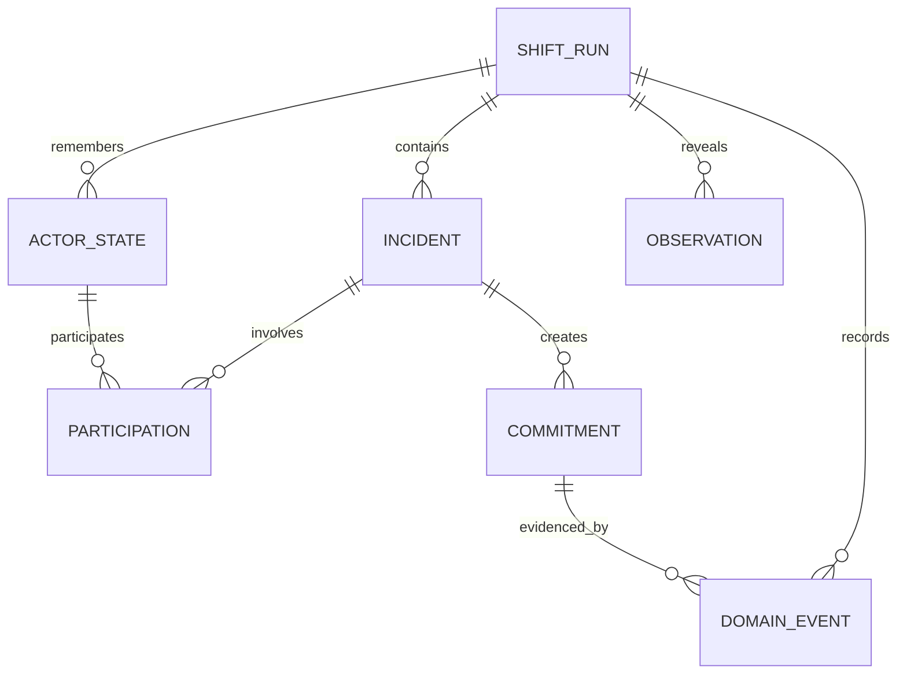
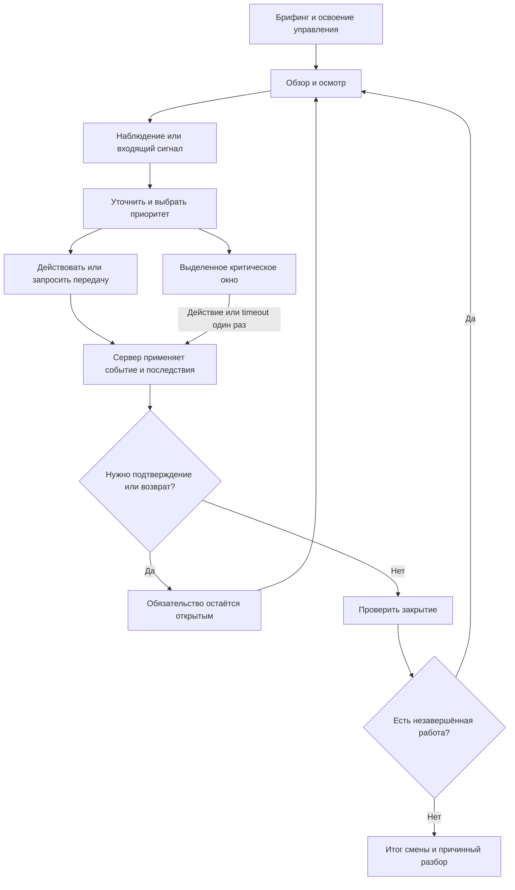

# РЕЙС 400 — во что играет проводник

Исследование игровых моделей для мобильного web-тренажёра · задача **[02 / #20](https://github.com/RomaGrach/mt-hackathon/issues/20)**

**Версия:** 1.0, 26.09.2026. **Статус:** исследование и рекомендация для принятия решения, не утверждённый gameplay ADR и не реализованная новая версия игры. **Изученный снимок репозитория:** `f7aff29448894a12d1d5069156a6b11cc67c8194`; базовая реализация спецификации — `aa8024f9c4f1604f55e2626da17610765c20e6b4`.

Основание: [SPECIFICATION](../../docs/SPECIFICATION.md), [REQ-ID и критерии](../../docs/REQUIREMENTS.md), [план 01–10](../../planning/2026-09-25-updated-plan.md). Следующий результат — выбор одного core loop, контракта и ADR в **[03 / #21](https://github.com/RomaGrach/mt-hackathon/issues/21)**. Этот документ не закрывает задачи реализации, пользовательской проверки и QA.

**Навигация:** [вывод](#summary) · [метод и источники](#method) · [текущий код](#baseline) · [9 моделей](#models) · [матрицы](#matrices) · [ситуация A](#case-a) · [ситуация B](#case-b) · [Passenger](#passenger) · [время и воспроизводимость](#time) · [shortlist и MVP](#shortlist) · [передача в 03](#handoff) · [первоисточники](#sources) · [приёмка исследования](#acceptance).

<a id="summary"></a>
## 1. Основной вывод

**Рекомендуемый кандидат для MVP: короткая смена с ограниченной очередью инцидентов, активным осмотром и встроенными ветвящимися диалогами.** Основная модель — **M6, очередь инцидентов**; обнаружение из M7 и диалог из M2 являются действиями внутри одного цикла, а не тремя самостоятельными играми.

Игрок осматривает доступную часть сидячего вагона, замечает признаки проблемы, уточняет информацию, выбирает, чем заняться первым, действует сам или передаёт задачу ответственному, возвращается к отложенному и проверяет результат. События сохраняют состояние. Итог объясняет не только отдельные реплики, но и последовательность действий, пропущенные признаки и невыполненные обещания.

**Shortlist для задачи 03:** M2 — ветвящийся эпизод; M6 — очередь инцидентов; M7 — ограниченное управление сменой. Предпочтителен M6 с одним содержательным действием осмотра. M2 дешевле для сохранения нынешней основы, но сам по себе не закрывает обнаружение и действительную параллельность. Полноценный M7 даёт больше самостоятельности, но дороже в контенте и проверке сочетаний.

Что принципиально:

- **Карточка, чат и картинка — представления, а не гарантия игрового процесса.** Игра появляется там, где действие меняет доступную информацию, состояние, обязательства или дальнейшие возможности, а не только прибавляет очки.
- **Параллельность — не два окна и не два одновременно запущенных прохождения.** Две проблемы должны оставаться актуальными в одной сессии; решение первой меняет условия работы со второй.
- **Память не требует симуляции всех пассажиров.** Для MVP достаточно устойчивых идентификаторов нескольких действующих лиц и структурированных фактов внутри сохранённой попытки. Отдельная таблица пассажиров или автономный AI не следуют из этого автоматически.
- **Давление времени должно проверять профессиональную своевременность.** Чтение длинного текста, поиск маленькой кнопки и задержка сети не становятся компетенцией от переименования в «реакцию».

Это проектные выводы из требований, анализа кода и сопоставления механизмов. Они не являются доказательством педагогической эффективности или обещанием конкурсных баллов.

<a id="method"></a>
## 2. Метод, границы и работа с предоставленными исследованиями

### 2.1. Что является фактом, а что предложением

В документе разделены четыре уровня:

| Уровень | Основание | Как читать |
|---|---|---|
| Требование проекта | Спецификация, матрица REQ-ID, исходная задача | Сохраняется установленная обязательность: формальное требование, уточнение Q&A или ограничение команды. |
| Факт о референсе | Официальная страница разработчика, издателя или документация; S01–S13 | Подтверждает наличие механизма, но не его эффективность для проводников и не внутреннюю архитектуру чужой игры. |
| Факт о текущем коде | Указанный снимок и конкретная функция | Это статическое чтение. Наличие кода не заменяет запуск и приёмку поведения. |
| Наша конструкция | Модели, сравнительные оценки, примеры, shortlist и MVP ниже | Рекомендация для обсуждения и проверки; не незаметно добавленное требование заказчика. |

Проведены чтение задания и результатов задачи 01, статический разбор движка, сравнение пользовательских отчётов и целевая проверка первоисточников. Это исследование дизайна, **не систематический обзор педагогических экспериментов**. Игры-референсы не проходились заново целиком; сравнение не выдаётся за hands-on тест. Отсутствуют измерения обучения на проводниках, новый запуск приложения, проверка физического телефона и новый CI-прогон.

Оценки стоимости относительные: один небольшой учебный эпизод, одинаковые ограничения по графике, без озвучки, без runtime LLM, с существующими профилем/API/хранением. Не приводятся вымышленные сроки, бюджеты и проценты эффективности. Разные модели не обязаны быть взаимоисключающими жанрами; они различены по **главному действию игрока, единице состояния и способу продвижения времени**.

### 2.2. Реестр четырёх вложений

Файлы получены от пользователя 26.09.2026 и прочитаны полностью. Это рабочие вторичные материалы, а не автоматически проверенные публикации. Исходные вложения этим документом не заменяются; их полные копии в рамках задачи 02 в репозиторий не добавляются.

| Код | Имя и заголовок | Использование |
|---|---|---|
| U1 | `deep-research-report (3).md` — «Геймплей-модели для мобильного тренажёра проводников» | Взяты охват восьми подходов, вопросы о последствиях, пассажирах и короткой сессии. Shortlist не перенесён автоматически. |
| U2 | `deep-research-report.md` — «Игровые подходы для мобильного web-тренажёра проводников» | Использованы разделение контекста сцены и сущности Passenger, идея сравнения очереди и диалога. Уточнены границы моделей. |
| U3 | `deep-research-report (2).md` — «Система геймификации Duolingo» | Отнесён к задачам 04/05: удержание, XP, лиги и серии не отвечают сами по себе на вопрос о действиях внутри смены. Правила Duolingo этим исследованием не подтверждаются. |
| U4 | `deep-research-report (1).md` — «Руководство по Deep Research» | Методический контекст, не предметное доказательство выбора геймплея. Заявления о возможностях сервисов здесь не исследуются. |

SHA-256 исходных байтов для идентификации предоставленных версий:

```text
U1 d9f062f837ee733c610dceb91e358a7b4a721d141921b0f3028b2bae2dd3bd59
U2 5140e1089fea11464a95e9fb3bcc3cc6b925d750abd0455b48320fa5dd19afd8
U3 98ae2f435b7bb309632967c1a83dab7ead414ecdc751ed5350a5972a2ca584c6
U4 d7db9041d336cf9411f6a2958f62c4cdc15e88ae064fa30b838bb5320289cd99
```

### 2.3. Что уточнено относительно U1/U2

| Положение в черновых исследованиях | Решение в этом документе |
|---|---|
| Почти каждой сложной модели приписано высокое качество обучения | Заменено на покрываемые действия и наблюдаемые свидетельства. Обучающий эффект требует отдельной проверки. |
| Иллюстрация, очки или таймер представлены достаточным отличием от теста | Не принято. Проверяем изменение будущего состояния, самостоятельный сбор информации и значимость последовательности. Хороший кейс-тест остаётся полезен, но не выдаётся за симуляцию смены. |
| Очередь, карточки и пассажиры местами описаны одинаково | M4 определена как последовательные решения над общим запасом; M6 — независимые жизненные циклы нескольких задач; M5 — повторное адресное взаимодействие с конкретными людьми. |
| Papers, Please отнесена преимущественно к диалогу | По официальному описанию основной полезный референс — проверка документов и работа с доказательствами [S07]. |
| Некоторые названия и количественные утверждения приведены без проверяемой ссылки | Не использованы как доказательства. Например, тезис о «40% мобильных сессий короче 15 секунд» не перенесён. Отсутствие проверки не объявляется доказательством несуществования названной игры. |
| Web-реализация управления сменой названа пограничной сама по себе | Не принято без измерений. В предложенном ограниченном варианте основная сложность — правила, авторинг и QA, а не обязательная тяжёлая графика. |
| Лекарства, диагнозы и гибель через условные секунды служат иллюстрациями таймера | Не перенесены в профессиональные правила. Примеры ниже используют наблюдение, организацию помощи и безопасную передачу; клинические алгоритмы должен утвердить методист. |

<a id="baseline"></a>
## 3. Требования и фактическая отправная точка

### 3.1. Что должно влиять на выбор

| Требования | Следствие для исследования |
|---|---|
| REQ-P01; N01/N11 | Учебная игра на личном смартфоне вне реальной смены. Нельзя проектировать только для опытного игрока с мышью. |
| REQ-F02 | Нужны разные допустимые пути и последствия, а не единственный набор вежливых фраз. |
| REQ-F03; G03 | Значимый таймер критического решения, серверный результат, восстановление, защита от повторного перехода. |
| REQ-F04; F07/F09 | Loyalty и safety сохраняются; разбор связывает наблюдение, решение и исход. Критическую ошибку не компенсирует накопленный XP. |
| REQ-Q01/Q02 | Игрок сам обнаруживает хотя бы часть проблем; несколько задач конкурируют за внимание в одной модели состояния. |
| REQ-Q03 | Рассматриваем приёмку до поездки и другие действия без разговора с пассажиром. |
| REQ-Q04/Q05/Q06 | Различия условий обслуживания, вариативность и оценка всей сессии. Класс обслуживания не меняет приоритет безопасности. |
| REQ-Q09; G01 | Сидячий вагон; web-only; фотореализм и 3D не являются условием содержательного геймплея. |

Здесь сохраняются типы обязательности из матрицы. В частности, требования Q&A и решения команды не объявляются девятью дополнительными формальными пунктами CASE. Сезоны, лиги, streak и уведомления рассматриваются отдельно в 04/05; новый игровой цикл не отменяет девять функциональных требований уже принятой спецификации.

### 3.2. Что уже есть и чего не следует дорисовывать в воображении

Источник: [README на изученном SHA](https://github.com/RomaGrach/mt-hackathon/blob/f7aff29448894a12d1d5069156a6b11cc67c8194/README.md) и [backend/engine.js](https://github.com/RomaGrach/mt-hackathon/blob/f7aff29448894a12d1d5069156a6b11cc67c8194/backend/engine.js).

| Наблюдение | Значение для выбора |
|---|---|
| `createState` хранит один `nodeId`, flags, resources, loyalty/safety, competencies, history и версию сценария | Хорошая основа M1/M2. Флаги уже позволяют раннему действию влиять на позднюю ветку. |
| `decide` применяет последствия и переводит в `feedback`; `advance` запускает следующий шаг | Чтение разбора отделено от таймера следующей сцены. Это следует сохранить либо явно переопределить. |
| Deadline абсолютный; время передаётся движку параметром | Полезная основа детерминированных тестов и серверного разрешения timeout. |
| В состоянии нет реестра инцидентов, фоновых событий смены и Passenger | Нельзя назвать текущую карту модулей симуляцией нескольких одновременно активных задач. Это также зафиксировано REQ-Q01/Q02. |
| `validateScenario` отвергает циклы; граф ограничен 100 узлами | Свободный возврат в один и тот же hub нельзя просто добавить обратной стрелкой. Нужен внешний контроллер задач либо явно ограниченное разворачивание обходов. |
| `responseMs` считается от входа в сцену; после половины её таймера `earned.speed` умножается на 0.5 | Время включает чтение, взаимодействие с интерфейсом и доставку запроса. Текущий порог нельзя считать валидированной оценкой профессиональной реакции. |
| `practice` есть, но `createState` всё равно назначает таймер из узла | Наличие флага практики само по себе не означает реализованный учебный режим без ограничения времени. |
| `criticalError` сохраняется; `summarize` проверяет его отдельно от шкал | Это полезный инвариант. Конкретные пороги шкал остаются авторской рубрикой. |

**Рекомендация по миграции:** не переписывать профиль, API и хранение ради нового внешнего вида. Сохранить граф как локальный обработчик инцидента, а общую смену проектировать отдельным ограниченным контроллером. Конкретный контракт, миграция результатов и совместимость старых попыток принадлежат задачам 03/08.

<a id="models"></a>
## 4. Девять игровых моделей

Восемь моделей M1–M8 соответствуют перечню задачи. M9 добавлена, чтобы отдельно рассмотреть полноценное недиалоговое рабочее место. Это не девять названий одного экрана: у каждой модели другой ответ на вопрос «чем игрок управляет?». Схемы показывают предлагаемую минимальную модель нашего продукта, **не устройство игр-референсов**.

### M1. Независимые ситуационные сценарии

**Единица игры:** отдельный кейс, после которого локальный мир сбрасывается. Игрок управляет решением одной сформулированной проблемы.

**Цикл и действия за 30–120 секунд.** Прочитать короткую вводную, открыть один-два факта, выбрать действие, увидеть локальный результат, закончить кейс. Внутри возможны несколько шагов; следующий кейс не наследует нерешённый конфликт предыдущего.

**Профессиональное решение и свидетельство.** Выбор подходящей процедуры на основании фактов, а не распознавание самой «доброй» реплики. Лог фиксирует, какие сведения были запрошены и какая последовательность выбрана. Это подходит для знакомства с типовой ситуацией, но не доказывает способность вести смену.

**Время, обнаружение и параллельность.** Таймер оправдан только на выделенном критическом шаге. Если название модуля уже сообщает проблему, обнаружение не проверяется. Можно включить недиагностированный снимок обстановки, но без самостоятельного выбора места осмотра это ограниченная задача распознавания. Два независимых последовательных кейса не образуют конкурирующих инцидентов.

**Последствия и повтор.** Изменяются локальные ветки и итог; между кейсами — учебный результат, не мировой инцидент. Повтор интересен новым набором существенных фактов или другим допустимым маршрутом, а не перестановкой кнопок.

```text
CaseDefinition(version) -> Attempt -> Node -> Action -> LocalOutcome
                                      \-> EvidenceLog -> Debrief
Passenger = контекст кейса, пока нет адресного повторного взаимодействия.
```

**Реализация, контент, mobile, QA.** FE и состояние относительно просты; основной расход — качественные альтернативы и объяснения. Текстовый web-интерфейс не требует игрового движка. Один экран удобно адаптировать под телефон. Проверки: достижимость финалов, корректность условий, критическая ошибка, before/after, обе стороны deadline. Риск теста высокий: это честно полезный учебный формат, но не достаточное самостоятельное решение REQ-Q02.

**Факт о референсе.** H5P Branching Scenario поддерживает дерево решений, разные окончания и обратную связь; официальный пример — Skills Practice: A Home Visit [S01]. **Перенос:** структура небольшого законченного учебного кейса. H5P здесь пример web-авторинга, а не доказательство, что любой модуль H5P является независимым кейсом или обучает проводников.

### M2. Ветвящийся диалог / interactive fiction

**Единица игры:** продолжающийся разговор или история. Игрок управляет способом выяснить ситуацию и повлиять на собеседника; переход выбирается через действия в текущей сцене.

**Цикл и действия за 30–120 секунд.** Получить реплику, задать уточняющий вопрос, сопоставить ответ с уже известным, выбрать объяснение или действие, встретить изменившуюся реакцию. Пропущенный вопрос может позднее закрыть возможность решения.

**Профессиональное решение и свидетельство.** Уточнение причины жалобы, проверка основания требования, объяснение ограничений, корректная передача коллеге. Оценивается содержание и выполненное действие, не количество вежливых слов. Желательны два профессионально допустимых пути с разными компромиссами.

**Время, обнаружение и параллельность.** Основное чтение без таймера; критическая развилка выделяется отдельно. Проблему можно распознать в противоречии реплик, но сам диалог обычно уже инициирован системой. Прерывание фразой «в другом месте звонок» даёт лишь сюжетное переключение. Для реального откладывания и возврата нужна общая очередь или несколько сохранённых разговоров — расширение в сторону M6.

**Последствия и повтор.** Сохраняются обещания, проверенные сведения и отношение; следующий разговор использует их. Повтор — иное основание конфликта и последствия другого способа урегулирования. Если все ветки быстро сходятся к одинаковому исходу, различия декоративны.

```text
StoryAttempt -> DialogueState(nodeId, facts, commitments)
                  -> Choice -> UpdatedFacts -> LaterDialogue / Ending
Passenger = локальный actorId; устойчивый объект нужен при повторном обращении.
```

**Реализация, контент, mobile, QA.** Близка текущему движку; FE небольшой, контентная стоимость высокая. Web-текст и статичные портреты достаточны; чат не требует свободного ввода или LLM. На телефоне нужны короткие сообщения, а не длинная переписка со скрытыми вариантами внизу. QA проверяет условия, допустимые альтернативы, невыданные знания и отсутствие «забытых» обещаний. Воспроизводимость высокая при фиксированном графе. Риск теста средний/высокий, если ответы отличаются только правильностью формулировки.

**Факт о референсе.** Bury me, my Love построена как мобильная переписка с выборами; персонаж может не следовать совету и не раскрывать всё [S02]. **Перенос:** неполная информация и реакции персонажа. Не переносим многочасовое реальное ожидание из этой игры: для учебной сессии оно не нужно. ink — отдельный инструмент описания ветвлений, а не самостоятельная gameplay-модель [S09].

### M3. Визуальная новелла с сохраняемым состоянием мира

**Единица игры:** история в меняющемся окружении. В отличие от M2, игрок выбирает не только реплику следующей сцены, но и доступную локацию или сюжетную линию по состоянию мира.

**Цикл и действия за 30–120 секунд.** Осмотреть сцену, выбрать место или персонажа, провести взаимодействие, вернуться в изменившийся hub. Ранее выполненная проверка открывает короткий путь; обещанная помощь может удержать персонажа в другой зоне.

**Профессиональное решение и свидетельство.** Связать информацию из нескольких источников, учесть последствия прошлого контакта, выбрать момент возвращения. Лог должен показывать причинную связь между ранним фактом и поздним действием.

**Время, обнаружение и параллельность.** Мир меняется на явных переходах или по расписанию. Обнаружение через осмотр зон, а не скрытую пиксельную точку. Несколько сюжетных линий могут оставаться открытыми; но пока они не меняются от очередности или времени, это нелинейное меню, не модель нагрузки.

**Последствия и повтор.** Состояние зон, доступность персонажей, знания и незакрытые линии переживают сцену. Повтор интересен другой последовательностью посещений. Критическая граница: допустимые сочетания должны быть прописаны; «любой порядок всего» резко увеличивает авторинг.

```text
Episode -> WorldSnapshot(zones, facts, openThreads)
              -> Visit -> SceneGraph -> WorldEffects -> AvailableVisits
Passenger = устойчивый actorId для возвращающихся персонажей; фон — контекст.
```

**Реализация, контент, mobile, QA.** FE средней сложности при статичных иллюстрациях; BE и контент дороже M2 из-за сочетаний. 3D не требуется: зоны доступны кнопками. Главная мобильная опасность — мелкие интерактивные объекты; дать равноценный текстовый осмотр. Тестируются условия доступности, возвращение в hub, последовательности A→B/B→A, сохранение знаний и отсутствие тупиков. Воспроизводимость не хуже других моделей при явных правилах; труднее именно покрытие. Риск теста средний, если состояние лишь перекрашивает фон.

**Факт о референсе.** В 80 Days интерактивные истории связаны выбором маршрута, временем и доверием Фогга [S03]. **Граница аналогии:** это не «чистая визуальная новелла», а пример соединения повествования с состоянием путешествия. Наша модель заимствует связь сцен и последствий, не глобус, транспортную экономику или конкретную технологию.

### M4. Карточки событий и общие ресурсы

**Единица игры:** последовательное решение над общим запасом или набором обязательств. Ключевой вопрос — не какую задачу открыть, а какую цену принять сейчас ради следующих событий.

**Цикл и действия за 30–120 секунд.** Получить карту, проверить доступный бюджет времени/поддержки, выбрать действие, изменить общий запас, открыть следующую карту. Иногда заранее известны две будущие потребности. Карта не должна исчезать, не оставив состояния или объяснения.

**Профессиональное решение и свидетельство.** Распределение ограниченного рабочего внимания, обоснованное обещание и сохранение резерва. Важно не превращать безопасность в торгуемую валюту: обратиться за необходимой помощью можно при любом балансе; наличие и время подтверждения помощи моделируются отдельно.

**Время, обнаружение и параллельность.** Обычно уместно условное время: действие стоит один рабочий такт. Реальный секундомер на каждом свайпе не нужен. Проблема чаще сообщена карточкой. Общий запас не создаёт нескольких одновременно существующих инцидентов; для этого нужны независимые состояния M6.

**Последствия и повтор.** Ранний выбор меняет доступные безопасные способы следующих действий, будущие карты или обязательства. Разные заранее проверенные колоды дают повторяемость. Случайная перестановка не должна требовать потратить отсутствующий ресурс на обязательную помощь.

```text
DeckDefinition -> Session(deckOrder, cursor, sharedState)
                   -> Card -> ActionCost + Effect -> LaterCard
Passenger = payload карты; постоянный ID только для адресного возврата.
```

**Реализация, контент, mobile, QA.** FE мал; BE средний из-за ресурсов и колоды; контент дешевле длинных диалогов при одинаковом числе ситуаций, но требует балансировки сочетаний. DOM/CSS достаточно. Явные кнопки предпочтительнее обязательного свайпа с неочевидным смыслом. Тесты проверяют исчерпание ресурсов, устойчивые критические флаги, доступность помощи, невозможные последовательности и повтор одного seed. Риск теста высокий, если ресурс ни на что не влияет; риск вредной оптимизации высокий, если игроку выгодно жертвовать безопасностью ради суммы очков.

**Факт о референсе.** Reigns использует последовательные решения, общие показатели и отложенные последствия [S04]. **Перенос:** понятная связь «решение сейчас → условия позже». Не переносим правило балансировать безопасность как один из взаимозаменяемых игровых запасов.

### M5. Отдельные пассажиры с памятью и состояниями

**Единица игры:** конкретный человек и история взаимодействия с ним. Игрок выбирает, к кому вернуться и какое обязательство выполнить; сюжет не обязан вести его по фиксированному порядку сцен.

**Цикл и действия за 30–120 секунд.** Просмотреть небольшую группу действующих лиц, вспомнить запрос, уточнить изменение состояния, выполнить обещанное, проверить эффект. Например, вопрос «вы обещали вернуться» меняет допустимое продолжение, даже если текущая реплика совпадает с прошлой.

**Профессиональное решение и свидетельство.** Адресное сопровождение и преемственность сервиса: нужное действие именно тому человеку, которому оно обещано. Наблюдаемый результат — совпадение обещания, адресата и фактического выполнения. Не нужны вымышленные биографии на десятки полей.

**Время, обнаружение и параллельность.** Срок относится к запросу/обязательству, а не к «таймеру жизни NPC». Обнаружение — заметить изменение при повторном обходе; скрытый диагноз не показывается шкалой здоровья. Несколько запросов могут сосуществовать, но персональная модель не заменяет правила общей очереди и координации.

**Последствия и повтор.** Меняется доверие, доступные факты, обещания и последующий диалог. Повтор — другой состав запросов и история контактов, а не случайный портрет. Класс обслуживания меняет сервисные условия, но не ценность помощи человеку.

```text
Run -> Actors{id -> observedFacts, relationshipFlags, commitments}
          -> Interact(actorId) -> ActorEffect -> FollowUp(actorId)
Incident ссылается на одного или нескольких actorId, не копирует их память.
```

**Реализация, контент, mobile, QA.** FE и BE средние для нескольких синтетических участников; контент и QA дорожают из-за персональной последовательности. Web-ограничение не требует сотен автономных агентов. На телефоне показывать действующих лиц и актуальные обязательства, не таблицу всего вагона. Тесты: эффект не попал соседу, один конфликт корректно связан с двумя людьми, завершённое обещание не повторяется, новый run не наследует память старого случайно. Риск теста средний: без использования памяти это просто портреты над ответами.

**Факт о референсе.** VA-11 HALL-A связывает знакомство с клиентами и их предпочтениями с действиями обслуживания; ветвление зависит от приготовленных напитков, а не только от обычного меню ответов [S05]. **Перенос:** действие по отношению к конкретному человеку как часть нарратива. Сайт не раскрывает схему хранения NPC, поэтому отдельная таблица Passenger не приписывается этой игре.

### M6. Очередь параллельных инцидентов / dispatch gameplay

**Единица игры:** набор одновременно актуальных задач с независимыми жизненными циклами. Игрок управляет приоритетом, состоянием передачи и возвратом, а не просто порядком выданных карточек.

**Цикл и действия за 30–120 секунд.** Получить сигнал, уточнить риск, выбрать задачу, выполнить короткое действие или запросить поддержку, переключиться, проверить подтверждение и вернуться к отложенному. Разговор может быть локальным действием внутри инцидента.

**Профессиональное решение и свидетельство.** Обоснованная очередность, безопасная временная мера, передача с подтверждением, проверка закрытия. «Нажал вызвать коллегу» не равно «задача решена». Лог должен показывать, почему отложенная проблема оставалась приемлемой либо стала требовать другого действия.

**Время, обнаружение и параллельность.** Параллельность встроена: обработка A расходует моделируемое время или меняет ресурс, влияющий на B. Срочные действия могут иметь реальный deadline; рядовые запросы — мягкую эскалацию по рабочим тактам. В чистом диспетчерском варианте проблема поступает извне, поэтому REQ-Q01 требует отдельного действия наблюдения до появления названного инцидента.

**Последствия и повтор.** Состояния «ожидает», «в работе», «передано», «проверено» не исчезают при смене фокуса. Меняется доступность коллеги, содержание повторного сигнала, оценка всей смены. Повтор интересен иной комбинацией и временем появления задач при сохранении решаемости.

```text
ShiftRun -> Incidents{id -> status, evidence, obligations, dueCondition}
          -> Focus / Act / Delegate / Verify
          -> EventQueue -> Effects on other incidents -> ShiftDebrief
Passenger = ссылки на участников; отдельная память нужна не каждому инциденту.
```

**Реализация, контент, mobile, QA.** FE средний для двух актуальных задач; BE средний/высокий из-за расписания, транзакций и независимых состояний; контент требует нескольких проверенных взаимодействий, не бесконечных веток. Достаточен обычный web backend; WebSocket не следует из наличия таймера. На телефоне — один фокус и компактная доступная сводка другой задачи, не сетка панелей. QA: A→B против B→A, одновременные события, повтор запроса, отмена старой эскалации, возврат из background, доступность помощи без ресурса. Воспроизводимость высокая при явном журнале времени. Риск теста низкий лишь когда очередность реально изменяет ситуацию.

**Факт о референсе.** 911 Operator сочетает обработку сообщений/звонков и назначение служб и команд [S06]. **Перенос:** разные жизненные циклы запросов и распределение внимания. Проводник не становится диспетчером городских служб; реальная цепочка ответственности и действия адаптируются по материалам заказчика.

### M7. Управление сменой и самостоятельное обнаружение проблем

**Единица игры:** ограниченная смена с плановыми обязанностями, зонами и неизвестными заранее проблемами. Игрок решает, что проверить, а не только выбирает из уже объявленного списка.

**Цикл и действия за 30–120 секунд.** Выбрать участок обхода, прочитать наблюдаемые признаки, сопоставить с чек-листом или предыдущей проверкой, сформировать задачу, принять временную меру, продолжить план и проверить результат. Отсутствие жалоб не означает отсутствие проблем.

**Профессиональное решение и свидетельство.** Проверить существенное, обнаружить отклонение до прямой тревоги, не подписать непроверенный результат, совместить рутину и внеплановое событие. Свидетельство — найденный признак и причинно обоснованное действие, не число тапов по объектам.

**Время, обнаружение и параллельность.** Основной clock может идти по завершённым действиям. Срочный сигнал переключает на короткое окно решения. Проблемы имеют скрытое состояние и доступные признаки; интерфейс не должен выдавать диагноз маркером. Несколько задач могут конкурировать с планом осмотра. Цель — содержательный выбор порядка, не хаотический поток тревог.

**Последствия и повтор.** Результат приёмки, обнаруженные дефекты, обещания и открытые задачи живут до конца смены. Повтор — другой существенный дефект/порядок событий при той же понятной компоновке, включая нормальные контрольные случаи. Обязательное наличие дефекта в каждом объекте учит подозревать всё, а не наблюдать.

```text
ShiftPlan + ZoneDefinitions + Variant -> ShiftRun
   -> Inspect(zone) -> Observations -> Recognize / Dismiss / RequestCheck
   -> Tasks + AcceptanceRecord -> FollowUp -> Handover
Passenger = необязателен для приёмки; объект оборудования может быть важнее.
```

**Реализация, контент, mobile, QA.** Полная смена дорога; ограничение одним вагоном и несколькими зонами делает объём управляемым, но не бесплатным. Нужны семантические зоны, не навигация персонажем по 3D. Главная стоимость — нормальные/аномальные наблюдения и последствия непроверенного. QA проверяет обнаружимость, ложные тревоги, достижимость безопасного исхода, возврат к плану и завершение с открытой задачей. На телефоне риск перегрузки выше M6. Воспроизводимость обеспечивается фиксированным вариантом и событиями; широкий простор действий увеличивает число проверок, а не делает повтор принципиально невозможным.

**Факты о референсах.** Papers, Please строит работу на исследовании предоставленных свидетельств [S07]; 80 Days связывает выбор дальнейшего действия с продолжающимся состоянием [S03]. **Граница:** ни один не объявляется точным симулятором приёмки поезда. Из первого заимствуется активная проверка, из второго — значение последовательности. Риск теста низкий, пока осмотр не превращён в обязательную кнопку «увидеть правильный ответ».

### M8. Гибрид нескольких самостоятельных режимов

**Единица игры:** смена, состоящая из различных наборов правил: например, осмотр → пространственная процедура → диалог → распределение задач. В отличие от M6 с несколькими действиями, здесь игрок действительно переучивается на другой способ взаимодействия.

**Цикл и действия за 30–120 секунд.** Завершить осмотр, перенести найденные факты в процедурный модуль, выполнить действие, вернуться в общую смену с изменённым состоянием. Если мини-игра не меняет дальнейшую ситуацию, она не оправдывает стоимость переключения.

**Профессиональное решение и свидетельство.** Содержание перехода между видами работы: результат осмотра определяет процедуру, выполненная процедура меняет условия разговора. Нельзя подменять навык случайной моторной мини-игрой, например быстрым попаданием в движущуюся кнопку.

**Время, обнаружение и параллельность.** Нужно единое правило часов, прерывания, сохранения и доступности помощи для всех режимов. Недопустима ситуация, когда одни часы заморожены, а другой инцидент незаметно штрафует во время инструкции. Обнаружение и параллельность зависят от конкретной композиции, не возникают от количества режимов.

**Последствия и повтор.** Итог модуля преобразуется в доменное событие, которое видят остальные. Повтор — иные входные условия, а не случайный порядок несвязанных развлечений.

```text
SharedShift -> ModeController
                 -> InspectionState
                 -> ProcedureState
                 -> DialogueState
              -> NormalizedEvents -> SharedConsequences
Passenger = общая сущность только там, где нужна; не отдельная копия в каждом режиме.
```

**Реализация, контент, mobile, QA.** Наивысший совокупный риск: несколько интерфейсов, правила адаптеров, сквозное обучение управлению и тесты переходов. Web-only реализуемо, но это не основание расширять MVP. Проверяются переходы в обоих направлениях, rollback/timeout, доступность помощи во всех режимах и отсутствие двойного учёта результата. Небольшой модуль может тестироваться легко; их комбинация требует отдельного покрытия. Риск теста зависит от содержания: три викторины остаются викторинами.

**Факт о референсе.** Keep Talking and Nobody Explodes объединяет разные модули задач, общий дефицит времени и разделённую информацию; совместная игра является частью её механики [S08]. **Перенос:** осмысленная связь подзадач, а не обязательные кооператив, VR или тематика игры. Для нашего одиночного MVP этот референс не обосновывает мультиплеер.

### M9. Процедурное рабочее место / сопоставление доказательств

**Единица игры:** рабочий объект и запись о его проверке. Игрок не выбирает готовую реплику, а собирает доказательство: сверяет данные, отмечает расхождение и формирует корректный результат.

**Цикл и действия за 30–120 секунд.** Открыть учебную карточку оборудования, сравнить заявленное состояние с наблюдаемым, выделить несовпадение, выбрать действие в пределах роли, записать факт и проверить ответ. Нажатие «всё исправно» без проверки не равнозначно выполненной процедуре.

**Профессиональное решение и свидетельство.** Обнаружить конкретное расхождение, отличить факт от предположения, не подтвердить готовность по одной старой записи. Лог связывает отметку с открытым источником сведений. Это недиалоговая механика для приёмки, документов и контроля результата.

**Время, обнаружение и параллельность.** По умолчанию без секундомера: сложность в содержательной проверке. Срок сдачи может создавать общий бюджет, но не должен требовать точного drag-and-drop. Обнаружение встроено в сопоставление; нескольких живущих инцидентов в чистой модели нет. Если они нужны, рабочее место вызывается как действие M6/M7.

**Последствия и повтор.** Подписанная запись влияет на приёмку или последующий эпизод. Варианты меняют проверяемые сведения, включая отсутствие нарушения, а не просто шрифт или место дефекта.

```text
WorkItem -> DeclaredFacts + ObservedFacts -> EvidenceSelection
         -> InspectionDecision -> Record -> DownstreamConsequence
Passenger = не нужен, если предмет проверки — оборудование/документ.
```

**Реализация, контент, mobile, QA.** FE средний из-за сравнения; BE относительно небольшой, контент требует достоверных правил. Реализация через HTML-формы и семантические элементы, без Canvas по умолчанию. На телефоне — последовательные пары фактов вместо уменьшенной копии рабочего стола. Тестируются нормальный случай, пропущенное/ложное расхождение, недостаточность доказательств, повторная подпись и восстановление. Риск теста средний: если всё сведено к одному очевидному чекбоксу, содержательной процедуры нет.

**Факт о референсе.** В Papers, Please решение строится на документах и инструментах проверки [S07]. Автор отдельно описывает переработку игры для телефона, включая отказ от необходимости прицеливаться и масштабировать документы [S13]. **Перенос:** профессиональный глагол «сверить» вместо «ответить». Не переносим тематику, санкции и корпоративные правила чужой игры.

<a id="matrices"></a>
## 5. Сравнительные матрицы

### 5.1. Покрытие игрового поведения

Обозначения: **ядро** — определяющее действие; **частично** — ограниченная форма; **расширение** — требует другого механизма; **нет** — отсутствует в чистой модели. Это оценка конструкции, не эмпирическая шкала качества обучения.

| Модель | Основной профессиональный глагол | Самостоятельное обнаружение | Параллельность | Сохранённые последствия | Осмысленный повтор | Риск теста |
|---|---|---|---|---|---|---|
| M1 Кейсы | Выбрать процедуру | Частично: распознавание | Нет | Внутри кейса | Другие существенные факты | Высокий |
| M2 Диалог | Уточнить и объяснить | Частично: реплики | Расширение | Факты/обещания истории | Альтернативный путь разговора | Средний/высокий |
| M3 Новелла + мир | Выбрать дальнейшую линию | Осмотр доступных сцен | Частично | Зоны и сюжетные линии | Иной маршрут | Средний |
| M4 Карты + ресурсы | Распределить запас | Обычно нет | Расширение | Общие ресурсы/будущие карты | Иная проверенная колода | Высокий без последствий |
| M5 Пассажиры | Вернуться и выполнить обещанное | Изменение конкретного человека | Частично | Адресная память | Другие обязательства/истории | Средний |
| M6 Очередь | Приоритизировать и передать | Расширение: осмотр | Ядро | Состояния задач/передачи | Другая комбинация инцидентов | Низкий при реальной связи |
| M7 Смена | Осмотреть, выявить, организовать | Ядро | План + внеплановые задачи | Состояние смены/приёмки | Иные нарушения и порядок | Низкий при реальном выборе |
| M8 Мультирежим | Перенести результат между действиями | Зависит от состава | Зависит от состава | Общая модель поверх режимов | Иные входы/связи модулей | Не гарантирован |
| M9 Рабочее место | Сверить и зафиксировать | Ядро в объекте | Расширение | Запись проверки/её последствия | Иные доказательства и контрольные случаи | Средний |

### 5.2. Стоимость и реализуемость

Н/С/В/ОВ — низкая/средняя/высокая/очень высокая относительная сложность при одинаковом небольшом содержательном объёме. QA — **стоимость покрытия**, а не невозможность воспроизводимости. Mobile означает проектный потенциал, не результат теста.

| Модель | FE | BE / состояние | Контент | QA | Mobile | Web-only | Близость к нынешнему ядру |
|---|---|---|---|---|---|---|---|
| M1 | Н | Н | С | Н | Хороший | Прямой текст/DOM | Высокая |
| M2 | Н–С | Н–С | В | С | Хороший при коротком тексте | Прямой текст/DOM | Высокая |
| M3 | С | В | В | В | Требует ясного hub | Да, статичные зоны | Средняя; нужен внешний мир |
| M4 | Н | С | С | С | Хороший без обязательных свайпов | Да, DOM и состояние | Средняя |
| M5 | С | С | В | В | Хороший для малого состава | Да, небольшой реестр | Средняя |
| M6 | С | В | С–В | В | Хороший при двух задачах | Да, события на сервере | Средняя; новый контроллер |
| M7 | С–В | В | В | В | Риск перегрузки | Да, не требует 3D | Ниже; новый цикл осмотра |
| M8 | В | ОВ | ОВ | ОВ | Риск обучения нескольким UI | Да; дорогая интеграция | Низкая |
| M9 | С | Н–С | С–В | С | Хороший при адаптации сравнения | Да, формы/семантический DOM | Средняя |

Не следует складывать эти символы в псевдоточный «рейтинг 87/100». Для задачи 03 сначала применяются обязательные условия: содержательное обнаружение, последствия очередности, понятный телефонный интерфейс, объяснимый итог и реализуемый объём. После них сравниваются стоимость и выразительность. Более простая модель не становится хуже педагогически только потому, что в ней меньше сущностей.

<a id="case-a"></a>
## 6. Подробное сравнение A: спор о месте и параллельный сигнал о самочувствии

### 6.1. Общая рабочая ситуация

Все версии используют одни и те же исходные факты. В сидячем вагоне два вымышленных пассажира спорят о месте. Явных признаков физического насилия в исходной вводной нет; основания претензий ещё нужно проверить. В другой части доступной зоны пассажир сидит, наклонившись, отвечает не сразу; сам о помощи не просит. Эти признаки **не являются диагнозом**. На втором рабочем такте сосед сообщает, что ему, возможно, нужна помощь. Один коллега доступен для связи, но передача считается принятой только после подтверждения.

Приоритет определяется наблюдаемой угрозой и новыми фактами, а не яркостью карточки и не классом билета. Сценарий проверяет замечание признаков, уточнение, организацию помощи, безопасное переключение и возврат к неоконченному спору. Он не обучает назначению препаратов и не устанавливает клинических сроков.

**Стенд сравнения:** начальные факты фиксированы; внешний сигнал появляется на такте 2; подтверждение принятой передачи — на следующем рабочем такте. Такты — авторские единицы симуляции, не реальные минуты. Во время чтения учебного пояснения они не идут. Клинический исход случайно не разыгрывается.

### 6.2. M2: последовательный диалог

1. Игрок открывает сцену спора и получает версии двух участников. Может уточнить документы/основание претензии либо сразу обещать пересадку. Проверка записывает `seatFactsChecked`; без неё обещание может оказаться необоснованным.
2. После рабочего действия выводится наблюдение о другом пассажире. Выбор «уточнить, нужна ли помощь» открывает соответствующий разговор; выбор «продолжить спор» оставляет сюжетный флаг пропуска.
3. На такте 2 сосед сообщает о необходимости внимания. Игрок может обозначить спорящим следующий шаг, организовать передачу и обратиться за помощью либо остаться в споре.
4. После подтверждения передачи история возвращает к месту. Раннее обещание учитывается: выполненное создаёт доверие, забытое — повторное недовольство.

**Два исхода:** проверка фактов + организованное переключение + возврат дают объяснимый благополучный учебный результат; необоснованное обещание + отсутствие передачи/возврата оставляют нерешённые задачи. Причина результата видна в истории.

**Честное ограничение:** если всю очередность возвратов задаёт автор следующей сцены, игрок не управляет двумя независимыми задачами. Это воспроизводимый интерактивный кейс, а не полноценная проверка REQ-Q02. Добавление доступного в любой момент возврата требует состояния M6/M5.

### 6.3. M6: очередь двух инцидентов

1. В начале в очереди только спор. Наблюдение о втором пассажире доступно в обзоре, но отдельного названного медицинского инцидента ещё нет. Действие «проверить наблюдение» создаёт второй инцидент раньше внешнего сообщения; без этого он появляется на такте 2 как входящий сигнал. Само такое наблюдение — явное расширение чистой M6.
2. Открыв вторую задачу, игрок не закрывает спор. Можно обозначить участникам дальнейший порядок и запросить коллегу. Состояние спора становится `handoff_pending`, а не `resolved`.
3. Принятая передача освобождает внимание, но сохраняет задачу проверки. Неподтверждённый запрос виден как незакрытое обязательство. Игрок выбирает между проверкой получения сообщения и дальнейшим действием по второй проблеме.
4. После организации помощи появляется содержательная точка возврата: проверить, выполнено ли обещание участникам спора. Продолжение зависит от того, проверены ли основания претензий и кто принял задачу.

**Маршрут A1:** обнаружить раньше сигнала → уточнить → организовать помощь → получить подтверждение передачи спора → вернуться и проверить. **Маршрут A2:** получить сигнал позже → обоснованно переключиться и передать → проверить обе задачи. Второй маршрут не автоматически провальный: он отличается отсутствием самостоятельного раннего обнаружения.

**Маршрут A3:** долго обсуждать место после значимого нового сигнала → отправить запрос без проверки подтверждения → завершить смену, считая обе задачи решёнными. Итог фиксирует неподтверждённую передачу и отсутствие контроля; диагноз и летальный исход не выдумываются.

**Смысл порядка:** один и тот же набор нажатий в иной последовательности может дать другой учебный итог. Именно это отличает очередь от двух независимых кейсов.

### 6.4. M7: обход и управление сменой

1. Игрок получает план осмотра, а не название «спор и медицинский инцидент». Он выбирает зону наблюдения. В доступной зоне видит поведение людей, а не надписи «правильный приоритет».
2. По разговору распознаёт спор; по дополнительному наблюдению — повод уточнить самочувствие. Действие `recognize` должно содержать выбранный признак или обоснование, а не просто тап по подсвеченному человеку.
3. Система сохраняет, что было замечено до внешнего сигнала, что после него, что не замечено. Затем возможны те же способы организации работы, что в M6.
4. Возврат к плану обхода конкурирует с проверкой открытых задач. Игрок решает, можно ли продолжать рутину, либо требуется сначала получить подтверждение помощи.

**Отличие:** M7 проверяет распределение наблюдения до готового списка задач. Цена — необходимость автору обеспечить заметные, доступные и не однозначно диагностические признаки, нормальные контрольные ситуации и честный обзор. Не разрешается наказывать за событие, признаки которого ни разу не были доступны игроку.

### 6.5. Как в этом примере работает Passenger

Участники спора — два `actorId`, нездорово выглядящий пассажир — третий. Один инцидент может иметь двух участников. Обещание «вернуться после уточнения» связано с адресатом и инцидентом. Если позже повторяется фраза «вы обещали», данные берутся из этого обязательства. Для такого поведения достаточно реестра внутри run; отдельная глобальная пассажирская база не нужна.

**Что сравнивать в прототипах:** замечен ли признак до сообщения; выбран ли обоснованный порядок; отличает ли игрок запрос от принятой передачи; возвращается ли к обещанному; может ли после разбора объяснить связь раннего решения с итогом. Время поиска интерфейсного элемента записывается как UX-наблюдение, не как медицинская компетенция.

<a id="case-b"></a>
## 7. Подробное сравнение B: приёмка вагона и неподтверждённая готовность

### 7.1. Общая рабочая ситуация без обязательного разговора

До поездки игрок проверяет три учебные зоны сидячего вагона: салон, входную зону и служебный участок. В записи предыдущей проверки оборудование отмечено готовым, однако текущий наблюдаемый индикатор не совпадает с учебным описанием нормы. Рядом появляется обычная сервисная задача. Ни отсутствие замечаний в журнале, ни обещание коллеги проверить позже не являются свежим подтверждением готовности.

Это **синтетическая задача на сопоставление сведений**, а не инструкция по конкретной модели поезда. Тип оборудования, нормативное состояние и полномочия должны быть заменены на согласованный материал заказчика. Игрок не получает право управлять движением поезда; он формирует учебную запись о своей проверке и передаёт вопрос ответственному.

**Стенд сравнения:** на такте 0 доступны старая запись и зоны; обычная сервисная задача появляется на такте 1; подтверждение проверки приходит через один такт после корректного запроса. В одном варианте есть расхождение, в контрольном варианте сведения согласованы. Полезное действие — собрать достаточно оснований, а не всегда нажать «неисправность».

### 7.2. M1: отдельный кейс

Игрок видит одновременно выдержку журнала и описание индикатора. Выбирает «подтвердить», «проверить расхождение», «передать на проверку». Следующий шаг показывает ответ; завершение поясняет достаточность основания.

**Успех:** расхождение проверено, запись отражает фактический статус. **Ошибка:** старая запись принята за новое доказательство. Это хороший компактный тренажёр правила, но он заранее выбрал объект за игрока и убрал конкуренцию с рутинной задачей.

### 7.3. M4: карточки с общим бюджетом работы

Игрок получает карту приёмки и затем карту сервиса. Действие «проверить» расходует рабочий такт и ставит флаг `verificationPending`; «отложить» сохраняет обязательство. Следующая карта использует этот флаг: завершать запись «готово» без подтверждения нельзя считать безопасным итогом.

**Успех:** игрок расходует такт на проверку, обоснованно откладывает рядовой запрос, возвращается после подтверждения. **Ошибка:** выбирает два быстрых внешне приятных действия и подписывает непроверенный статус. Общий балл лояльности не компенсирует эту ошибку.

**Граница:** если карты всегда приходят в одном порядке, оценивается управление общим состоянием, но не самостоятельный выбор места проверки. Помощь и передача вопроса доступны при нулевом игровом запасе; ресурс ограничивает собственные рабочие действия, а не право запросить помощь.

### 7.4. M7: осмотр и план смены

Игрок сам выбирает одну из зон. Увидев индикатор, может открыть запись предыдущей проверки и учебную норму. Система создаёт наблюдение, но не готовый диагноз. Игрок отмечает конкретное расхождение и запрашивает проверку в пределах своей роли.

Пока проверка ожидается, можно выполнить обычный запрос. После сообщения о результате нужно вернуться и обновить запись. Зона, которая не была проверена, остаётся «не проверена», а не автоматически «исправна».

**Успех B1:** осмотр → расхождение → запрос → сервис во время ожидания → подтверждение → корректная запись. **Успех B2:** осмотр → расхождение → дождаться/проверить ответ → корректная запись → сервис; безопасный, но менее экономный порядок может быть принят без критической ошибки. **Ошибка B3:** пройти привычный маршрут, пропустить наблюдаемый признак и подписать готовность по старому журналу. Итог указывает пропущенное свидетельство и необоснованную запись.

### 7.5. M9: рабочее место доказательств

Слева/сверху — одна запись, рядом/на следующем шаге — один текущий факт. Игрок выбирает сравниваемые поля, отмечает несовпадение, формирует запись «требует проверки» и связывает её с подтверждающим наблюдением. Интерфейс не предлагает заранее готовую фразу «вы обнаружили неисправность».

**Успех:** запись основана на конкретной паре фактов и актуальном ответе. **Ошибка:** выбрано случайное поле, утверждён диагноз без основания либо подтверждена готовность без проверки. Контрольный вариант без расхождения защищает от стратегии всегда объявлять проблему.

**Отличие от M7:** не требуется самому выбрать участок обхода; основная сложность — проверить предмет, а не распределить осмотр. Поэтому M9 полезна как действие внутри рекомендуемой короткой смены, но не заменяет очередь.

### 7.6. Отложенные последствия и timeout в обоих примерах

Объяснение результата строится одинаково: **раннее действие → сохранённый факт/обязательство → более поздний сигнал → возможность или ограничение → итог**. Поздняя реплика или статус обязаны ссылаться на реальное событие журнала, а не на случайно выбранный текст.

Для отдельного испытания таймера можно добавить авторское критическое окно после явного сигнала и окончания вводной. Например, в тестовой конфигурации `decisionWindowSeconds = 30`; это **только параметр теста механики, не медицинский или железнодорожный норматив**. На границе `now >= deadline` сервер один раз применяет предусмотренную ветку `noTimelyDecision`: событие остаётся нерешённым/эскалируется, а причина записывается. Отсутствие ответа не считается произвольным опасным действием игрока. Конкретная тяжесть ошибки определяется утверждённой рубрикой.

Вариант с таймером и вариант без него сравниваются раздельно. Техническая потеря ответа не должна незаметно превращаться в вывод о квалификации: итог отображает зафиксированные технические условия и ограничение интерпретации.

<a id="passenger"></a>
## 8. Когда Passenger является сущностью

### 8.1. Решение по поведению, а не по существительному

| Вопрос | Минимальное решение |
|---|---|
| Человек появляется в одном кейсе и больше ни на что не влияет? | Контекст сцены: роль, нужные реплики и визуальный образ. |
| Один человек упомянут в нескольких узлах того же графа, память сведена к паре флагов? | Стабильный `actorId` и адресные флаги в run; отдельная таблица не нужна. |
| Игрок выбирает, к кому вернуться; обещание или результат относится к конкретному адресату? | Сущность с идентичностью и состоянием внутри попытки. Хранить её вместе с run допустимо. |
| В одном конфликте два человека, а один из них участвует ещё в другой задаче? | Общий реестр actors и ссылки из инцидентов; не независимые копии пассажира. |
| Тот же человек должен продолжить историю в другой смене? | Отдельно обосновать межсессионную идентичность и хранение. Для MVP такой потребности не установлено. |
| Объект проверки — оборудование или зона? | `InspectionItem`/контекст зоны; Passenger не нужен. |

**Минимальная память для рекомендуемого кандидата:** идентификатор, место/зона, раскрытые сведения, несколько флагов отношений, обязательства со статусом и ссылка на породившее событие. «Память» не равна генеративному агенту, embedding-базе, биографии или скрытой числовой шкале здоровья.

Необходимы два слоя: **истина сценария** на сервере и **знания игрока** после наблюдения. Нельзя заранее отправлять в клиент скрытый диагноз, правильное действие или будущее ухудшение. После обнаружения показывается ровно та информация, которая доступна по ситуации. Демо использует синтетические идентичности; сохранение адресных событий не требует реальных ФИО.

### 8.2. Предлагаемая схема отношений



Это **логическая схема**, не требование создать семь SQL-таблиц. `Participation` показывает связь нескольких участников и инцидентов; её можно хранить массивом ссылок. Небольшое состояние смены может оставаться сериализованным в run, если обеспечены транзакции, версии и проверка ссылок.

### 8.3. Иллюстративный серверный снимок, не утверждённый API

```json
{
  "schemaVersion": "research-example-1",
  "runId": "synthetic-run-a",
  "contentVersion": "candidate-a-1",
  "rulesVersion": "research-only-1",
  "mode": "practice",
  "variantId": "a-early-observation",
  "seed": 42,
  "revision": 5,
  "clock": { "kind": "action-step", "step": 2, "criticalDeadline": null },
  "actors": [
    { "id": "p1", "zoneId": "seats-front", "knownFacts": ["seat-claim-a"] },
    { "id": "p2", "zoneId": "seats-front", "knownFacts": ["seat-claim-b"] },
    { "id": "p3", "zoneId": "seats-rear", "knownFacts": ["slow-response-observed"] }
  ],
  "incidents": [
    { "id": "i-seat", "actorIds": ["p1", "p2"], "status": "handoff_pending" },
    { "id": "i-help", "actorIds": ["p3"], "status": "active" }
  ],
  "commitments": [
    { "id": "c-return", "incidentId": "i-seat", "actorId": "p1", "status": "open", "createdByEventId": "e4" }
  ],
  "pendingEvents": [
    { "id": "e6", "atStep": 3, "type": "handoff_acknowledged", "incidentId": "i-seat" }
  ],
  "history": [
    { "id": "e4", "step": 1, "type": "return_promised", "incidentId": "i-seat", "actorId": "p1" },
    { "id": "e5", "step": 2, "type": "handoff_requested", "incidentId": "i-seat" }
  ]
}
```

Пример показывает связи, а не полный контракт сохранения. Начальные значения шкал, конфигурация сценария и предыдущая история здесь опущены; по одному этому фрагменту полный replay невозможен. `pendingEvents` — серверная часть, не автоматически публичный payload. В задаче 03 нужно отдельно определить команду, ответ клиенту, snapshot, event log и сохранение прежних версий.

<a id="time"></a>
## 9. Время, последствия, доступность и воспроизводимость

### 9.1. Три разных значения времени

| Вид времени | Для чего | Предлагаемая политика |
|---|---|---|
| Время чтения/освоения интерфейса | Понять вводную, инструкцию и учебный разбор | Не начислять за него «профессиональную скорость». Инструктаж и изучение управления до критического окна. |
| Моделируемое рабочее время | Очерёдность задач, ожидание подтверждения, последствия действий | Двигается по явно описанным рабочим действиям. Навигационный тап и открытие справки сами по себе не рабочая процедура. |
| Реальный срок критического решения | Проверить своевременный выбор после понятного сигнала | Серверный deadline; срок не сбрасывается reload/background. Конкретный порог и интерпретация согласуются отдельно. |

**Рекомендация для MVP:** основной цикл по рабочим тактам плюс отдельно выделенные критические окна. Не смешивать два clock неявно: при входе в критическое окно фиксируется текущий такт; по одному исходу окна применяется заранее заданное событие/стоимость, а не два списания за одно действие. Приоритизация остаётся реальной: пока выполняется действие по A, наступает очередной такт и может измениться B. Это не непрерывная физическая симуляция, и называть её так не следует.

В учебном режиме инструкции и разбор не двигают общий clock. В оценочном режиме можно оставить подробный разбор на конец, а обязательную мгновенную обратную связь выражать наблюдаемым результатом. Паузы, подсказки и доступные адаптации отмечаются в результате; их режимы нельзя молча смешать в одном рейтинге. Итоговые правила сравнения принадлежат задаче 05.

### 9.2. Почему секундомер не доказывает навык

Даже короткое окно включает восприятие, чтение и взаимодействие. Нельзя достоверно вычесть всё это из server elapsed time одним коэффициентом. Предлагается оценивать прежде всего допустимость действия, порядок и факт своевременного обращения, отдельно регистрируя время как ограниченный поведенческий показатель.

В будущем нужны согласование с методистом и пользовательская проверка: достаточно ли времени понять сигнал, равны ли условия разных вариантов и не выигрывает ли человек только за счёт знакомства с интерфейсом. Текущий коэффициент `speed *= 0.5` после половины таймера следует пересмотреть в 03/08, а не обосновывать задним числом.

W3C описывает возможность отключения/изменения/продления временных ограничений и исключение, когда время действительно существенно для деятельности [S10]. Искусственно смоделированное событие не становится внешним real-time event только потому, что показано с секундомером. Исключение essential требует обоснования; слово «тренажёр» не освобождает весь интерфейс от доступности.

### 9.3. Практические правила мобильного взаимодействия

Предлагаются один основной фокус, постоянно доступная сводка незакрытых задач, понятные текстовые статусы и крупные подписанные действия. Не менять порядок кнопок внутри критического окна, не прятать необходимую помощь за прокруткой или игровым балансом, не использовать только цвет/звук. Осмотр должен иметь текстовый эквивалент, не выдающий ответ, но сообщающий те же признаки.

WCAG 2.2 SC 2.5.8 задаёт минимум 24×24 CSS px с оговорёнными исключениями [S11]. Для критических кнопок проекту стоит выбрать более крупную внутреннюю цель и проверить её на телефоне; это не новое численное требование конкурса. История адаптации Papers, Please показывает, что перенос рабочего процесса на телефон требует перепроектирования взаимодействий, а не уменьшения desktop-экрана [S13].

### 9.4. Серверное время и восстановление

Браузеры ограничивают выполнение таймеров в неактивных вкладках [S12]. Поэтому клиентский `setInterval` может только отображать остаток, а не определять истечение. Сохранённое серверное состояние — источник результата.

Предлагаемые инварианты для 03/08:

1. После серверного старта критического окна сохраняются его идентификатор и абсолютный deadline. Предварительная готовность интерфейса может быть частью handshake, но клиент не назначает произвольное начало после просмотра решения. Окончательный протокол должен учитывать задержку сети и границы доверия.
2. `now >= deadline` разрешается ровно один раз: команда, повтор команды, чтение и фоновая обработка не создают несколько штрафов или исходов.
3. Действие разрешается атомарно вместе с изменениями затронутых инцидентов. Используются `commandId`, ожидаемая revision и проверка владельца.
4. При совпавших сроках действует стабильный порядок событий, например `(dueTime, authoredPriority, eventId)`. Это технический порядок обработки, не автоматическая оценка профессионального приоритета игрока.
5. Эскалация проверяет актуальный статус. Закрытая задача не ухудшается из-за старого события в очереди; повторная доставка подтверждения не выполняет обязательство дважды.
6. Учебная явная пауза сохраняется как состояние; закрытие вкладки не выдаётся за команду паузы. При восстановлении показываются произошедшие изменения и причина timeout.

### 9.5. Что нужно сохранить для воспроизводимости

**Seed недостаточен.** Для точного повторения нужны версия контента, версия правил/оценки, начальный снимок, выбранный вариант, алгоритм генерации и seed при его использовании, упорядоченный журнал действий и внешних событий, принятые сервером времена, паузы и адаптации режима. Один seed с новой версией правил не является прежней попыткой.

Различать два продукта: **replay** воспроизводит ту же историю для разбора; **повторная тренировка** создаёт новую попытку, где можно изменить действие или вариант. Исходная оценка не переписывается новым маршрутом. Для сравнения учеников нужны сопоставимые формы; больше событий или более тяжёлый вариант не означает автоматически большую компетентность.

При авторинге вариативности разрешать только заранее проверенные сочетания. Ограничивать число одновременно критических окон, обеспечивать доступный путь организации помощи, включать обычные контрольные наблюдения, не менять скрыто существенные факты после решения игрока. Случайность должна менять задачу, а не превращать безопасное решение в случайное наказание.

### 9.6. Предлагаемый flow одного цикла



Схема содержит циклы смены, но это не предложение вставить циклические ссылки в нынешний DAG сценария. Локальный диалог может остаться ациклическим. Контроллер обязан иметь условия завершения/прерывания и не позволять получать бесконечные награды за повторный осмотр.

<a id="shortlist"></a>
## 10. Shortlist, хакатонный минимум и развитие

### 10.1. Три кандидата для решения

| Кандидат | Что даёт | Чего не хватает в чистом виде | Когда выбирать |
|---|---|---|---|
| **M2: ветвящийся эпизод** | Максимальное использование существующих графов; сильная работа с содержанием реплик и фактами | Обнаружение ограничено текстом; реальная параллельность требует расширения | Как локальный обработчик инцидента и наиболее дешёвая исходная основа. Не объявлять закрытием Q01/Q02 без дополнений. |
| **M6: ограниченная очередь** | Ясная приоритизация, передача, возврат, общий итог; состояние нескольких задач | Нужны осмотр до объявления проблемы и новый контроллер | Предпочтительный основной цикл MVP при ограничении состава событий. |
| **M7: короткая смена с осмотром** | Самостоятельность, приёмка и недиалоговые действия | Больше контента, способов потеряться и сочетаний для QA | Если команда успевает проверить доступность признаков и завершение всех путей; иначе оставить её минимальное действие в M6. |

**Почему не M5 как отдельная основа:** персональная память полезна, но не решает самостоятельно проблему организации нескольких событий. Включаем минимальную адресность по необходимости. **Почему не M8 целиком:** затраты на разные правила управления и сквозные переходы сейчас не оправданы. **Почему не M4 как полное решение:** общий запас не заменяет независимые нерешённые задачи. **M9** полезна как один содержательный вид действия при приёмке, а не обязательная новая мини-игра.

### 10.2. Предлагаемый вертикальный срез

Все числа этого раздела — **внутреннее ограничение объёма для обсуждения**, не норматив и не обещание сроков.

| Граница | Предложение |
|---|---|
| Пространство | Один сидячий вагон, три подписанные зоны. Без ходьбы аватаром, камеры и тяжёлой 3D-сцены. |
| Состав событий | Два содержательных инцидента одновременно; один из них сначала доступен как наблюдение, а не готовая карточка. |
| Действующие лица | Только необходимые синтетические участники; одна моделируемая линия связи с коллегой, с различием запроса и подтверждения. |
| Действия | Осмотреть/сверить, уточнить, выполнить, запросить передачу, вернуться/проверить. Переход в диалог не отдельная игра. |
| Последствия | Хотя бы одна адресная обязанность и одна зависимость позднего действия от раннего решения. |
| Варианты | Два вручную проверенных существенных варианта и контрольные нормальные наблюдения; не генерация произвольных диагнозов. |
| Время | Рабочие такты для основного цикла и одно явно обозначенное критическое окно с веткой timeout. |
| Завершение | Разобраны все обязательные задачи либо явно оформлена передача; незакрытое не исчезает. Возможен итог «нужна практика». |
| Разбор | Причинная лента всей смены: признаки, пропуски, приоритеты, передачи, возвраты, шкалы и критические ошибки. |
| Профиль и мотивация | Сохранить существующий продуктовый контур. XP, достижения и рейтинги не заменяют учебную оценку. |

**Один абзац для демонстрации кандидата:** «Вы ведёте короткий учебный эпизод в вагоне: сначала замечаете происходящее, затем решаете, что требует внимания, организуете действия и проверяете результат. Пока работаете с одной проблемой, другая не исчезает. Смена заканчивается разбором того, какие признаки вы увидели, почему выбранный порядок сработал или не сработал и что осталось неподтверждённым».

Ориентир длительности можно проверять как короткую сессию порядка нескольких минут, но не обещать точное время до готового контента и прогона. Демо не должно требовать пройти десятки других модулей ради показа нужного цикла.

### 10.3. Что не включать только ради привлекательности

Не добавлять обязательный multiplayer, голос, runtime AI, экономику покупки помощи, десятки автономных NPC, восемь подробных вагонов, кинематографические сцены, случайные мини-игры на ловкость, бесконечную выдачу очков за обход. Отсутствие этих вещей не отменяет формальные требования к профилю, шкалам, аналитике, достижениям и API.

Если объём не помещается, сокращать количество зон, персонажей, иллюстраций и вариантов, но не выдавать последовательный список кейсов за работающую параллельность и не удалять ветку timeout ради красивого демо. Не реализованный подтверждённый пункт остаётся явно отмеченным разрывом.

### 10.4. После хакатона

Развитие должно идти по наблюдаемой проблеме, а не по числу функций. Сначала согласовать профессиональную рубрику и содержание, затем расширять типы приёмки/сервиса и четыре класса обслуживания. Различия классов задаются условиями и ожиданиями; порог необходимой безопасности не становится привилегией.

Следующий уровень — больше проверенных сочетаний инцидентов, инструменты методиста, версии и публикация контента, сравнимые тренировочные формы. Более глубокая память пассажиров появляется лишь при реальных сценариях повторного обслуживания. Адаптивность выбирает подходящий проверенный вариант, а не сочиняет медицинские правила на лету. Мультирежим или совместная работа требуют самостоятельного обоснования после проверки одиночного цикла.

<a id="handoff"></a>
## 11. Передача результата в задачи 03, 06, 08 и 09

### 11.1. Что задача 03 должна решить явно

| Решение | Рекомендация исследования | Что должно появиться в ADR/контракте |
|---|---|---|
| Основной loop | M6 + минимальный осмотр M7 + локальный диалог M2 | Один основной цикл и границы, не список всех понравившихся жанров. |
| Единица сессии | Ограниченная учебная смена, а не весь рейс | Условия начала, окончания, передачи и прерывания. |
| Passenger | Идентичность и обязательства внутри run при необходимости | Какие поля реально читаются поздними действиями; что остаётся контекстом. |
| Параллельность | Два независимых актуальных инцидента | Их состояния, взаимодействия и пример A→B/B→A. |
| Знания | Серверная истина отдельно от раскрытых наблюдений | Public view без будущих событий/правильных ответов. |
| Время | Такты + отдельное критическое окно | Момент запуска, паузы, deadline, сетевые ограничения, порядок совпавших событий. |
| Оценка | Причины, порядок, критические ошибки и ограничения времени | Рубрика и версии; safe alternatives; запрет компенсации критической ошибки XP. |
| Контент | Два проверенных варианта и нормальные наблюдения | Происхождение, методическая проверка и допустимые сочетания. |
| Сохранение | Snapshot + версия + события/команды | Idempotency, ownership, старые активные попытки и повтор после обновления. |

Открытые вопросы спецификации OQ-04/05/07/10 не объявляются автоматически разрешёнными этим текстом. Здесь есть кандидаты и границы; согласованный объём, администрирование и профессиональная валидация должны получить отдельное решение.

### 11.2. Предполагаемые изменения относительно текущего кода

| Область | Сохранить | Исследовать/изменить после решения 03 |
|---|---|---|
| Backend engine | Локальные ветвления, flags, history, sticky criticalError, инъекцию времени | Ограниченный контроллер смены, независимые статусы задач, события и подтверждения; не ломать DAG неявными циклами. |
| Backend persistence/API | Серверную авторитетность, версии, revision и владение | Атомарное изменение нескольких инцидентов; публичные наблюдения; миграцию старых run; правила фоновой обработки. |
| Оценка | Связь before/after и объяснение исхода | Пересмотреть speed-порог; добавить обнаружение, порядок, подтверждения и follow-up без двойной награды. |
| Content | Проверенные исходные темы и объяснения | Начальные наблюдения до названия проблемы, два взаимодействующих события, нормальные случаи, допустимые альтернативы и объяснение timeout. |
| Frontend / задача 06 | Понятный вход, профиль, результаты | Обзор одной зоны, сводку другой задачи, pending/acknowledged, сохранение фокуса и чтения при новом сигнале, доступный осмотр. |
| QA / задача 09 | Проверки графов, сервера и хранения как основу | Сочетания, порядок событий, невыданные знания, техническое восстановление, сравнимость режимов и проверку на телефоне. |

Это карта будущих работ, не утверждение, что они уже реализованы задачей 02. Выбор библиотеки не должен предшествовать решению, какой именно цикл и какие состояния нужны.

### 11.3. Механика и технический инструмент — разные решения

| Средство | Подходящая роль | Чего оно не решает автоматически |
|---|---|---|
| Существующие JS-графы + web UI | Базовый путь для локальных диалогов и нового ограниченного контроллера | Не дают сами по себе качественные сценарии, параллельность или доступность. |
| ink / Inky | Отдельный возможный слой авторинга ветвящейся прозы; есть экспорт в JSON и web [S09] | Не заменяют доменную модель смены, server deadline, авторизацию и интеграцию результатов. Миграция требует оценки отдельно. |
| H5P Branching Scenario | Быстрое исследование подачи кейса и авторинга [S01] | Наличие HTML5-ветвлений не доказывает готовую серверную очередь или соответствие нашей рубрике. |
| DOM/CSS и простая схема зон | Основное представление для телефона | Необходимы явные состояние, семантика действий и пользовательская проверка. |
| Canvas/WebGL | Только при обоснованной необходимости визуализации | Не нужны для самого факта наблюдения, таймера или параллельных задач; увеличивают обязанности по доступности. |

Сравнение референсов не предписывает использовать их движки, ассеты или исходники. Лицензирование конкретных зависимостей и материалов проверяется при фактическом включении, а не предполагается по наличию открытого сайта.

### 11.4. Как проверить выбор без самооценки «очень обучающе»

Для раннего сравнения подготовить три одинаково оформленных прототипа на ситуации A: M2, M6, M7-lite. Зафиксировать исходные факты, доступные безопасные действия и последствия. Разница — организация выбора и обнаружения, а не качество иллюстраций или объём подсказок. Использовать альтернативные эквивалентные варианты и менять порядок показа, иначе второй интерфейс выиграет просто за счёт знания ответа.

Проба на 3–5 представителях аудитории, как внутренний UX-ориентир задачи 06, помогает найти грубые проблемы, но **не доказывает статистически обучение или превосходство модели**. Результаты сохранять по каждому наблюдению, не заменять оценкой «понравилось».

| Наблюдение | Что считать полезным свидетельством | Что не считать достаточным |
|---|---|---|
| Обнаружение | Участник сам назвал доступный признак до прямой подсказки | Нажал подсвеченную карточку «проблема». |
| Приоритизация | Может объяснить порядок и учесть новый факт | Быстрее всех нажал верхний элемент. |
| Передача | Проверил подтверждение, не потерял ответственность | Один раз нажал «вызвать». |
| Последствия | Объяснил, какое раннее действие изменило поздний исход | Запомнил зелёную кнопку или финальное число. |
| Возврат | Проверил открытое обязательство без ведущей подсказки | Система автоматически показала ему завершение. |
| Удобство | Сам нашёл осмотр, вторую задачу и восстановился после прерывания | Понял после подробной инструкции ведущего. |
| Перенос | На новом, не виденном варианте использовал ту же профессиональную логику | Повторил выученный набор кликов на прежнем сценарии. |

Критерий допуска к разработке: есть содержательное свидетельство каждого выбранного требования, понятный путь и воспроизводимые исходы. Если очередь теряется на телефоне — сократить отображаемые детали и состав событий; если обнаружение не работает — переделать признаки и действия, а не просто подсветить правильный ответ. Клинические и железнодорожные правила проверяются профильным специалистом независимо от удобства UI.

### 11.5. Обязательные проверки будущего вертикального среза

| ID | Проверка | Ожидаемое свидетельство |
|---|---|---|
| G-01 | Раннее обнаружение / поздний сигнал / не обнаружено | Разные записи и объяснимые последствия, без скрытых недоступных улик. |
| G-02 | A→B и B→A при одинаковой конфигурации | Очередность влияет на состояние и разбор; обе задачи существуют совместно. |
| G-03 | Передача отправлена, но не подтверждена | Задача не считается закрытой; доступна проверка/альтернативная эскалация. |
| G-04 | Помощь при нулевом игровом ресурсе | Обращение не блокируется монетами или балансом очков. |
| G-05 | Два разных безопасных маршрута | Оба принимаются по рубрике; не требуется единственная магическая реплика. |
| G-06 | Критическая ошибка и высокий loyalty/XP | Зачёт не восстанавливается за счёт суммы баллов. |
| G-07 | До, ровно на и после deadline | Один корректный исход; на границе применяется определённая политика. |
| G-08 | Reload, background, restart, повтор команды | Нет сброса срока, повторной награды и двойного перехода. |
| G-09 | Решение и эскалация с одним временем | Стабильный порядок; старое событие не портит уже закрытую задачу. |
| G-10 | Replay и новая тренировка | Replay сохраняет историю; новый путь не переписывает исходную оценку. |
| G-11 | Контрольный вариант без нарушения | Нет награды за необоснованную тревогу или за каждое нажатие осмотра. |
| G-12 | Public state и адресные эффекты | Нет скрытых ответов; эффект одному пассажиру не меняет другого случайно. |
| G-13 | Конец смены с открытой задачей | Открытое явно передано либо отражено как незавершённое; не исчезает. |
| G-14 | Телефон, увеличенный текст, недоступный звук | Все существенные признаки и действия доступны без точного прицеливания. |

G-01–G-14 — **план проверки**, а не выполненные тесты. В 09 к каждому нужен конкретный SHA, окружение и фактический результат.

<a id="sources"></a>
## 12. Проверенные внешние первоисточники

Проверка выполнена 26.09.2026. Дата доступа не означает дату публикации. Взяты описания разработчиков/издателей и официальная техническая документация; отзывы, пользовательские теги и награды не использовались как доказательство эффективности обучения. Заимствованных больших цитат и игровых ассетов нет.

| Код | Первоисточник | Подтверждённый факт / применение | Граница |
|---|---|---|---|
| S01 | [H5P — Branching Scenario](https://h5p.org/branching-scenario), страница H5P Group, первоначально 25.02.2019 | HTML5-ветвления, окончания, feedback; пример Skills Practice: A Home Visit. M1 и сравнение авторинга. | Не доказательство эффективности для проводников или готовой серверной симуляции. |
| S02 | [ARTE — Bury me, my Love: …and continues on a phone](https://burymemylove.arte.tv/and-continues-on-a-phone/) | Мобильная переписка, выборы, неполная информация и псевдореальное ожидание. M2. | Не переносим длительное ожидание и не выводим из описания внутреннюю схему NPC. |
| S03 | [inkle — 80 Days press kit](https://www.inklestudios.com/press/80days/) | Выбор маршрута связан с интерактивными историями, временем и доверием. M3, связь действий со сменой состояния. | Не точный жанровый дубль новеллы или тренажёра вагона. |
| S04 | [Devolver Digital — Reigns](https://www.devolverdigital.com/games/reigns) | Последовательные решения, общие показатели и поздние последствия. M4. | Использован доступный индексированный текст официальной страницы; прямое открытие первоначально вернуло 403. Не hands-on проверка. |
| S05 | [Sukeban Games — VA-11 HALL-A](https://www.waifubartending.com/) | Клиенты и их предпочтения; ветвление через действия обслуживания. M5. | Нет доказательства конкретной схемы хранения памяти персонажей. |
| S06 | [911 Operator — официальное описание Jutsu Games / Games Operators в Steam](https://store.steampowered.com/app/503560/911_Operator/) | Обработка вызовов и назначение команд/служб. M6. | Использован раздел издательского описания, не пользовательские отзывы; игровые процедуры не считаются нашими регламентами. |
| S07 | [Lucas Pope / 3909 — Papers, Please press kit](https://papersplea.se/presskit/) | Решение на основе документов и инструментов проверки. M7/M9. | Тематика и профессиональные полномочия не переносятся на проводника. |
| S08 | [Steel Crate Games — Keep Talking and Nobody Explodes](https://keeptalkinggame.com/) | Модули задач, совместное использование информации, общий срок; кооператив как часть механики. M8. | Не основание делать multiplayer/VR обязательными и не доказательство учебного переноса. |
| S09 | [inkle — ink / Inky](https://www.inklestudios.com/ink/) | Авторинг ветвлений, экспорт JSON и web, встраиваемый повествовательный инструмент. | Не выбор нового стека проекта; интеграция с серверной оценкой отдельно. |
| S10 | [W3C — Understanding SC 2.2.1 Timing Adjustable](https://www.w3.org/WAI/WCAG22/Understanding/timing-adjustable.html) | Регулирование лимитов времени и границы исключений. | Поясняющий документ стандарта; исследование не является аудитом соответствия WCAG. |
| S11 | [W3C — Understanding SC 2.5.8 Target Size Minimum](https://www.w3.org/WAI/WCAG22/Understanding/target-size-minimum.html) | Минимальный размер цели и исключения; достаточный размер/разделение действий. | Не полный стандарт доступности и не численное требование конкурса. |
| S12 | [MDN — Page Visibility API](https://developer.mozilla.org/en-US/docs/Web/API/Page_Visibility_API) | Ограничение браузерных таймеров в неактивных вкладках. | Не обещание конкретной частоты во всех браузерах; серверная политика проектируется отдельно. |
| S13 | [Lucas Pope — Cramming Papers, Please Onto Phones](https://dukope.com/devlogs/papers-please/mobile/), 06.08.2022 | Авторский разбор адаптации рабочего пространства и управления к телефону. | Опыт конкретной игры, не универсальная гарантия удобства нашего UI. |

### 12.1. Реестр внутренних оснований

- [Задача 02 / #20](https://github.com/RomaGrach/mt-hackathon/issues/20): восемь обязательных направлений сравнения, ограничения и критерии результата.
- [Задача 03 / #21](https://github.com/RomaGrach/mt-hackathon/issues/21): граница между shortlist исследования и принятым решением/ADR.
- [SPECIFICATION на изученном SHA](https://github.com/RomaGrach/mt-hackathon/blob/f7aff29448894a12d1d5069156a6b11cc67c8194/docs/SPECIFICATION.md): источники, аудитория, обязательность, временные решения и открытые вопросы.
- [REQUIREMENTS на изученном SHA](https://github.com/RomaGrach/mt-hackathon/blob/f7aff29448894a12d1d5069156a6b11cc67c8194/docs/REQUIREMENTS.md): REQ-ID и разрывы. Этот отчёт не повышает статусы реализации.
- [engine.js на изученном SHA](https://github.com/RomaGrach/mt-hackathon/blob/f7aff29448894a12d1d5069156a6b11cc67c8194/backend/engine.js): `createState`, `validateScenario`, `decide`, `advance`, `summarize`, `rewind`, начало `publicState`; статическое чтение.
- [README](https://github.com/RomaGrach/mt-hackathon/blob/f7aff29448894a12d1d5069156a6b11cc67c8194/README.md): заявленный текущий путь и ограничения. Сведения о сервисе/хранении, не проверенные здесь непосредственно в коде, трактуются через спецификацию, а не как новый аудит.
- U1–U4: предоставленные пользователем отчёты, идентифицированные в разделе 2.2. Полезные идеи отделены от проверенных фактов; неподтверждённые детали не добавлены в требования.

<a id="acceptance"></a>
## 13. Проверка готовности задачи 02

| Критерий issue #20 | Артефакт / доказательство |
|---|---|
| Не менее 8 действительно разных подходов | Раздел 4: обязательные M1–M8 и дополнительная M9; различены главное действие, состояние, время и правила выбора. |
| Минимум 2 подробных примера одной ситуации в разных моделях | Раздел 6: одна ситуация A в M2/M6/M7 с одинаковыми исходными фактами; раздел 7: одна ситуация B в M1/M4/M7/M9. |
| Есть вариант не только про разговор | Приёмка и осмотр M7, сопоставление доказательств M9, ситуация B без обязательного диалога. |
| Есть shortlist для задачи 03 | Раздел 10: M2/M6/M7, рекомендуемый ограниченный кандидат, границы MVP; раздел 11: решения, изменения и план проверки. |
| Матрица, референсы, схемы моделей | Разделы 4–5: 9 минимальных схем и две матрицы; разделы 8–9: ER/flow; раздел 12: 13 первоисточников. |
| Разобран Passenger | Раздел 8: контекст, адресная память внутри run, межсессионная идентичность и границы сохранения. |
| Соблюдены ограничения | Web-only, механика отдельно от движка, помощь без монет, отсутствие обязательной 3D и запрет приравнивать поиск кнопки к компетенции описаны в сравнении и сквозных правилах. |

**Итог:** исследовательский результат задачи 02 подготовлен. Выбор окончательной модели и утверждение контракта остаются задачей 03; реализация — 06/08; запуск тестов, проверка обучения, телефона и релиза не подменяются наличием этого документа.
